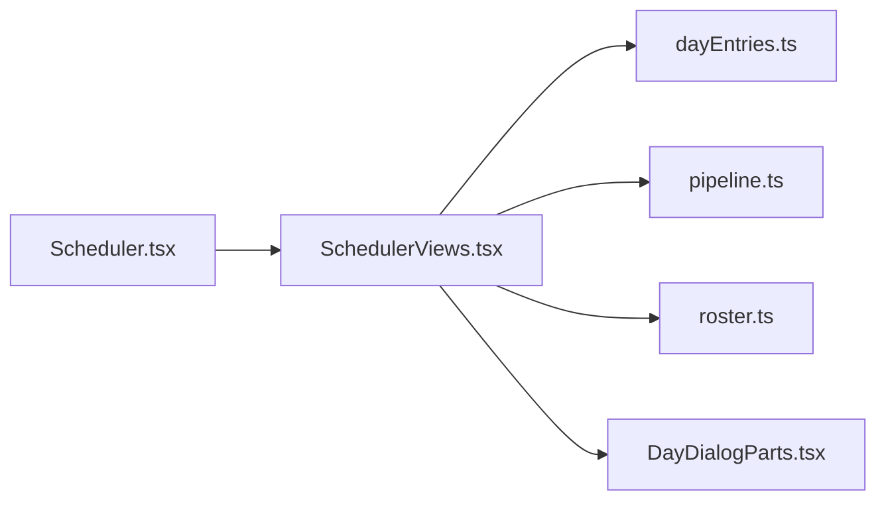

# SchedulerViews.tsx

저장소 경로 `frontend/src/routes/SchedulerViews.tsx` 의 관계 노트입니다. `scripts/codegraph.py` 가 생성하므로 직접 수정하지 않습니다.

## imports

- [[graph/frontend/src/lib/dayEntries|dayEntries.ts]]
- [[graph/frontend/src/lib/pipeline|pipeline.ts]]
- [[graph/frontend/src/lib/roster|roster.ts]]
- [[graph/frontend/src/routes/DayDialogParts|DayDialogParts.tsx]]

## imported by

- [[graph/frontend/src/routes/Scheduler|Scheduler.tsx]]
