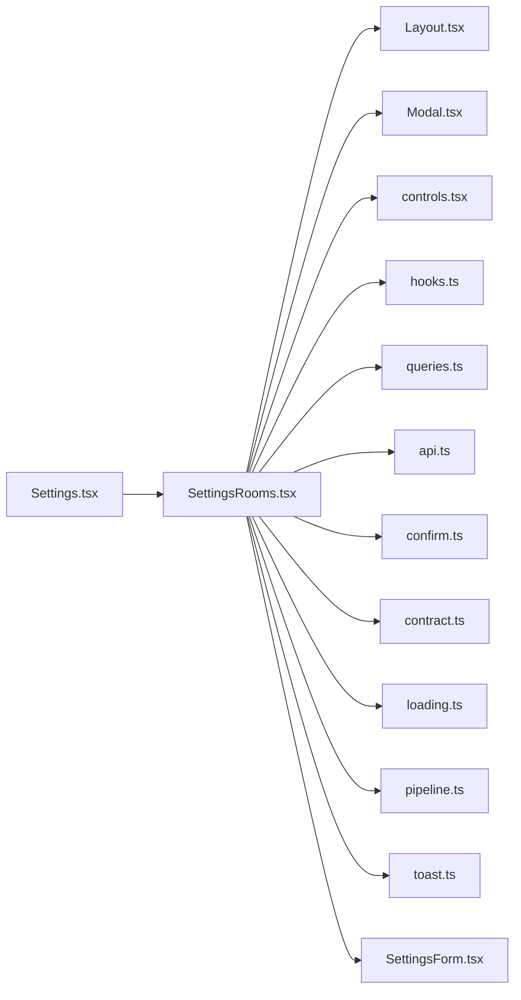

# SettingsRooms.tsx

저장소 경로 `frontend/src/routes/SettingsRooms.tsx` 의 관계 노트입니다. `scripts/codegraph.py` 가 생성하므로 직접 수정하지 않습니다.

## imports

- [[graph/frontend/src/components/Layout|Layout.tsx]]
- [[graph/frontend/src/components/Modal|Modal.tsx]]
- [[graph/frontend/src/components/controls|controls.tsx]]
- [[graph/frontend/src/components/hooks|hooks.ts]]
- [[graph/frontend/src/components/queries|queries.ts]]
- [[graph/frontend/src/lib/api|api.ts]]
- [[graph/frontend/src/lib/confirm|confirm.ts]]
- [[graph/frontend/src/lib/contract|contract.ts]]
- [[graph/frontend/src/lib/loading|loading.ts]]
- [[graph/frontend/src/lib/pipeline|pipeline.ts]]
- [[graph/frontend/src/lib/toast|toast.ts]]
- [[graph/frontend/src/routes/SettingsForm|SettingsForm.tsx]]

## imported by

- [[graph/frontend/src/routes/Settings|Settings.tsx]]
