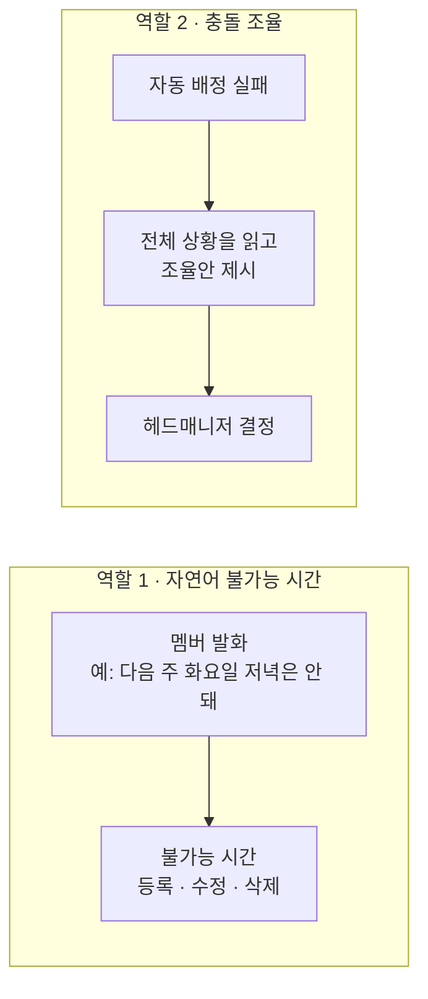

> 문서 버전: 1.1.0 draft

## Abstract

LLM 도우미는 두 가지 일을 한다. 하나는 멤버가 말로 표현한 불가능 시간을 알아듣고 등록·수정·삭제하는 것이고, 다른 하나는 자동 배정이 막혔을 때 사람이 고를 조율안을 제시하는 것이다. 두 번째 일은 전체 일정 상황을 읽고 여러 대안을 따져야 하므로 더 무겁다.

## Introduction

불가능 시간을 매번 표에서 클릭해 넣는 일은 번거롭다. 말로 넣을 수 있으면 훨씬 빠르다. 한편 자동 배정이 답을 못 찾을 때, 무엇을 어떻게 바꾸면 풀리는지를 사람이 일일이 따지는 것도 힘들다. LLM 도우미는 이 두 지점을 맡되, 결정 자체는 사람이 하도록 남겨 둔다.

## Related Work

- [Banblit 개요](../README.md) — 전체 기능 지도
- [자동 배정](../auto-assignment/README.md) — 조율안이 필요해지는 지점
- [스케줄러](../scheduler/README.md) — 자연어로 다루는 불가능 시간이 반영되는 화면
- [계정과 역할](../accounts-and-roles/README.md) — 조율안을 최종 결정하는 헤드매니저

## Description

**역할 1 — 자연어 불가능 시간.** 멤버가 "다음 주 화요일 저녁은 안 돼"처럼 말하면, 이를 불가능 시간으로 바꿔 등록하고, 수정·삭제도 말로 처리한다. 같은 일을 화면에서 직접 하는 방법은 [스케줄러](../scheduler/README.md)의 퍼스널 모드에 있다.

**역할 2 — 충돌 조율.** 자동 배정이 어떤 배정으로도 조건을 못 맞추면, 전체 일정과 팀·멤버 상황을 바탕으로 사람이 판단할 조율안을 만든다. 자리를 서로 맞바꿔야 푸는 경우는 [자동 배정](../auto-assignment/README.md) 계산 안에서 이미 처리되므로, 여기서 사람에게 전하는 것은 "이 인원을 제외하면 배정이 가능해진다"는 제안이다. LLM은 이 제안을 헤드매니저가 이해하기 쉬운 말로 풀어 전한다.

**결정은 사람이.** 조율안은 제안일 뿐이며, 무엇을 택할지는 헤드매니저가 정한다. 조율안이 틀리면 잘못된 결정으로 이어질 수 있으므로, 이 역할에는 판단력이 좋은 모델을 쓴다.

**연동 방식.** 자연어 처리는 Claude API로 연동할 방향이며, 실제 연동은 이후 확정한다. 이 API는 사용량에 따라 비용이 드는 별도 결제 대상으로, 개인용 구독과는 별개다. 충돌 조율은 자동 배정이 실패할 때만 호출되어, 자주 일어나지는 않되 한 번의 처리가 무겁다.

## Conclusion

LLM 도우미는 입력을 편하게 하고, 막힌 배정을 사람이 풀 수 있게 돕는다. 사람 사이의 소통을 다루는 부분은 [게시판과 공지](../boards/README.md)에서 이어진다.
