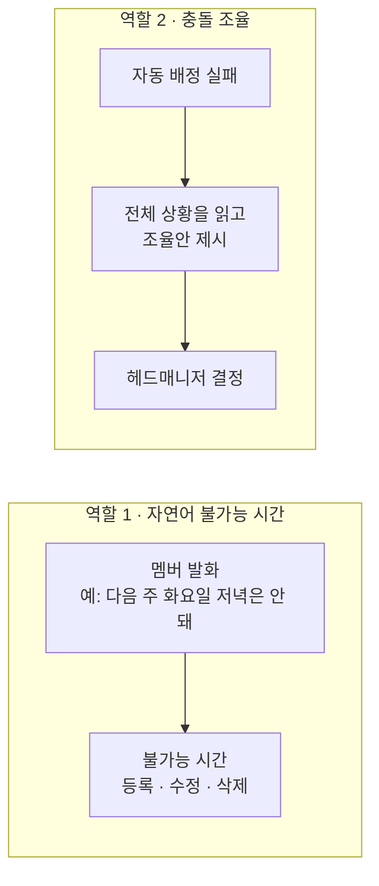

> 문서 버전: 1.1.1 draft

## Abstract

LLM 도우미는 두 가지 역할을 합니다. 첫째, 멤버가 말로 표현한 불가능 일정을 이해하고 등록·수정·삭제합니다. 둘째, 자동 배정이 실패했을 때 조율안을 제시하여 사용자가 선택할 수 있도록 돕습니다. 두 번째 역할은 전체 일정 상황을 분석하고 여러 대안을 검토해야 하므로 훨씬 더 복잡합니다.

## Introduction

불가능 시간을 매번 table을 직접 조작하여 입력하는 것은 번거롭고, 자연어로 입력할 수 있으면 훨씬 빠릅니다. 반면 자동 배정이 해결책을 찾지 못했을 때, 어떤 조건을 어떻게 변경해야 배정이 가능해지는지를 사람이 일일이 판단하는 것도 부담입니다. LLM 도우미는 이 두 지점을 지원하되, 최종 결정은 사용자가 내리도록 설계했습니다.

## Related Work

- [Banblit 개요](../README.md) — 전체 기능 지도
- [자동 배정](../auto-assignment/README.md) — 조율안이 필요해지는 지점
- [스케줄러](../scheduler/README.md) — 자연어로 다루는 불가능 시간이 반영되는 화면
- [계정과 역할](../accounts-and-roles/README.md) — 조율안을 최종 결정하는 헤드매니저

## Description

### 역할 1 — 말로 넣는 불가능 시간

멤버가 "다음 주 화요일 저녁은 안 돼"처럼 말하면 이를 불가능 시간으로 바꿔 등록하고, 수정과 삭제도 말로 처리합니다. 같은 일을 화면에서 직접 하는 방법은 [스케줄러](../scheduler/README.md)의 퍼스널 모드에 있습니다.

### 역할 2 — 막힌 배정을 사람에게 넘기다

자동 배정이 모든 조건을 충족하는 배정안을 찾지 못할 경우, 전체 일정과 팀·멤버 상황을 분석하여 사용자가 판단할 수 있는 조율안을 생성합니다. slot(1시간 단위 시간 칸)을 서로 교환하여 풀 수 있는 경우는 [자동 배정](../auto-assignment/README.md) 계산 내에서 이미 처리되므로, 여기서 제시하는 것은 "이 멤버를 제외하면 배정이 가능해진다"라는 제안입니다. LLM은 이 제안을 헤드매니저가 이해하기 쉽도록 자연어로 설명합니다.

조율안은 제안일 뿐 최종 선택은 헤드매니저가 합니다. 조율안의 정확성이 결정 품질을 좌우하므로, 이 역할에는 추론 능력이 우수한 모델을 사용합니다.

### 연동은 아직 방향만 정했습니다

자연어 처리는 Claude API로 연동할 계획이며, 실제 연동은 이후에 구현합니다. 이 API는 사용량 기반 별도 결제이므로 개인 구독과는 독립적입니다. 충돌 조율은 자동 배정이 실패했을 때만 호출되므로 빈번하지 않지만, 한 번의 요청에 많은 context가 필요합니다.

## Conclusion

LLM 도우미는 입력 편의성을 높이고, 자동 배정 실패 시 사용자가 해결책을 수립할 수 있도록 지원합니다. 사용자 간 소통을 다루는 부분은 [게시판과 공지](../boards/README.md)에서 계속됩니다.
