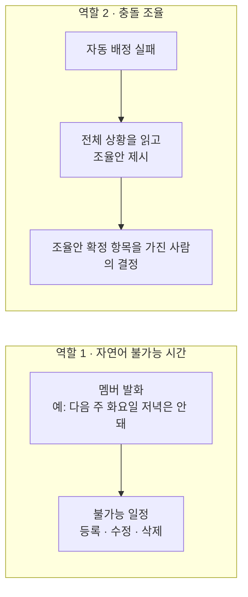

> 문서 버전: 1.1.3 draft

## Abstract

LLM 도우미는 2가지 역할을 합니다. 첫째, 멤버가 자연어로 표현한 불가능 일정을 해석하여 등록·수정·삭제합니다. 둘째, 자동 배정이 실패했을 때 조율안을 제시하여 조율안 확정 항목을 가진 사람이 선택할 수 있도록 지원합니다. 2번째 역할은 전체 일정 상황을 분석하고 2개 이상의 대안을 검토해야 하므로 1번째 역할보다 복잡합니다.

## Introduction

불가능 일정을 매번 화면에서 직접 입력하는 것은 번거롭고, 자연어로 입력할 수 있으면 입력 시간이 줄어듭니다. 자동 배정이 조건을 충족하는 배정안을 찾지 못했을 때, 어떤 조건을 어떻게 변경해야 배정이 가능해지는지를 조율안 확정 권한자가 직접 판단하는 것도 부담입니다. LLM 도우미는 이 2가지를 지원하되, 최종 결정은 조율안 확정 권한자가 내리도록 설계했습니다.

## Related Work

- [Banblit 개요](../README.md) — 전체 기능 지도
- [자동 배정](../auto-assignment/README.md) — 조율안이 필요해지는 지점
- [스케줄러](../scheduler/README.md) — 자연어로 등록한 불가능 일정이 표시되는 화면
- [계정과 역할](../accounts-and-roles/README.md) — 조율안을 최종 결정하는 조율안 확정 권한자

## Description

### 역할 1 — 자연어로 등록하는 불가능 일정

멤버가 "다음 주 화요일 저녁은 안 돼"처럼 말하면 그 발화를 불가능 일정으로 변환하여 등록하고, 수정과 삭제도 자연어로 처리합니다. 같은 등록·수정·삭제를 화면에서 직접 하는 방법은 [스케줄러](../scheduler/README.md)의 내 일정 모드에 있습니다.

### 역할 2 — 실패한 배정을 조율안 확정 권한자에게 전달합니다

자동 배정이 모든 조건을 충족하는 배정안을 찾지 못할 경우, 전체 일정과 팀·멤버 상황을 분석하여 조율안 확정 권한자가 판단할 수 있는 조율안을 생성합니다. slot(1시간 단위 시간 칸)을 서로 교환하여 해결할 수 있는 경우는 [자동 배정](../auto-assignment/README.md) 계산 내에서 이미 처리되므로, LLM 도우미가 제시하는 조율안은 "이 멤버를 제외하면 배정이 가능해진다"라는 제안입니다. LLM은 이 제안을 조율안 확정 권한자가 이해할 수 있도록 자연어로 설명합니다.

조율안은 제안일 뿐 최종 선택은 조율안 확정 권한자가 합니다. 조율안의 정확성이 결정 품질을 좌우하므로, 이 역할에는 추론 능력이 우수한 모델을 사용합니다.

### 연동은 아직 방향만 정했습니다

자연어 처리는 Claude API로 연동할 계획이며, 실제 연동은 미구현입니다. Claude API는 사용량 기반 별도 결제이므로 개인 구독과는 독립적입니다. 충돌 조율은 자동 배정이 실패했을 때만 호출되므로 호출 횟수는 적지만, 1번의 요청에 전체 일정·팀·멤버 상황을 담은 context(모델에 1번의 요청으로 전달하는 입력 전체)가 필요합니다.

## Conclusion

LLM 도우미는 불가능 일정 입력을 자연어로 받고, 자동 배정 실패 시 조율안 확정 권한자가 조율안을 결정할 수 있도록 지원합니다. 사용자 간 소통을 다루는 부분은 [게시판과 공지](../boards/README.md)에서 계속됩니다.
