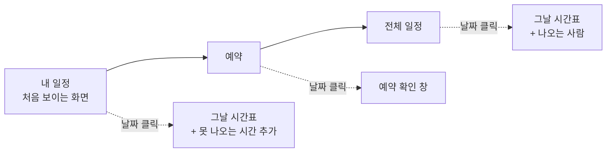

> 문서 버전: 1.2.0 draft

```
┌──────────────────────────────────────────────────────────────────────────┐
│ ☰  Banblit                                              ( 프로필 이름 ▾ ) │  ← 상단 바
├────────────┬─────────────────────────────────────────────────────────────┤
│ 사이드바    │  [내 일정] 예약  전체 일정                                   │  ← 탭
│ (상시)      │ ┌───────────────────────────────┐ ┌────────────────────┐   │
│            │ │  ‹ 2026년 9월 ›      [월│주]   │ │ 공지사항        →  │   │
│ 시간표      │ ├───────────────────────────────┤ ├────────────────────┤   │
│ 공지사항    │ │  일  월  화  수  목  금  토    │ │ (최근 글 몇 개)     │   │
│ 팀 찾기     │ │                                │ └────────────────────┘   │
│ 팀 게시판   │ │        (한 달이 통째로)         │ ┌────────────────────┐   │
│ ─────────  │ │                                │ │ 내 팀           →  │   │
│ 배정 결과   │ │                                │ ├────────────────────┤   │
│ 합주실 설정 │ │                                │ │ (내가 속한 팀만)    │   │
│            │ └───────────────────────────────┘ └────────────────────┘   │
└────────────┴─────────────────────────────────────────────────────────────┘
             └────── 캘린더와 오른쪽 목록은 윗선과 높이가 같다 ──────┘
```

## Abstract

스케줄러는 Banblit에서 가장 큰 자리를 차지하는 메인 화면이다. 캘린더로 일정을 보여주며 월 보기와 주 보기를 오간다. 월 보기는 위쪽 탭으로 세 가지 모드(내 일정, 예약, 전체 일정)를 전환한다. 주 보기는 모드 구분 없이 모든 팀의 하루를 시간 순서로 펼친다. 캘린더 오른쪽에는 공지사항과 내가 속한 팀 목록이 함께 놓인다.

## Introduction

여러 팀의 일정, 합주실 예약, 그리고 내 개인 일정은 성격이 다르지만 모두 같은 달력 위에서 벌어진다. 화면을 따로 두면 오가기 번거롭다. 그래서 하나의 캘린더에 모드를 두어 보고 싶은 관점으로 전환한다. 여기 보이는 일정은 저장된 내용을 그대로 표시하는 것이며, 일정을 만드는 계산은 [자동 배정](../auto-assignment/README.md)이 담당한다.

부원이 이 화면에서 가장 자주 하는 일은 두 가지다 — 우리 팀 합주가 언제인지 확인하는 것과, 내가 못 나오는 시간을 알리는 것. 그래서 처음 들어왔을 때 보이는 것은 전체 팀 일정이 아니라 **내 일정**이다.

## Related Work

- [Banblit 개요](../README.md) — 전체 기능 지도
- [합주실과 기간](../practice-room-and-periods/README.md) — 예약과 기간의 규칙
- [자동 배정](../auto-assignment/README.md) — 여기 표시되는 배정 결과의 출처
- [LLM 도우미](../llm-assistant/README.md) — 못 나오는 시간을 말로 넣는 방법
- [계정과 역할](../accounts-and-roles/README.md) — 프로필 카드에 나오는 역할과 소속
- [팀과 소속](../teams/README.md) — 오른쪽 "내 팀" 목록의 근거
- [게시판과 공지](../boards/README.md) — 오른쪽 공지사항 목록의 출처
- [화면 프로토타입](../screen-prototypes/README.md) — 이 화면을 실제 서버에 물려 확인한 결과
- [기간 자동 배정](../scheduling-api/period-assignment/README.md) — 달력이 읽어오는 확정된 시간표의 출처

## Description

### 화면의 뼈대

화면은 다섯 자리로 나뉜다.

| 자리 | 무엇이 있나 |
| --- | --- |
| 왼쪽 위 | 사이드바를 여닫는 버튼과 로고 |
| 오른쪽 위 | 접속한 사람의 프로필 |
| 왼쪽 | 사이드바 — 넓은 화면에서는 늘 펼쳐져 있다 |
| 가운데 | 탭과 캘린더 |
| 오른쪽 | 공지사항과 내 팀 목록 |

**사이드바는 상시 노출이다.** 접었다 펴는 것이 아니라 펼친 상태가 기본이며, 창이 좁아질 때만 접혀 들어간다. 넓은 화면에서 여닫으면 캘린더를 덮지 않고 밀어내므로 캘린더가 그만큼 좁아진다.

**프로필 아이콘은 프로필 카드를 연다.** 아이콘 아래에 말풍선처럼 붙어 뜨며 이름, 역할, 소속 팀과 포지션, 프로필 설정과 로그아웃이 들어 있다. 화면 가운데에 큰 창을 띄우지 않는다.

**오른쪽 목록은 캘린더와 키를 맞춘다.** 공지사항 카드의 윗선은 탭이 아니라 캘린더 카드의 윗선과 같은 자리에서 시작하고, 공지사항과 내 팀을 합친 높이가 캘린더 높이와 같다. 목록이 길면 카드 안에서만 스크롤한다. 주 보기로 바꿔도 이 목록은 그대로 있다.

**캘린더는 한 화면에 들어간다.** 전체화면에서 페이지를 스크롤하지 않고 그 달 전체가 보인다. 남는 높이를 그 달의 주 수만큼 나눠 가지므로 5주인 달은 칸이 크고 6주인 달은 조금 작아진다. 창이 좁아지면 배치가 바뀐다 — 오른쪽 목록이 캘린더 아래로 내려가고 사이드바가 접힌다.

### 월 보기의 세 모드



| 모드 | 칸에 보이는 것 | 날짜를 누르면 |
| --- | --- | --- |
| 내 일정 | 내 소속팀 합주와 내가 못 나오는 시간 | 그날 시간표. 못 나오는 시간을 추가한다 |
| 예약 | 그날 예약할 수 있는지 | 예약 확인 창 |
| 전체 일정 | 모든 팀의 합주 | 그날 시간표와 그날 나오는 사람 |

### 예약은 시간을 먼저 고른다

예약 모드에서는 캘린더 위에 시작 시각과 끝 시각을 고르는 자리가 붙는다. 이것이 날짜를 거르는 조건이 된다.

```
시간을 골랐을 때     →  그 시간이 비어 있는 날짜만 누를 수 있다
시간을 안 골랐을 때  →  남은 칸이 하나라도 있는 날짜만 누를 수 있다
집중 합주기간        →  언제나 누를 수 없다 (자동 배정만 들어온다)
```

"목요일 7시에 두 시간 쓰고 싶은데 언제 비어 있지"가 실제 질문이기 때문이다. 날짜를 하나씩 열어 확인하는 대신 시간을 먼저 걸고 가능한 날짜만 남긴다.

시간을 고르지 않았을 때는 날짜 칸에 그날 남은 30분 칸의 수와, 24칸 중 어디가 찼는지 보여주는 눈금이 함께 나온다. 다 찬 날은 눌리지 않는다.

날짜를 누르면 확인 창이 뜬다. 시간을 이미 골랐다면 그 시간이 크게 적혀 있고 누구 이름으로 예약할지만 고르면 된다. 안 골랐다면 이 창 안에서 시간을 고른다. 예약 규칙의 자세한 내용은 [합주실과 기간](../practice-room-and-periods/README.md)에서 다룬다.

### 주 보기

모드 구분 없이 하루를 시간 축으로 세로로 펼치고 여러 날을 가로로 늘어놓는다. 오른쪽 목록을 그대로 두므로 캘린더 폭 안에서 가로로 스크롤한다.

### 개인 일정 입력

내 일정 모드에서 날짜를 눌러 못 나오는 시간을 추가한다. 같은 일을 말로 하는 방법은 [LLM 도우미](../llm-assistant/README.md)가 맡는다. 별도의 마이페이지는 두지 않고 개인 일정 관리는 이 모드로 모은다.

### 저장소가 끊겼을 때

캘린더 자리에 불러오지 못했다는 안내와 다시 불러오기 버튼이 나온다. 저절로 다시 시도하지 않는다. 힘들어하는 저장소에 요청이 몇 배로 몰리는 것을 막기 위해서다.

### 실물로 확인한 것

이 설계를 그대로 둔 채 데이터만 실제 서버 응답으로 갈아끼운 사본을 만들어 열어봤다. 달력에 확정된 합주 일정이 실제로 그려지는 것을 확인했고, 동시에 이 화면을 완성하려면 무엇이 더 필요한지가 드러났다.

계산은 30분 칸을 하나씩 배정하므로 서버가 주는 것은 조각의 나열이다. 화면은 같은 팀이 같은 방에서 이어 쓴 조각을 하나로 합쳐 "합주 한 번"으로 그린다. 사람이 세는 단위는 칸이 아니라 합주이기 때문이다.

아직 통로가 없어 화면이 임시로 메우고 있는 자리가 남아 있다 — 합주실 여닫는 시각, 집중기간의 범위, 팀별 명단, 내가 속한 팀의 구분이 그렇다. 화면은 이미 받아온 배정에서 뽑아낼 수 있는 것은 뽑아내고, 그럴 수 없는 것은 사람에게 미연동이라고 밝힌다. 무엇을 어떻게 메우고 있는지는 [화면 프로토타입](../screen-prototypes/README.md)이 표로 정리한다.

예약과 못 나오는 시간은 서버와 주고받을 통로가 아직 없다. 화면에서 넣은 것은 그 브라우저 안에만 남고 새로 고치면 사라진다. 이 화면의 설계는 그대로 유효하며, 통로가 생기면 데이터를 받아오는 자리만 바꿔 끼우면 된다.

## Conclusion

스케줄러는 결과를 보여주는 창이다. 그 결과가 어떻게 만들어지는지는 [자동 배정](../auto-assignment/README.md)에서, 개인 일정을 말로 다루는 방법은 [LLM 도우미](../llm-assistant/README.md)에서 이어진다.
