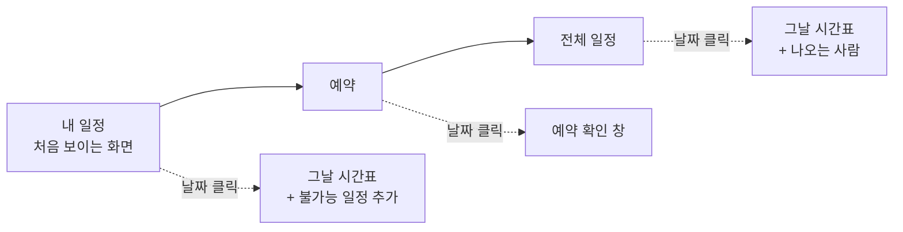

> 문서 버전: 1.7.0 draft

```
┌──────────────────────────────────────────────────────────────────────────┐
│ ☰  Banblit                                              ( 프로필 이름 ▾ ) │  ← 상단 바
├────────────┬─────────────────────────────────────────────────────────────┤
│ 사이드바    │  [내 일정] 예약  전체 일정                                   │  ← 탭
│ (상시)      │ ┌───────────────────────────────┐ ┌────────────────────┐   │
│            │ │  ‹ 2026년 9월 ›      [월│주]   │ │ 알림      안 읽음 2 │   │
│ 시간표      │ ├───────────────────────────────┤ ├────────────────────┤   │
│ 공지사항    │ │  일  월  화  수  목  금  토    │ │ (알림 1줄에 1개씩)  │   │
│ 팀 찾기     │ │                                │ └────────────────────┘   │
│ 팀 게시판   │ │        (한 달이 통째로)         │ ┌────────────────────┐   │
│ ─────────  │ │                                │ │ 공지사항        →  │   │
│ 배정 결과   │ │                                │ ├────────────────────┤   │
│ 합주실 설정 │ │                                │ │ (최근 글 3개)       │   │
│            │ │                                │ └────────────────────┘   │
│            │ │                                │ ┌────────────────────┐   │
│            │ │                                │ │ 내 팀           →  │   │
│            │ │                                │ ├────────────────────┤   │
│            │ │                                │ │ (내가 속한 팀만)    │   │
│            │ └───────────────────────────────┘ └────────────────────┘   │
└────────────┴─────────────────────────────────────────────────────────────┘
             └────── 캘린더와 오른쪽 목록은 윗선과 높이가 같다 ──────┘
```

## Abstract

스케줄러는 Banblit의 메인 화면입니다. 캘린더에 3가지 모드(내 일정, 예약, 전체 일정)로 일정을 표시하고, 월 보기와 주 보기를 전환합니다. 월 보기는 위쪽 탭으로 모드를 바꾸고, 주 보기는 모드를 구분하지 않고 모든 팀의 하루를 시간 축으로 표시합니다. 캘린더 오른쪽에는 알림, 공지사항, 내가 속한 팀 목록이 위에서 아래로 이 순서로 배치됩니다.

## Introduction

2개 이상 팀의 일정, 합주실 예약, 내 불가능 일정은 성격이 다르지만 모두 같은 날짜 위에 표시됩니다. 화면을 따로 두면 이동이 번거로우므로 캘린더 1개에 모드를 두고 보려는 관점으로 전환하게 했습니다. 스케줄러에 표시되는 일정은 저장된 시간표이고, 시간표 계산은 [자동 배정](../auto-assignment/README.md)이 담당합니다.

멤버가 이 화면에서 가장 자주 하는 일은 2가지입니다. 소속 팀의 합주 시간 확인과, 자신의 불가능 일정 등록입니다. 그래서 처음 열었을 때 표시되는 모드는 전체 일정이 아니라 내 일정입니다.

## Related Work

- [Banblit 개요](../README.md) — 전체 기능 지도
- [합주실과 기간](../practice-room-and-periods/README.md) — 예약과 기간의 규칙
- [자동 배정](../auto-assignment/README.md) — 스케줄러에 표시되는 배정 결과의 출처
- [LLM 도우미](../llm-assistant/README.md) — 불가능 일정을 자연어로 등록하는 방법
- [계정과 역할](../accounts-and-roles/README.md) — 프로필 카드에 나오는 역할과 소속
- [팀과 포지션](../teams/README.md) — 오른쪽 "내 팀" 목록의 근거
- [게시판과 공지](../boards/README.md) — 오른쪽 공지사항 목록의 출처
- [화면](../screens/README.md) — 이 설계가 실제 앱에서 어떻게 구현되는지
- [기간 자동 배정](../scheduling-api/period-assignment/README.md) — 달력이 조회하는 확정된 시간표의 출처

## Description

### 화면은 5개 영역으로 나뉩니다

| 자리 | 무엇이 있나 |
| --- | --- |
| 왼쪽 위 | 사이드바를 열고 닫는 버튼과 로고 |
| 오른쪽 위 | 로그인한 사용자의 프로필 |
| 왼쪽 | 사이드바. 넓은 화면에서는 항상 펼쳐져 있습니다 |
| 가운데 | 탭과 캘린더 |
| 오른쪽 | 알림, 공지사항, 내 팀 목록. 위에서부터 이 순서입니다 |

사이드바의 기본 상태는 펼쳐져 있고, 창이 좁아질 때만 접힙니다. 넓은 화면에서 여닫으면 캘린더를 덮지 않고 밀어내므로 캘린더가 그만큼 좁아집니다.

프로필 아이콘을 누르면 프로필 카드가 열립니다. 아이콘 아래에 프로필 카드가 열리고 이름, 역할, 소속 팀과 포지션, 프로필 설정과 로그아웃이 들어 있습니다. 화면 가운데에 큰 창을 띄우지는 않습니다.

오른쪽 목록은 캘린더와 위치를 맞춥니다. 맨 위 카드의 윗선은 탭이 아니라 캘린더 카드의 윗선과 같은 위치에서 시작하고, 3개 카드를 합친 높이가 캘린더의 높이와 같습니다. 목록이 길면 카드 안에서만 스크롤하고, 주 보기로 바꿔도 이 목록은 그대로 유지됩니다.

### 오른쪽 목록 맨 위에 알림을 뒀습니다 (2026-09-07)

오른쪽 목록에 카드가 1개 늘었습니다. 알림이 맨 위로 들어가고, 공지사항과 내 팀은 1칸씩 내려갔습니다.

```
       예전                      지금
  ┌────────────┐          ┌────────────┐
  │ 공지사항    │          │ 알림        │  ← 새로 생긴 자리
  ├────────────┤          ├────────────┤
  │ 내 팀       │          │ 공지사항    │
  └────────────┘          ├────────────┤
                          │ 내 팀       │
                          └────────────┘
```

알림을 맨 위에 둔 이유는 시간표 변경을 가장 먼저 알아야 하기 때문입니다. 공지는 사람이 작성한 글이라 긴급하지 않지만, 알림은 사용자가 알고 있던 시간표가 변경되었다는 뜻입니다. 그래서 이 화면을 연 사용자가 처음 보는 위치에 알림을 배치합니다.

| 상태 | 카드가 보이는 모습 | 누르면 |
| --- | --- | --- |
| 안 읽은 알림이 있습니다 | 머리글에 안 읽은 개수가 표시되고, 안 읽은 줄마다 표시가 붙습니다 | 전부 읽음으로 표시되고 개수와 표시가 사라집니다 |
| 전부 읽었습니다 | 개수도 표시도 없습니다 | 아무 일도 일어나지 않습니다 |
| 아직 조회하지 못했거나 조회에 실패했습니다 | 조회 중 또는 실패 안내를 1줄로 표시합니다 | — |

머리글을 눌러도 줄 1개를 눌러도 전체가 읽음으로 표시됩니다. 알림을 1개씩 읽는 화면은 미구현이므로 어느 쪽을 눌러도 결과가 같습니다.

색으로만 알리지는 않습니다. 안 읽은 줄에 붙는 점에는 "안 읽음" 텍스트가 있어 스크린 리더가 "안 읽음"으로 읽습니다. 색만으로 구분하면 스크린 리더를 쓰는 사용자에게는 읽은 줄과 안 읽은 줄이 똑같이 들립니다.

알림이 언제 누구에게 생성되는지는 이 화면이 정하지 않습니다. 알림 생성 조건과 대상은 [자동 배정](../auto-assignment/README.md)이 정본이고, 정해진 시각에 자동으로 실행되는 계산만이 아니라 사용자가 배정 화면에서 다시 계산해 저장하거나 이전 배정기록으로 되돌렸을 때도 같은 알림이 생성됩니다. 이 화면은 서버에서 받은 알림 종류를 문장으로 변환하여 표시하고, 정의되지 않은 종류가 오면 종류 이름 대신 "새 소식이 있습니다"로 표시합니다.

캘린더는 화면 1개에 들어갑니다. 전체 페이지를 스크롤하지 않고 그 달 전체가 표시되는데, 남은 높이를 그 달의 주(week) 수만큼 나눠 가지므로 5주인 달은 칸이 크고 6주인 달은 칸이 작습니다. 창이 좁아지면 오른쪽 목록이 캘린더 아래로 내려가고 사이드바가 접힙니다.

### 월 보기는 3개 모드로 나뉩니다



| 모드 | 칸에 보이는 것 | 날짜를 누르면 |
| --- | --- | --- |
| 내 일정 | 내 소속팀 합주와 내 불가능 일정 | 그날 시간표. 불가능 일정을 추가합니다 |
| 예약 | 그날 예약 가능 여부 | 예약 확인 창 |
| 전체 일정 | 모든 팀의 합주 | 그날 시간표와 그날 나오는 사람 |

### 예약은 시간을 먼저 선택합니다

예약 모드에서는 캘린더 위에 시작시간과 종료시간을 선택하는 입력칸이 붙고, 선택한 시간이 날짜를 필터링하는 조건이 됩니다.

```
시간을 선택했을 때   →  그 시간이 비어 있는 날짜만 누를 수 있다
시간을 선택하지 않음  →  남은 slot 이 하나라도 있는 날짜만 누를 수 있다
집중 합주기간        →  자동 배정이 남긴 시간만 누를 수 있다
```

"목요일 7시에 두 시간 쓰고 싶은데 언제 비어 있나"가 사용자의 실제 질문이기 때문입니다. 날짜를 1개씩 열어 확인하는 대신 시간을 먼저 선택하고 예약 가능한 날짜만 남깁니다.

집중 합주기간 전체의 예약을 차단하지는 않습니다. 모든 팀에 slot을 배정하고도 남는 slot이 생기는데 그 slot까지 차단하면 합주실이 빈 채로 남으므로, 자동 배정이 남긴 slot은 다른 날과 같게 선착순으로 개방합니다. 남는 slot이 생기는 이유는 [합주실과 기간](../practice-room-and-periods/README.md)에서 다룹니다.

시간을 선택하지 않았을 때는 날짜 칸에 그날 남은 slot의 개수와, 어느 시간이 찼는지 표시하는 눈금이 함께 표시됩니다. 다 찬 날은 상호작용하지 않습니다.

날짜를 누르면 확인 창이 열립니다. 시간을 이미 선택했다면 그 시간이 크게 표시되고 일정 이름(내 팀 중 하나, 고르지 않으면 예약자 이름)만 선택하면 되고, 선택하지 않았다면 이 창 안에서 시간을 선택합니다. 예약 규칙의 자세한 내용은 [합주실과 기간](../practice-room-and-periods/README.md)에서 다룹니다.

### 하루 확인 창은 3단입니다

내 일정 탭과 예약 탭의 확인 창은 왼쪽 그날 타임라인, 가운데 등록 폼, 오른쪽 내 일정 목록의 카드 3장입니다(저장소 루트 `모달개선예시.png`). dialog 는 투명한 grid 틀이고 카드(`.pane`)마다 배경·모서리·그림자를 따로 가져 서로 떨어진 창처럼 보입니다(사용자 결정 2026-09-15). 카드 3장은 폭이 같고, 내용이 적어도 같은 높이(dialog 높이 92vh)이며, 내용이 넘치면 그 카드의 안쪽(타임라인·폼·목록)만 스크롤합니다. 제목과 닫기 버튼은 왼쪽 카드, 등록 버튼은 가운데 카드 안에 있습니다. 창 폭이 960px 이하이면 카드가 세로로 쌓입니다. 전체 일정 탭은 조회 전용이라 카드 1장짜리 일반 modal 그대로입니다.

| 단 | 내용 | 동작 |
| --- | --- | --- |
| 왼쪽 | 그날 타임라인 | 누른 자리부터 끄는 자리까지 드래그하면 설정 단위(`slot_minutes`)로 내림한 구간이 점선 막대로 표시되고, 가운데 폼의 시작·끝 select 가 같은 값으로 바뀝니다(`lib/calendar.ts` 의 `dragRange`). 드래그하기 전에는 구간이 없고, 그 상태로 등록하면 select 의 값(여는 시각부터 닫는 시각까지)으로 등록합니다 |
| 가운데 | 등록 폼 | 불가능 일정은 날짜·시작·끝·반복(반복 없음·매일·매주 그 요일)·일정 이름·사유. 예약은 날짜·합주실·시작·끝·일정 이름(내 팀 드롭다운). 시작·끝 select 는 드래그를 쓰지 못하는 키보드 사용자의 입력 수단입니다 |
| 오른쪽 | 내 일정 목록 | 내 일정 탭은 내가 등록한 불가능 일정, 예약 탭은 내가 한 예약만 나열하고 줄마다 삭제 아이콘이 있습니다 |

등록해도 창은 닫히지 않습니다. 같은 날에 일정 여러 개를 이어서 등록할 수 있게 하기 위해서이고, 예외는 위에서 시간을 먼저 선택하고 연 예약 창뿐입니다. 등록이 끝나면 고른 구간과 일정 이름·사유 입력칸을 비웁니다.

일정 이름은 캘린더의 달 보기·주 보기·타임라인·오른쪽 목록 전부에 표시되는 이름입니다(`routes/DayDialogParts.tsx` 의 `entryName`). 불가능 일정은 비워 두면 "불가능 일정"으로, 예약은 팀을 고르지 않으면 예약자 이름으로 표시합니다. 서버는 `unavailable_times.name`(60자, NULL 허용)과 `reservations.name` 에 저장하며 배정 엔진은 사용하지 않습니다. 사유(`reason`)는 이름과 따로 타임라인 막대의 작은 글씨에만 표시합니다.

### 주 보기와 불가능 일정 입력

주 보기는 모드를 구분하지 않고 하루를 시간 축으로 세로로 표시하고 2일 이상을 가로로 나열합니다. 오른쪽 목록을 그대로 두므로 캘린더 폭 안에서 가로로 스크롤합니다.

시간 축의 격자 줄은 1시간마다 긋고, 막대는 시작·종료 시각을 한 시간의 비율로 환산한 소수 위치에 그립니다(`lib/slots.ts` 의 `slotIndex`, 여는 시각 18시 기준 18:10 → 0.1667). 주 보기의 막대는 시작 시각이 속한 시간 줄 안에서 그 비율만큼 내려 시작하고, 날짜 모달의 타임라인 막대도 같은 값으로 위치와 높이를 정합니다. 예약 가능 여부를 세는 칸 계산(`lib/calendar.ts` 의 `takenGrid`)은 소수 구간이 일부라도 걸친 1시간 칸을 전부 찬 것으로 봅니다. 사용자가 설정 단위로 시각을 고르는 입력은 하루 확인 창의 타임라인 드래그와 시작·끝 select 입니다.

불가능 일정은 내 일정 모드에서 날짜를 눌러 추가합니다. 같은 추가를 자연어로 하는 방법은 [LLM 도우미](../llm-assistant/README.md)가 담당합니다. 별도의 마이페이지는 두지 않고 불가능 일정 관리는 이 모드로 모았습니다.

### 저장소에 접속하지 못했을 때는 다시 시도하지 않습니다

캘린더 위치에 불러오지 못했다는 안내와 다시 불러오기 버튼이 표시됩니다. 자동으로 다시 시도하지 않는 이유는 응답하지 못하는 저장소에 요청 수가 증가하는 것을 막기 위해서입니다.

### 실제 서버 응답으로 확인했습니다

이 설계를 유지한 채 데이터만 실제 서버 응답으로 교체한 사본을 만들어 확인했습니다. 달력에 확정된 합주 일정이 표시되는 것을 확인했고, 동시에 이 화면을 완성하기 위해 필요한 값이 무엇인지 드러났습니다.

계산은 1시간 단위 slot을 1개씩 배정하므로 서버가 반환하는 시간표는 slot의 나열입니다. 화면은 같은 팀이 같은 합주실에서 연속으로 사용하는 slot을 합쳐 "합주 1회"로 표시하는데, 사용자가 세는 단위는 slot이 아니라 합주이기 때문입니다.

그때 화면이 임시로 채우던 값은 지금 전부 서버에서 조회합니다. 처음에는 이미 조회한 배정에서 추출할 수 있는 값만 추출하고 나머지는 미구현으로 표시했는데, 그 값을 반환하는 endpoint(API의 요청 주소 단위)가 1개씩 추가되었습니다.

| 화면이 필요로 하는 것 | 예전 | 지금 |
| --- | --- | --- |
| 합주실 개방·폐쇄 시각 | 배정된 가장 이른 시각과 가장 늦은 시각으로 대신했습니다 | 합주실 목록을 조회하여 가장 이른 개방 시각과 가장 늦은 폐쇄 시각을 달력의 시작·종료 시각으로 사용합니다 |
| 집중 합주기간의 날짜 범위 | 배정이 있는 날짜의 첫날과 마지막 날로 대신했습니다 | 기간 목록을 조회하여 집중 합주기간의 시작일과 종료일을 그대로 사용합니다 |
| 팀별 명단 | 없었습니다 | 하루 상세 dialog가 그날 배정된 팀의 명단만 조회하여 "이날 나오는 사람"을 표시합니다 |
| 내가 속한 팀 | 화면에 고정한 팀 2개를 사용했습니다 | 내 계정을 조회할 때 함께 받는 소속 목록으로 구분합니다 |
| 예약·불가능 일정 | 브라우저 안에만 남고 새로 고침하면 사라졌습니다 | 서버에 저장합니다. 입력한 뒤 다시 조회하여 저장 여부를 확인합니다 |

달력은 집중 합주기간 전부를 표시합니다. 달 보기의 날짜 칸은 어느 집중 합주기간에든 속하면 집중 합주일로 표시하고, 달력 아래 띠는 기간마다 "<시작일> ~ <종료일>" 을 쉼표로 이어 표시합니다. "매일" 기간은 종료일 자리에 "매일" 을 표시합니다. 서버가 집중 합주기간끼리의 날짜 겹침을 거절하므로 한 날짜는 기간 하나에만 속합니다(`lib/calendar.ts` 의 `focusedRanges`·`inRanges`, 테스트는 `calendar.test.ts`). 화면 전체의 미구현 항목은 [화면](../screens/README.md)이 표로 정리합니다.

예약과 불가능 일정은 이제 서버에 저장됩니다. 입력한 예약과 불가능 일정이 새로 고침 뒤에도 유지되고, 예약자는 화면이 보내지 않고 서버가 로그인한 사용자로 정합니다. 이 화면의 설계는 앱으로 옮기는 동안 그대로 유효했고, 바뀐 부분은 값을 조회하는 출처뿐입니다.

## Conclusion

스케줄러는 배정 결과를 표시하는 화면입니다. 배정 결과의 계산 규칙은 [자동 배정](../auto-assignment/README.md)에서, 불가능 일정을 자연어로 등록하는 방법은 [LLM 도우미](../llm-assistant/README.md)에서 이어집니다.
