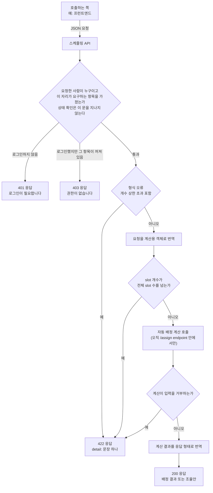

> 문서 버전: 1.8.0 draft



## Abstract

스케줄링 API는 이미 만들어진 자동 배정 계산을 바깥에서 호출할 수 있게 여는 서버 endpoint입니다. 이 문서가 다루는 배정 요청(`POST /assign`)은 저장소를 거치지 않습니다. 호출하는 쪽이 팀·멤버·합주실·팀당 slot 개수를 요청 한 번에 모두 담아 보내면, 그 자리에서 계산해 배정 결과를 돌려줄 뿐 아무것도 남기지 않습니다. 이 계층은 계산 자체를 새로 만들지 않고, 요청의 형태를 확인하고 계산이 쓰는 형태로 옮기고 계산이 끝나면 다시 응답 형태로 옮기는 번역 역할만 합니다. 같은 계산을 저장된 데이터로 돌리고 결과까지 저장하는 endpoint는 [기간 자동 배정](./period-assignment/README.md)에서 따로 다룹니다.

## Introduction

자동 배정 계산은 원래 같은 프로그램 안에서만 부를 수 있는 파이썬 코드였습니다. 바깥의 다른 프로그램이 이 계산을 쓰려면 네트워크로 요청을 보내고 응답을 받을 수 있는 endpoint가 있어야 하는데, 스케줄링 API가 그 자리입니다.

endpoint를 만들면서 계산의 규칙을 다시 만들지 않는 것이 중요하다고 봤습니다. 같은 규칙이 두 곳에 따로 있으면 시간이 지나며 서로 어긋나기 쉽기 때문입니다. 그래서 이 계층은 기존 계산이 이미 갖고 있던 규칙을 그대로 재사용하고, 그 위에 얇은 요청·응답 번역만 얹었습니다.

## Related Work

- [Banblit 개요](../README.md) — 전체 기능 지도
- [자동 배정](../auto-assignment/README.md) — 이 API가 호출하는 계산 로직과 그 규칙
- [계정과 역할](../accounts-and-roles/README.md) — 요청한 사람을 가려내는 로그인 세션과, 자리마다 요구하는 권한 항목
- [합주실과 기간](../practice-room-and-periods/README.md) — 요청에 담기는 합주실·운영 시간의 규칙
- [팀과 포지션](../teams/README.md) — 요청에 담기는 팀·포지션 구조
- [기간 자동 배정](./period-assignment/README.md) — 같은 계산을 저장된 데이터로 돌리고, 성공하면 저장까지 잇는 endpoint
- [화면](../screens/README.md) — 이 endpoint를 실제로 부르는 화면들

## Description

### endpoint는 둘이고, 부를 수 있는 사람이 다릅니다

| endpoint | 무엇을 하는가 | 정상 응답 |
| --- | --- | --- |
| 상태 확인 | 서버가 살아 있는지 확인한다 | 상태 문구 |
| 배정 요청 | 팀·멤버·합주실·팀당 slot 개수를 받아 즉시 계산하고 결과를 돌려준다 | 배정 결과(성공 시) 또는 조율안(실패 시) |

예전에는 로그인하지 않은 사람도 배정 계산을 시킬 수 있었습니다. 지금은 상태 확인 하나를 뺀 모든 endpoint가 "요청한 사람이 누구인가"를 먼저 확인하고, 그 확인은 한 자리에 모여 있습니다. endpoint마다 쿠키를 따로 들여다보면 한 곳만 빠뜨려도 그 endpoint가 통째로 열리기 때문입니다. 누구인지 가려내는 방법 자체는 [계정과 역할](../accounts-and-roles/README.md)에서 다룹니다.

| endpoint | 부를 수 있는 사람 | 그렇게 정한 이유 |
| --- | --- | --- |
| 상태 확인 | 누구나 — 로그인하지 않아도 된다 | 부르는 쪽(배포 도구, 앞단)이 계정을 가질 수 없다 |
| 배정 요청 (저장하지 않는 계산) | 로그인한 사람 전체 | 저장은 하지 않지만 계산이 최대 22.2초까지 걸린 실측이 있다(2026-08-28). 로그인 없이 열어 두면 이 endpoint 하나로 서버를 묶을 수 있다 |
| 기간의 시간표 조회 | 로그인한 사람 전체 | 확정된 시간표는 자기 팀 일정을 보려는 사람이 읽어야 한다 |
| 기간 배정 시키기 | 배정 계산 항목이 켜진 사람 | 시간표를 실제로 바꾸는 일이다 |
| 계산 결과 되묻기 | 계산 결과 보기 항목이 켜진 사람 | 그 결과에는 아직 확정되지 않은 조율안과, 그 안에서 제외될 사람의 이름이 들어 있다 |
| 조율안 하나를 골라 확정 | 조율안 확정 항목이 켜진 사람 | 시간표를 실제로 바꾸는 일이다 |
| 기간 배정 되돌리기 | 되돌리기 항목이 켜진 사람 | 시간표를 실제로 바꾸는 일이다 |

표의 아래 다섯 줄은 저장된 기간을 다루는 endpoint입니다. 그 동작 자체는 [기간 자동 배정](./period-assignment/README.md)과 [자동 배정](../auto-assignment/README.md)에서 다루고, 여기 함께 적은 것은 규칙을 한 장에서 비교해 보기 위해서입니다. 게시판·예약처럼 다른 문서가 다루는 endpoint의 규칙은 각자의 문서에 있습니다.

계산 결과를 되묻는 자리도 함께 잠급니다. 배정을 시키는 쪽만 잠그고 결과를 읽는 쪽을 열어 두면 막아 둔 것을 옆문으로 그대로 내주는 셈이 되기 때문입니다. 다만 두 자리가 요구하는 것은 서로 다른 항목이어서, 계산은 못 돌리지만 남이 돌린 결과를 검토만 하는 사람을 둘 수 있습니다. 항목이 무엇이고 어떻게 켜고 끄는지는 [계정과 역할](../accounts-and-roles/README.md)이 정본입니다.

상태 확인은 열어 두었지만 지금은 아무도 부르지 않습니다. 컨테이너 구성의 상태 확인은 데이터베이스 컨테이너에만 붙어 있고, 앞단이나 배포 도구가 이 서버의 상태를 물어보기 시작할 때를 위해 열어 둔 상태입니다.

시간표를 실제로 바꾸는 세 자리(배정 시키기·조율안 확정·되돌리기)는 저장이 실제로 된 때만 그 기간에 slot을 받은 팀의 사람에게 알림 한 줄을 남깁니다. 저장하지 않는 계산과 조회는 아무것도 남기지 않습니다. 이 계층이 새로 정하는 규칙은 아니고, 누구에게 무엇이 남는지는 [자동 배정](../auto-assignment/README.md)이 정본입니다.

401과 403은 가릅니다. 로그인하지 않은 것과 로그인했지만 권한이 없는 것은 사람이 해야 할 일이 다르기 때문입니다. 앞은 로그인 화면으로 보내야 할 사람이고, 뒤는 보내봐야 같은 자리로 되돌아옵니다.

### 요청 한 번에 모든 정보를 담습니다

이 계층은 상태를 기억하지 않습니다. 저장소가 없으므로 어제 보낸 팀 명단이나 합주실 설정을 서버가 따로 기억하고 있지 않고, 배정을 계산하려면 매 요청마다 필요한 정보(팀과 그 소속 멤버, 각 멤버의 불가능 시간, 합주실과 운영 시간, 팀당 slot 개수)를 통째로 함께 보내야 합니다.

형태 확인과 번역은 나뉘어 있습니다. 요청이 들어오면 먼저 형태를 확인하고, 형태가 맞으면 그 값을 계산이 실제로 쓰는 객체로 옮기고, 계산이 끝나면 그 결과를 다시 응답으로 옮깁니다. 이 옮기는 작업 자체는 아무 판단도 하지 않고 값을 그대로 나르기만 합니다.

### 이름은 이 계층에서만 씁니다

계산은 팀·합주실·사람을 번호로만 가립니다([자동 배정](../auto-assignment/README.md) 참고). 그런데 이 endpoint는 저장소를 거치지 않아 진짜 번호가 없어서, 요청에 적힌 순서를 번호로 삼습니다. 목록의 몇 번째 자리인지가 곧 그 대상의 번호입니다. 사람만은 예외로, 같은 이름이 여러 팀에 나오면 처음 나온 번호를 계속 씁니다. 그래야 두 팀을 겸하는 한 사람이 계산에서 한 몸으로 다뤄지기 때문입니다.

```
요청                          계산에 넘기는 번호        응답
teams[0] "기타팀"      ──►    팀 0                ──►   "기타팀"
teams[1] "드럼팀"      ──►    팀 1                ──►   "드럼팀"
  둘 다 멤버 "김민수"  ──►    사람 0 (하나)        ──►   "김민수"
rooms[0] "1번방"       ──►    합주실 0            ──►   "1번방"
```

번호는 이 endpoint 안에서만 살아 있고 응답에는 요청에 적힌 이름이 그대로 다시 실리므로, 부르는 쪽은 번호를 볼 일이 없습니다.

### 입력의 옳고 그름은 원칙적으로 계산이 판단합니다

한 팀 명단에 같은 사람이 중복 등록됨, slot 개수가 음수, 운영 시간이 정시를 벗어남, 시간대가 붙은 시각처럼 계산이 이미 거부하던 입력은 이 API 계층에서 다시 검사하지 않습니다. 계산이 던지는 거부 사유를 그대로 받아 그 문구를 담아 오류 응답으로 돌려줄 뿐입니다. 새로운 검사 규칙을 이 계층에서 따로 만들면 시간이 지나 계산의 규칙과 API의 규칙이 서로 다른 말을 하게 될 위험이 있기 때문입니다.

이 원칙에 예외가 세 가지 있습니다. 앞의 둘은 "계산이 시작되기도 전에 감당할 수 없는 규모"를 막기 위한 것이고, 나머지 하나는 계산이 알 수 없는 것(요청에 적힌 이름)을 다루기 때문에 이 계층에만 있을 수 있는 것입니다.

첫째는 요청 자체의 개수 상한입니다. 팀은 최대 20개, 팀당 멤버는 최대 10명, 합주실은 최대 10개, 멤버당 불가능 시간은 최대 100개까지만 받고, 이를 넘는 요청은 형식 오류로 취급해 계산을 부르기도 전에 거절합니다.

둘째는 slot 개수의 동적 검사입니다. 팀당 slot 개수(`slots_per_team`)에는 고정 상한이 없고, 대신 요청마다 "요청한 slot 개수(팀 수 × 팀당 slot)"와 "요청에 담긴 합주실 운영시간이 실제로 제공하는 전체 slot 수"를 비교해 앞의 것이 뒤의 것보다 크면 계산을 부르기 전에 거절합니다. 예를 들어 팀 2개가 각각 2 slot씩(총 4 slot)을 요구하는데 합주실 운영시간이 slot 2개만 제공한다면, 계산에 넘기지 않고 곧바로 "요청한 slot 개수(...)가 운영시간의 전체 slot 수(...)를 넘습니다"라는 문구로 거절합니다. 합주실 운영시간 자체가 이미 잘못된 값이라 slot 수를 셀 수 없는 경우에는 요청에 적힌 방 이름을 붙여 이 자리에서 곧바로 거절합니다. 계산이 붙이는 번호는 요청 안의 몇 번째 자리인지일 뿐이라 부르는 쪽에는 아무 뜻이 없기 때문입니다.

셋째는 이름 겹침 검사입니다. 응답은 팀 이름으로 배정 결과를 묶고 합주실 이름으로 slot을 가리키므로, 요청에 같은 팀 이름이나 같은 합주실 이름이 두 번 나오면 한쪽 결과가 다른 쪽을 덮어써 조용히 사라집니다. 계산은 이름을 아예 받지 않기 때문에 이 검사는 계산에 맡길 수 없고, 그래서 번역을 시작하기 전에 이 계층이 직접 거절합니다.

계산이 던지는 거부 사유를 오류 응답으로 바꾸는 처리는 배정 요청(`POST /assign`) endpoint 안에서만 적용됩니다. 이 endpoint 밖에서 우연히 같은 종류의 오류가 터지더라도 그것을 자동으로 "입력이 잘못됐다"는 뜻으로 해석해 오류 응답으로 둔갑시키지 않습니다. 그런 경우는 서버 오류로 남겨서, 계산 규칙과 무관한 문제를 입력 오류로 잘못 알리는 일이 없게 했습니다.

### 두 가지 실패를 구분합니다

"요청 자체가 잘못됨"과 "요청은 올바르지만 조건을 만족하는 배정을 찾지 못함"은 다른 종류의 실패입니다.

| 상황 | 응답 |
| --- | --- |
| 요청 형식이 잘못됨(필수 항목 누락·개수 상한 초과·slot 개수가 전체 slot 수 초과 등) | 422 오류 응답 |
| 요청에 팀 이름이나 합주실 이름이 겹침 | 422 오류 응답. 겹친 이름을 지목한다 |
| 계산이 입력을 거부함(명단 오류·음수·시간대 등) | 422 오류 응답. 계산이 낸 거부 사유를 그대로 담는다 |
| 계산은 됐지만, 모든 조건을 만족하는 배정이 없음 | 200 정상 응답. 대신 "누구를 빼면 되는지" 조율안을 함께 담는다 |

앞의 두 경우는 부르는 쪽의 실수이므로 오류로 알리고, 마지막 경우는 잘못이 아니라 계산이 낸 정당한 결과이므로 오류가 아니라 성공 응답 안에 조율안을 담아 돌려줍니다.

오류 응답의 모양은 하나로 통일돼 있습니다. 형식이 잘못된 오류든 계산이 거부한 오류든 화면이 받는 오류 응답은 항상 같은 모양이어서, "무엇이 문제인지"를 담은 문장 하나가 오류 항목 하나에 담겨 옵니다. 화면 쪽에서 두 가지 오류 모양을 따로 처리할 필요가 없습니다.

### 상태 확인은 실제 상태를 말합니다

상태 확인 endpoint는 "살아 있다"는 고정된 답을 돌려주지 않습니다. 부를 때마다 저장소에 실제로 접속해 보고 적용된 마이그레이션 번호까지 읽어서 그 결과를 그대로 싣습니다. 접속은 되는데 마이그레이션이 아직 적용되지 않았다면 기동 준비가 끝나지 않은 것이므로 정상이 아니라고 답합니다. 고정된 답을 돌려주는 상태 확인은 아무것도 막지 못하고, 저장소가 죽어 있는 서버에도 계속 요청이 흘러들어갑니다.

저장소에 닿지 못하면 "지금은 못 받는다"고 답합니다. 다섯 종류의 실패를 화면이 구별할 수 있어야 하기 때문입니다.

| 상황 | 응답 | 화면이 해야 할 일 |
| --- | --- | --- |
| 요청이 잘못됨 | 422 | 무엇이 잘못됐는지 사용자에게 보여준다 |
| 로그인하지 않음 | 401 | 로그인 화면으로 보낸다 |
| 로그인했지만 권한이 없음 | 403 | 할 수 없는 일이라고 알린다. 로그인 화면으로 보내지 않는다 |
| 저장소에 닿지 못함 | 503 | 실패를 보여주고 **재시도 버튼**을 준다 |
| 그 밖의 서버 고장 | 500 | 사용자가 할 수 있는 일이 없다 |

503을 받은 화면은 스스로 다시 보내지 않습니다. 자동 재시도를 넣으면 저장소가 이미 힘들어하는 순간에 요청이 몇 배로 늘어나기 때문에, 실패했다는 것과 재시도 버튼을 보여주고 다시 보낼지는 사람이 정하게 했습니다.

기다리는 시간에도 상한이 있습니다. 저장소 접속을 여는 데 기다리는 시간과 이미 열린 접속을 받으려고 기다리는 시간 모두 상한을 뒀는데, 상한이 없으면 저장소가 응답하지 않을 때 요청이 영원히 매달려 그 자체가 장애가 되기 때문입니다. 상한 값은 환경변수로 바꿀 수 있습니다.

접속 실패의 실제 사유에는 접속 주소나 계정 이름 같은 내부 정보가 섞여 있습니다. 화면에는 사람이 읽을 한 문장만 보내고, 원인을 찾을 재료는 기록에 남깁니다.

### 컨테이너에서 서버로 뜹니다

개발할 때는 소스 코드가 연결된 채로 뜨는 서버를 컨테이너로 띄워, 코드를 고치면 서버가 자동으로 다시 뜹니다. 배포용 이미지는 실행 명령 자체가 이 서버를 띄우는 명령으로 되어 있어 이미지를 실행하면 바로 서버가 응답을 받을 준비 상태가 됩니다. 배포용 이미지에는 테스트 도구가 들어가지 않고 실행에 필요한 것만 남깁니다.

개발할 때만 설계 원본을 함께 내보냅니다. 브라우저는 화면을 받아온 곳과 다른 곳에 값을 물으면 막는데, 사람이 실제로 쓰는 앱은 자기 개발 서버에서 뜨고 그 서버가 API 경로만 이쪽으로 넘겨주므로 이 문제를 스스로 풉니다. 이 서버가 따로 내보내는 것은 확정된 설계를 굳혀둔 정적 화면입니다. 옮기는 도중 모양이 어긋났을 때 나란히 놓고 비교할 기준이 필요하기 때문입니다.

이 자리는 화면 폴더를 가리키는 값이 주어지고 그것이 실제 폴더일 때만 만들어집니다. 값이 없는 배포 환경에서는 조건에 걸려 꺼지는 것이 아니라 자리 자체가 생기지 않는데, 개발용 장치가 배포에 딸려 나가지 않게 하는 가장 확실한 방법이라고 봤습니다. 걸어주는 폴더는 읽기 전용이라 서버 쪽에서 화면을 고칠 수 없습니다. 고치는 곳은 언제나 한 곳이어야 하기 때문입니다.

### TDD로 검증했습니다

이 계층은 테스트를 먼저 실패시키고, 그 테스트를 통과시키는 최소한의 코드를 작성하는 방식으로 만들었습니다.

| 테스트 파일 | 커버하는 시나리오 |
| --- | --- |
| `backend/tests/unit/test_api_health.py` | 상태 확인이 의존 대상의 실제 상태를 그대로 싣는지, 하나라도 끊겼을 때 정상이 아니라고 답하는지 |
| `backend/tests/unit/test_api_database_down.py` | 저장소에 닿지 못한 요청이 서버 고장이 아니라 "지금 못 받는 상태"로 답하는지, 그 사유가 기록에는 남고 화면에는 새지 않는지 |
| `backend/tests/unit/test_api_mapping.py` | 요청이 계산용 객체로 올바르게 옮겨지는지, 두 팀에 걸친 같은 이름의 사람이 하나의 번호를 받는지, 팀 이름이 겹치는 요청이 거절되는지, 운영시간이 잘못됐을 때 요청에 적힌 방 이름을 붙여 알리는지, 계산이 성공했을 때 결과가 응답 형태로 올바르게 옮겨지는지, 계산이 실패(조율안)했을 때도 올바르게 옮겨지는지 |
| `backend/tests/integration/db/test_api_assign.py` | 로그인하지 않은 배정 요청이 401로 거절되는지, 정상 배정 요청이 성공 응답을 받는지, 남은 slot이 예약 가능 자리(open_slots)로 정확히 돌아오는지, 합주실 이름이 겹치는 요청이 오류로 거부되는지, 시간대가 붙은 시각이 오류로 거부되는지, 조건을 만족하는 배정이 없을 때 오류가 아니라 조율안을 담은 정상 응답을 받는지, 팀 개수 상한(20개)을 넘는 요청이 거부되는지, slot 개수가 운영시간의 전체 slot 수를 넘는 요청이 거부되는지, 배정 endpoint 밖에서 터진 계산 오류가 422로 둔갑하지 않는지, 형식 오류의 응답도 문장 하나(detail)로 오는지 |

실행 커맨드(저장소 루트에서):

```
docker compose run --rm dev pytest -q
```

이 명령으로 위 네 파일을 포함한 전체 486개 테스트가 통과함을 확인했습니다. 아무것도 띄우지 않고 순수 계산 부분만 확인하려면 `docker compose run --rm --no-deps dev pytest tests/unit -q`로 범위를 좁힐 수 있습니다.

타입 표기는 따로 확인합니다. endpoint마다 걸어 둔 확인 자리가 실제로 사람 하나를 돌려주는지는 표기로만 드러나기 때문입니다.

```
docker compose run --rm --no-deps dev mypy
```

104개 파일에서 이상이 없음을 확인했습니다.

### 트러블슈팅

**문제 1 — 한글이 든 요청이 서버에서 깨짐**

- **언제**: 컨테이너로 띄운 서버에 배정 요청을 직접 보내 실제로 동작하는지 확인하던 중
- **어디서**: Windows PC의 Git Bash 셸에서 `curl` 명령을 실행하는 과정
- **무엇이 벌어졌나**: 합주실 이름 "1번방"처럼 한글이 포함된 JSON 요청 본문을 작은따옴표로 감싼 인라인 인자(`curl -d '...'`)로 넘겼더니, 서버가 요청 자체를 읽지 못했다는 오류를 돌려줬습니다
- **왜 그런가**: Git Bash가 작은따옴표로 감싼 인라인 인자를 셸 자체적으로 처리하는 과정에서 그 안의 한글 문자를 온전한 UTF-8로 그대로 넘기지 못했고, 그 결과 서버에 도착한 시점에는 이미 올바른 JSON이 아니었습니다. 서버나 계산 로직의 결함이 아니라 셸이 인라인 인자를 다루는 방식에서 생긴 문제입니다
- **어떻게 해결했나**: 요청 본문을 UTF-8로 인코딩된 파일로 먼저 저장한 뒤 `curl`의 `--data-binary @파일이름` 옵션으로 그 파일을 그대로 전송했습니다. 파일 내용은 셸의 인라인 인자 처리 경로를 거치지 않으므로 한글이 깨지지 않습니다
- **남는 영향**: 이후로도 한글이 포함된 요청을 Git Bash에서 직접 검증할 때는 인라인 인자 대신 파일 전달 방식을 씁니다

**문제 2 — 서버를 띄우려는 포트를 다른 프로젝트가 이미 쓰고 있었음**

- **언제**: 개발용 서버를 컨테이너로 띄우려던 시점
- **어디서**: 같은 PC에서 이 저장소와 무관한 다른 프로젝트("infrastructure"라는 이름의 별도 서비스 묶음)가 이미 실행 중이었습니다
- **무엇이 벌어졌나**: 이 서버가 쓰려는 포트를 그 다른 프로젝트의 컨테이너가 먼저 차지하고 있어, 포트를 여는 시도가 "이미 쓰이고 있다"는 오류로 실패했습니다
- **왜 바로 내리지 않았나**: 이 저장소의 규율상, 이 작업과 무관하게 이미 동작 중인 프로그램을 멈추는 것처럼 되돌리기 번거로운 행위를 하기 전에는 반드시 먼저 사용자에게 이유를 설명하고 승인을 받아야 합니다. 그 다른 프로젝트가 멈췄을 때 어떤 영향이 있을지 이 작업만으로는 알 수 없었기 때문에 임의로 내리지 않고 먼저 상황을 보고했습니다
- **어떻게 해결했나**: 사용자에게 상황을 설명하고 승인을 받은 뒤 그 다른 프로젝트의 서비스 묶음을 내려 포트를 비웠고, 이후 이 저장소의 서버가 그 포트를 정상적으로 쓸 수 있었습니다
- **남는 영향**: 이 문제는 이 저장소 코드의 결함이 아니라 개발 환경에서 포트가 겹칠 때 생기는 상황입니다. 같은 포트를 쓰는 다른 프로그램이 실행 중이면 다시 발생할 수 있고, 그때도 같은 절차(원인 확인 → 사용자 승인 → 정리)를 따릅니다

## Conclusion

스케줄링 API는 지금은 자동 배정 계산 하나만 바깥으로 열지만, 형태 확인 → 번역 → 계산 호출 → 번역이라는 같은 뼈대 위에서 앞으로 다른 기능(팀·합주실 관리 등)도 같은 방식으로 이어붙일 수 있는 자리입니다. 이 endpoint가 실제로 어떤 규칙으로 배정을 계산하는지는 [자동 배정](../auto-assignment/README.md)에서 이어집니다.
