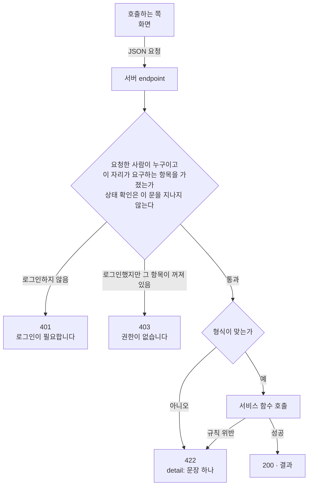

> 문서 버전: 2.0.0 draft

## Abstract

서버가 화면에 여는 endpoint 전체가 따르는 **공통 규칙**을 다룹니다 — 누가 부를 수 있는지를 가르는 문, 잘못된 요청에 답하는 모양, 서버가 살아 있는지 확인하는 자리. 개별 endpoint 가 무엇을 하는지는 각 기능 문서가 맡고, 배정을 계산하고 저장하는 endpoint 는 [기간 자동 배정](./period-assignment/README.md)이 맡습니다.

처음에는 팀·합주실을 **이름으로 직접 적어 보내면 그 자리에서 계산만 하는** `POST /assign` 이 이 문서의 주제였습니다. 저장소가 생기고 화면이 기간 번호 하나로 부르는 endpoint 만 쓰게 되면서, 그 입구와 이름↔번호 번역 계층은 2026-09-08 에 걷어냈습니다(사용자 결정). 로그인만 하면 아무 이름으로나 22초짜리 계산을 돌릴 수 있던 통로도 함께 닫혔습니다.

## Introduction

endpoint 는 열 몇 개이고 각자 하는 일이 다르지만, 셋은 어디서나 같아야 합니다. 요청한 사람을 가려내는 방식이 자리마다 다르면 한 자리의 구멍이 전체의 구멍이 되고, 오류 응답의 모양이 다르면 화면이 모양마다 따로 처리해야 하고, 상태 확인이 실제 상태를 말하지 않으면 죽은 서버가 살아 있다고 보고됩니다. 이 문서는 그 셋을 적습니다.

## Related Work

- [Banblit 개요](../README.md) — 전체 기능 지도
- [계정과 역할](../accounts-and-roles/README.md) — 로그인 세션과, 자리마다 요구하는 권한 항목이 무엇인지
- [기간 자동 배정](./period-assignment/README.md) — 배정을 계산하고 저장하고 되돌리는 다섯 endpoint
- [자동 배정](../auto-assignment/README.md) — 그 endpoint 가 부르는 계산 자체
- [데이터 저장소](../database-layer/README.md) — 상태 확인이 실제로 들여다보는 층
- [개발 환경](../dev-environment/README.md) — 서버가 컨테이너로 뜨는 방식
- [화면](../screens/README.md) — 이 endpoint 들을 실제로 부르는 쪽

## Description

### 누가 부를 수 있는지는 한 자리에서 가릅니다

endpoint 마다 필요한 것을 선언만 합니다 — "로그인한 사람" 또는 "이 항목이 켜진 사람". 실제로 쿠키를 읽어 사람을 찾고 그 사람의 권한 묶음을 합쳐 판정하는 코드는 한 곳뿐이고, 모든 endpoint 가 그 한 곳을 지납니다.

| 요청 | 응답 |
| --- | --- |
| 쿠키가 없거나 세션이 끊김 | 401 · 로그인이 필요합니다 |
| 로그인했지만 그 자리가 요구하는 항목이 꺼져 있음 | 403 · 권한이 없습니다 |
| 통과 | endpoint 본문 |

401 과 403 을 가르는 것은 화면 때문입니다. 401 이면 로그인 화면으로 보내고, 403 이면 그 자리에 머문 채 안내만 합니다. 둘을 합치면 권한이 없는 사람을 로그인 화면으로 보내 "다시 로그인하면 되나" 하고 헤매게 만듭니다.

상태 확인(`/health`)만 이 문을 지나지 않습니다 — 서버가 살아 있는지 묻는 쪽은 사람이 아닙니다.

### 잘못된 요청에는 문장 하나로 답합니다

형식이 틀렸든(필수 항목 누락, 개수 상한 초과) 규칙에 걸렸든(이름 겹침, 정시가 아닌 시각, 집중기간에 예약) 오류 응답의 모양은 하나입니다 — `detail` 에 사람이 읽을 **문장 하나**. 화면은 그 문장을 그대로 보여주면 되고, 오류 종류마다 다른 모양을 다룰 필요가 없습니다.

형식 오류는 프레임워크가 항목별 목록으로 내려주는데, 그것을 문장 하나로 눌러 담는 처리가 앱에 한 겹 있습니다. 규칙 위반은 서비스 함수가 던진 문장을 422 에 그대로 싣습니다.

"요청은 올바르지만 답이 없다"는 오류가 아닙니다. 배정 계산이 조건을 만족하는 시간표를 못 찾으면 200 에 조율안을 담아 돌려줍니다 — 그 갈림은 [기간 자동 배정](./period-assignment/README.md)에 있습니다.

### 상태 확인은 실제 상태를 말합니다

상태 확인 endpoint는 "살아 있다"는 고정된 답을 돌려주지 않습니다. 부를 때마다 저장소에 실제로 접속해 보고 적용된 마이그레이션 번호까지 읽어서 그 결과를 그대로 싣습니다. 접속은 되는데 마이그레이션이 아직 적용되지 않았다면 기동 준비가 끝나지 않은 것이므로 정상이 아니라고 답합니다. 고정된 답을 돌려주는 상태 확인은 아무것도 막지 못하고, 저장소가 죽어 있는 서버에도 계속 요청이 흘러들어갑니다.

저장소에 닿지 못하면 "지금은 못 받는다"고 답합니다. 다섯 종류의 실패를 화면이 구별할 수 있어야 하기 때문입니다.

| 상황 | 응답 | 화면이 해야 할 일 |
| --- | --- | --- |
| 요청이 잘못됨 | 422 | 무엇이 잘못됐는지 사용자에게 보여준다 |
| 로그인하지 않음 | 401 | 로그인 화면으로 보낸다 |
| 로그인했지만 권한이 없음 | 403 | 할 수 없는 일이라고 알린다. 로그인 화면으로 보내지 않는다 |
| 저장소에 닿지 못함 | 503 | 실패를 보여주고 **재시도 버튼**을 준다 |
| 그 밖의 서버 고장 | 500 | 사용자가 할 수 있는 일이 없다 |

503을 받은 화면은 스스로 다시 보내지 않습니다. 자동 재시도를 넣으면 저장소가 이미 힘들어하는 순간에 요청이 몇 배로 늘어나기 때문에, 실패했다는 것과 재시도 버튼을 보여주고 다시 보낼지는 사람이 정하게 했습니다.

기다리는 시간에도 상한이 있습니다. 저장소 접속을 여는 데 기다리는 시간과 이미 열린 접속을 받으려고 기다리는 시간 모두 상한을 뒀는데, 상한이 없으면 저장소가 응답하지 않을 때 요청이 영원히 매달려 그 자체가 장애가 되기 때문입니다. 상한 값은 환경변수로 바꿀 수 있습니다.

접속 실패의 실제 사유에는 접속 주소나 계정 이름 같은 내부 정보가 섞여 있습니다. 화면에는 사람이 읽을 한 문장만 보내고, 원인을 찾을 재료는 기록에 남깁니다.

### 컨테이너에서 서버로 뜹니다

개발할 때는 소스 코드가 연결된 채로 뜨는 서버를 컨테이너로 띄워, 코드를 고치면 서버가 자동으로 다시 뜹니다. 배포용 이미지는 실행 명령 자체가 이 서버를 띄우는 명령으로 되어 있어 이미지를 실행하면 바로 서버가 응답을 받을 준비 상태가 됩니다. 배포용 이미지에는 테스트 도구가 들어가지 않고 실행에 필요한 것만 남깁니다.

개발할 때만 설계 원본을 함께 내보냅니다. 브라우저는 화면을 받아온 곳과 다른 곳에 값을 물으면 막는데, 사람이 실제로 쓰는 앱은 자기 개발 서버에서 뜨고 그 서버가 API 경로만 이쪽으로 넘겨주므로 이 문제를 스스로 풉니다. 이 서버가 따로 내보내는 것은 확정된 설계를 굳혀둔 정적 화면입니다. 옮기는 도중 모양이 어긋났을 때 나란히 놓고 비교할 기준이 필요하기 때문입니다.

이 자리는 화면 폴더를 가리키는 값이 주어지고 그것이 실제 폴더일 때만 만들어집니다. 값이 없는 배포 환경에서는 조건에 걸려 꺼지는 것이 아니라 자리 자체가 생기지 않는데, 개발용 장치가 배포에 딸려 나가지 않게 하는 가장 확실한 방법이라고 봤습니다. 걸어주는 폴더는 읽기 전용이라 서버 쪽에서 화면을 고칠 수 없습니다. 고치는 곳은 언제나 한 곳이어야 하기 때문입니다.

### 어떻게 확인했나

| 테스트 파일 | 커버하는 시나리오 |
| --- | --- |
| `backend/tests/unit/test_api_health.py` | 상태 확인이 의존 대상의 실제 상태를 그대로 싣는지, 하나라도 끊겼을 때 정상이 아니라고 답하는지 |
| `backend/tests/unit/test_api_database_down.py` | 저장소에 닿지 못한 요청이 서버 고장이 아니라 "지금 못 받는 상태"로 답하는지, 그 사유가 기록에는 남고 화면에는 새지 않는지 |
| `backend/tests/integration/db/test_*_endpoints.py` | endpoint 마다 로그인하지 않은 요청은 401 로, 항목이 없는 사람은 403 으로 가르는지 |

옛 `POST /assign` 을 확인하던 테스트 열여섯 개는 endpoint 와 함께 `trash/2026-09-08-refactor/` 로 옮겼습니다. 남은 서버 테스트는 485개입니다.

### 트러블슈팅

**문제 1 — 한글이 든 요청이 서버에서 깨짐**

- **언제**: 컨테이너로 띄운 서버에 배정 요청을 직접 보내 실제로 동작하는지 확인하던 중
- **어디서**: Windows PC의 Git Bash 셸에서 `curl` 명령을 실행하는 과정
- **무엇이 벌어졌나**: 합주실 이름 "1번방"처럼 한글이 포함된 JSON 요청 본문을 작은따옴표로 감싼 인라인 인자(`curl -d '...'`)로 넘겼더니, 서버가 요청 자체를 읽지 못했다는 오류를 돌려줬습니다
- **왜 그런가**: Git Bash가 작은따옴표로 감싼 인라인 인자를 셸 자체적으로 처리하는 과정에서 그 안의 한글 문자를 온전한 UTF-8로 그대로 넘기지 못했고, 그 결과 서버에 도착한 시점에는 이미 올바른 JSON이 아니었습니다. 서버나 계산 로직의 결함이 아니라 셸이 인라인 인자를 다루는 방식에서 생긴 문제입니다
- **어떻게 해결했나**: 요청 본문을 UTF-8로 인코딩된 파일로 먼저 저장한 뒤 `curl`의 `--data-binary @파일이름` 옵션으로 그 파일을 그대로 전송했습니다. 파일 내용은 셸의 인라인 인자 처리 경로를 거치지 않으므로 한글이 깨지지 않습니다
- **남는 영향**: 이후로도 한글이 포함된 요청을 Git Bash에서 직접 검증할 때는 인라인 인자 대신 파일 전달 방식을 씁니다

**문제 2 — 서버를 띄우려는 포트를 다른 프로젝트가 이미 쓰고 있었음**

- **언제**: 개발용 서버를 컨테이너로 띄우려던 시점
- **어디서**: 같은 PC에서 이 저장소와 무관한 다른 프로젝트("infrastructure"라는 이름의 별도 서비스 묶음)가 이미 실행 중이었습니다
- **무엇이 벌어졌나**: 이 서버가 쓰려는 포트를 그 다른 프로젝트의 컨테이너가 먼저 차지하고 있어, 포트를 여는 시도가 "이미 쓰이고 있다"는 오류로 실패했습니다
- **왜 바로 내리지 않았나**: 이 저장소의 규율상, 이 작업과 무관하게 이미 동작 중인 프로그램을 멈추는 것처럼 되돌리기 번거로운 행위를 하기 전에는 반드시 먼저 사용자에게 이유를 설명하고 승인을 받아야 합니다. 그 다른 프로젝트가 멈췄을 때 어떤 영향이 있을지 이 작업만으로는 알 수 없었기 때문에 임의로 내리지 않고 먼저 상황을 보고했습니다
- **어떻게 해결했나**: 사용자에게 상황을 설명하고 승인을 받은 뒤 그 다른 프로젝트의 서비스 묶음을 내려 포트를 비웠고, 이후 이 저장소의 서버가 그 포트를 정상적으로 쓸 수 있었습니다
- **남는 영향**: 이 문제는 이 저장소 코드의 결함이 아니라 개발 환경에서 포트가 겹칠 때 생기는 상황입니다. 같은 포트를 쓰는 다른 프로그램이 실행 중이면 다시 발생할 수 있고, 그때도 같은 절차(원인 확인 → 사용자 승인 → 정리)를 따릅니다

## Conclusion

문을 지나는 방식, 거절하는 모양, 살아 있는지 확인하는 자리 — 이 셋 위에 각 기능의 endpoint 가 얹힙니다. 배정을 실제로 계산하고 저장하는 자리는 [기간 자동 배정](./period-assignment/README.md)으로 이어집니다.
