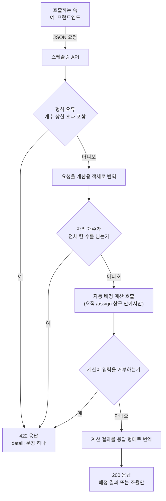

> 문서 버전: 1.2.0 draft



## Abstract

스케줄링 API는 이미 만들어진 자동 배정 계산을 바깥에서 호출할 수 있게 여는 서버 통로다. 이 문서가 다루는 배정 요청(`POST /assign`)은 저장소(데이터베이스)를 거치지 않는다 — 호출하는 쪽이 팀·멤버·합주실·팀당 자리 개수를 요청 한 번에 모두 담아 보내면, 그 자리에서 계산해 배정 결과를 돌려줄 뿐 아무것도 남기지 않는다. 이 계층은 계산 자체를 새로 만들지 않는다. 요청의 형태를 확인하고, 계산이 쓰는 형태로 옮기고, 계산이 끝나면 다시 응답 형태로 옮기는 번역 역할만 한다. 같은 계산을 저장된 데이터로 돌리고 결과까지 저장하는 통로는 별도로 [기간 자동 배정](./period-assignment/README.md)에서 다룬다.

## Introduction

자동 배정 계산은 원래 같은 프로그램 안에서만 부를 수 있는 파이썬 코드였다. 바깥의 다른 프로그램(예: 화면을 보여주는 프런트엔드)이 이 계산을 쓰려면, 네트워크로 요청을 보내고 응답을 받을 수 있는 통로가 있어야 한다. 스케줄링 API는 그 통로다. 통로를 만들면서 계산의 규칙(누구를 어디에 배정할지, 잘못된 입력을 어떻게 거를지)을 다시 만들지 않는 것이 중요하다. 같은 규칙이 두 곳에 따로 있으면 시간이 지나며 서로 어긋나기 쉽다. 그래서 이 계층은 기존 계산이 이미 갖고 있던 규칙을 그대로 재사용하고, 그 위에 얇은 요청·응답 번역만 얹는다.

## Related Work

- [Banblit 개요](../README.md) — 전체 기능 지도
- [자동 배정](../auto-assignment/README.md) — 이 API가 호출하는 계산 로직과 그 규칙
- [합주실과 기간](../practice-room-and-periods/README.md) — 요청에 담기는 합주실·운영 시간의 규칙
- [팀과 소속](../teams/README.md) — 요청에 담기는 팀·멤버 구조
- [기간 자동 배정](./period-assignment/README.md) — 같은 계산을 저장된 데이터로 돌리고, 성공하면 저장까지 잇는 통로

## Description

**두 개의 통로.**

| 통로 | 무엇을 하는가 | 정상 응답 |
| --- | --- | --- |
| 상태 확인 | 서버가 살아 있는지 확인한다 | 상태 문구 |
| 배정 요청 | 팀·멤버·합주실·팀당 자리 개수를 받아 즉시 계산하고 결과를 돌려준다 | 배정 결과(성공 시) 또는 조율안(실패 시) |

**요청 한 번에 모든 정보를 담는다.** 이 계층은 상태를 기억하지 않는다. 저장소가 없으므로, 어제 보낸 팀 명단이나 합주실 설정을 서버가 따로 기억하고 있지 않다. 배정을 계산하려면 매 요청마다 필요한 정보(팀과 그 소속 멤버, 각 멤버의 불가능 시간, 합주실과 운영 시간, 팀당 자리 개수)를 통째로 함께 보내야 한다.

**형태 확인과 번역은 나누어져 있다.** 요청이 들어오면 먼저 형태(숫자여야 할 자리에 문자가 들어왔는지, 필수 항목이 빠졌는지 등)를 확인한다. 형태가 맞으면, 그 값을 계산이 실제로 쓰는 객체로 옮긴다. 계산이 끝나면 그 결과를 다시 응답으로 옮긴다. 이 옮기는 작업 자체는 아무 판단도 하지 않는다 — 값을 그대로 나르기만 한다.

**입력의 옳고 그름은 원칙적으로 계산이 판단한다.** 합주실 이름 중복, 팀 이름 중복, 한 팀 명단에 같은 사람이 중복 등록됨, 자리 개수가 음수, 운영 시간이 30분 단위를 벗어남, 시간대가 붙은 시각처럼 계산이 이미 거부하던 입력은 이 API 계층에서 다시 검사하지 않는다. 계산이 던지는 거부 사유를 그대로 받아, 그 문구를 담아 오류 응답으로 돌려줄 뿐이다. 새로운 검사 규칙을 이 계층에서 따로 만들면, 시간이 지나 계산의 규칙과 API의 규칙이 서로 다른 말을 하게 될 위험이 있기 때문이다.

이 원칙에 예외가 두 가지 있는데, 둘 다 "계산이 시작되기도 전에 감당할 수 없는 규모"를 막기 위한 것이라 계산의 규칙과 겹치지 않는다.

- **요청 자체의 개수 상한.** 팀은 최대 20개, 팀당 멤버는 최대 10명, 합주실은 최대 10개, 멤버당 불가능 시간은 최대 100개까지만 받는다. 이를 넘는 요청은 형식 오류로 취급해 계산을 부르기도 전에 거절한다.
- **자리 개수의 동적 검사.** 팀당 자리 개수(`slots_per_team`)에는 고정 상한이 없다. 대신 요청마다 "요청한 자리 개수(팀 수 × 팀당 자리)"와 "요청에 담긴 합주실 운영시간이 실제로 제공하는 전체 30분 칸 수"를 비교해, 앞의 것이 뒤의 것보다 크면 계산을 부르기 전에 거절한다. 예를 들어 팀 2개가 각각 2칸씩(총 4칸)을 요구하는데 합주실 운영시간이 30분 칸 2개만 제공한다면, 계산에 넘기지 않고 곧바로 "요청한 자리 개수(...)가 운영시간의 전체 칸 수(...)를 넘습니다"라는 문구로 거절한다. 합주실 운영시간 자체가 이미 잘못된 값(30분 격자를 벗어나는 등)이라 칸 수를 셀 수 없는 경우에는, 이 검사를 조용히 건너뛰고 계산의 기존 검증(방 이름을 붙여 알려주는 오류)에 판단을 맡긴다.

**계산 거부 처리는 배정 창구 안에서만 일어난다.** 계산이 던지는 거부 사유를 오류 응답으로 바꾸는 처리는 배정 요청(`POST /assign`) 창구 안에서만 적용된다. 이 창구 밖에서 우연히 같은 종류의 오류가 터지더라도, 그것을 자동으로 "입력이 잘못됐다"는 뜻으로 해석해 오류 응답으로 둔갑시키지 않는다 — 그런 경우는 서버 오류로 남아, 계산 규칙과 무관한 문제를 입력 오류로 잘못 알리는 일이 없게 한다.

**두 가지 실패를 구분한다.** "요청 자체가 잘못됨"과 "요청은 올바르지만 조건을 만족하는 배정을 찾지 못함"은 다른 종류의 실패다.

| 상황 | 응답 |
| --- | --- |
| 요청 형식이 잘못됨(필수 항목 누락·개수 상한 초과·자리 개수가 전체 칸 수 초과 등) | 422 오류 응답 |
| 계산이 입력을 거부함(이름 중복·명단 오류·음수·시간대 등) | 422 오류 응답. 계산이 낸 거부 사유를 그대로 담는다 |
| 계산은 됐지만, 모든 조건을 만족하는 배정이 없음 | 200 정상 응답. 대신 "누구를 빼면 되는지" 조율안을 함께 담는다 |

앞의 두 경우는 부르는 쪽의 실수이므로 오류로 알린다. 마지막 경우는 잘못이 아니라 계산이 낸 정당한 결과이므로, 오류가 아니라 성공 응답 안에 조율안을 담아 돌려준다.

**오류 응답의 모양은 하나로 통일돼 있다.** 형식이 잘못된 오류든, 계산이 거부한 오류든, 화면이 받는 오류 응답은 항상 같은 모양이다 — "무엇이 문제인지"를 담은 문장 하나가 오류 항목 하나에 담겨 온다. 화면 쪽에서 두 가지 오류 모양을 따로 처리할 필요가 없다.

**컨테이너에서 서버로 뜬다.** 개발할 때는 소스 코드가 연결된 채로 뜨는 서버를 컨테이너로 띄워, 코드를 고치면 서버가 자동으로 다시 뜬다. 배포용 이미지는 실행 명령 자체가 이 서버를 띄우는 명령으로 되어 있어, 이미지를 실행하면 바로 서버가 응답을 받을 준비 상태가 된다. 배포용 이미지에는 테스트 도구가 들어가지 않는다 — 실행에 필요한 것만 남긴다.

### TDD 검증

이 계층은 테스트를 먼저 실패시키고, 그 테스트를 통과시키는 최소한의 코드를 작성하는 방식으로 만들었다.

| 테스트 파일 | 커버하는 시나리오 |
| --- | --- |
| `backend/tests/test_api_health.py` | 서버가 뜨고, 상태 확인 요청에 정상 응답하는지 |
| `backend/tests/test_api_mapping.py` | 요청이 계산용 객체로 올바르게 옮겨지는지, 계산이 성공했을 때 결과가 응답 형태로 올바르게 옮겨지는지, 계산이 실패(조율안)했을 때도 올바르게 옮겨지는지 |
| `backend/tests/test_api_assign.py` | 정상 배정 요청이 성공 응답을 받는지, 남은 칸이 예약 가능 자리(open_slots)로 정확히 돌아오는지, 합주실 이름이 겹치는 요청이 오류로 거부되는지, 시간대가 붙은 시각이 오류로 거부되는지, 조건을 만족하는 배정이 없을 때 오류가 아니라 조율안을 담은 정상 응답을 받는지, 팀 개수 상한(20개)을 넘는 요청이 거부되는지, 자리 개수가 운영시간의 전체 칸 수를 넘는 요청이 거부되는지, 배정 창구 밖에서 터진 계산 오류가 422로 둔갑하지 않는지, 형식 오류의 응답도 문장 하나(detail)로 오는지 |

실행 커맨드(저장소 루트에서):

```
docker compose run --rm dev pytest -q
```

이 명령으로 위 세 파일을 포함한 전체 48개 테스트가 통과함을 확인했다. 이 계층만 따로 확인하려면 `docker compose run --rm dev pytest tests/test_api_health.py tests/test_api_mapping.py tests/test_api_assign.py -q`로 범위를 좁힐 수 있다.

### 트러블슈팅

**문제 1 — 한글이 든 요청이 서버에서 깨짐**

- **언제**: 컨테이너로 띄운 서버에 배정 요청을 직접 보내 실제로 동작하는지 확인하던 중
- **어디서**: Windows PC의 Git Bash 셸에서 `curl` 명령을 실행하는 과정
- **무엇이 벌어졌나**: 합주실 이름 "1번방"처럼 한글이 포함된 JSON 요청 본문을 작은따옴표로 감싼 인라인 인자(`curl -d '...'`)로 넘겼더니, 서버가 요청 자체를 읽지 못했다는 오류를 돌려줬다
- **왜 그런가**: Git Bash가 작은따옴표로 감싼 인라인 인자를 셸 자체적으로 처리하는 과정에서 그 안의 한글 문자를 온전한 UTF-8로 그대로 넘기지 못했다. 그 결과 서버에 도착한 시점에는 이미 올바른 JSON이 아니었다. 이는 서버나 계산 로직의 결함이 아니라, 셸이 인라인 인자를 다루는 방식에서 생긴 문제다
- **어떻게 해결했나**: 요청 본문을 UTF-8로 인코딩된 파일로 먼저 저장한 뒤, `curl`의 `--data-binary @파일이름` 옵션으로 그 파일을 그대로 전송했다. 파일 내용은 셸의 인라인 인자 처리 경로를 거치지 않으므로 한글이 깨지지 않았다
- **남는 영향**: 이후로도 한글이 포함된 요청을 Git Bash에서 직접 검증할 때는 인라인 인자 대신 파일 전달 방식을 쓴다

**문제 2 — 서버를 띄우려는 포트를 다른 프로젝트가 이미 쓰고 있었음**

- **언제**: 개발용 서버를 컨테이너로 띄우려던 시점
- **어디서**: 같은 PC에서 이 저장소와 무관한 다른 프로젝트("infrastructure"라는 이름의 별도 서비스 묶음)가 이미 실행 중이었음
- **무엇이 벌어졌나**: 이 서버가 쓰려는 포트를 그 다른 프로젝트의 컨테이너가 먼저 차지하고 있어, 포트를 여는 시도가 "이미 쓰이고 있다"는 오류로 실패했다
- **왜 바로 내리지 않았나**: 이 저장소의 규율상, 다른 프로그램(특히 이 작업과 무관하게 이미 동작 중인 것)을 멈추는 것처럼 되돌리기 번거로운 행위를 하기 전에는 반드시 먼저 사용자에게 이유를 설명하고 승인을 받아야 한다. 그 다른 프로젝트가 멈췄을 때 어떤 영향이 있을지 이 작업만으로는 알 수 없었기 때문에, 임의로 내리지 않고 먼저 상황을 보고했다
- **어떻게 해결했나**: 사용자에게 상황을 설명하고 승인을 받은 뒤, 그 다른 프로젝트의 서비스 묶음을 내려 포트를 비웠다. 이후 이 저장소의 서버가 그 포트를 정상적으로 쓸 수 있었다
- **남는 영향**: 이 문제는 이 저장소 코드의 결함이 아니라 개발 환경에서 포트가 겹칠 때 생기는 상황이다. 같은 포트를 쓰는 다른 프로그램이 실행 중이면 다시 발생할 수 있으며, 그때도 같은 절차(원인 확인 → 사용자 승인 → 정리)를 따른다

## Conclusion

스케줄링 API는 지금은 자동 배정 계산 하나만 바깥으로 열지만, 형태 확인 → 번역 → 계산 호출 → 번역이라는 같은 뼈대 위에서 앞으로 다른 기능(팀·합주실 관리 등)도 같은 방식으로 이어붙일 수 있는 자리다. 이 통로가 실제로 어떤 규칙으로 배정을 계산하는지는 [자동 배정](../auto-assignment/README.md)에서 이어진다.
