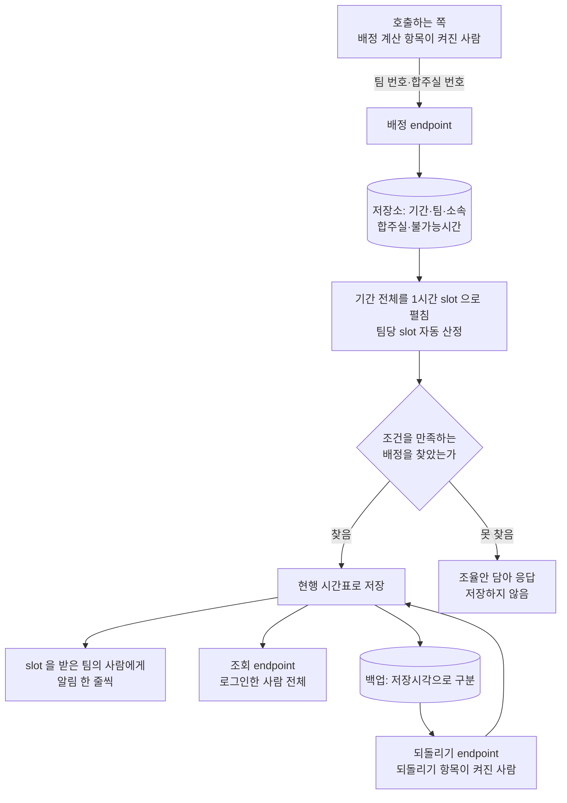

> 문서 버전: 2.0.0 draft



## Abstract

기간 자동 배정은 이미 저장된 기간·팀·소속·합주실·불가능시간 데이터를 읽어 그 기간 전체의 시간표를 계산하고 저장까지 잇는 endpoint입니다. 호출하는 쪽은 배정할 팀과 합주실의 번호만 보내면 되고, 나머지(어느 날짜까지 짤지, 팀마다 몇 slot씩 줄지, 화면에 보일 이름을 어디서 가져올지)는 저장된 데이터로부터 이 계층이 채웁니다. 계산이 성공하면 그 자리에서 현행 시간표로 저장하고, 실패하면 오류가 아니라 조율안을 담아 알립니다. 짜기·조회·되돌리기 세 endpoint가 이 흐름을 이룹니다.

## Introduction

앞서 [스케줄링 API](../README.md)는 요청 한 번에 팀·멤버·합주실 정보를 통째로 실어 보내야 계산할 수 있었습니다. 실제 운영에서는 그 정보가 이미 데이터베이스에 있으므로 매번 다시 실어 보내는 일은 번거롭고 실수의 여지도 큽니다. 이 계층은 그 정보를 저장된 곳에서 직접 읽어, 기간 하나를 지정하는 것만으로 계산이 돌아가게 합니다.

여기서 풀어야 할 것이 세 가지였습니다. 첫째, 계산 엔진은 "기간"이라는 개념을 모르고 하루치 운영시간과 팀 목록만 받으므로 기간의 시작일부터 종료일까지 여러 날을 계산 엔진이 다룰 수 있는 형태로 펼쳐야 합니다. 둘째, 계산 엔진은 번호만 다루고 이름은 아예 받지 않으므로 저장소의 번호를 그대로 넘기고 결과가 나오면 화면에 보일 이름을 그때 붙여야 합니다. 셋째, 계산이 성공한 시간표를 그냥 버려두면 다시 조회할 방법이 없으므로 성공한 결과는 곧바로 저장해야 하고, 그 저장은 [배정 이력과 롤백](../../database-layer/schedule-versioning/README.md)이 이미 정해 둔 백업·롤백 규칙을 그대로 탑니다.

## Related Work

- [스케줄링 API](../README.md) — 이 계층이 재사용하는 계산 호출·오류 응답 규칙의 상위 맥락
- [배정 이력과 롤백](../../database-layer/schedule-versioning/README.md) — 저장·백업·롤백의 실제 규칙. 이 계층은 그 규칙을 부르기만 한다
- [자동 배정](../../auto-assignment/README.md) — 계산 엔진 자체의 배정·조율안 규칙
- [계정과 역할](../../accounts-and-roles/README.md) — 세 endpoint가 요청한 사람을 가려내는 근거와, 자리마다 요구하는 권한 항목
- [합주실과 기간](../../practice-room-and-periods/README.md) — 기간의 종류와 "매일" 옵션의 뜻
- [데이터 저장소](../../database-layer/README.md) — 팀·소속·불가능시간·합주실이 저장되는 테이블 구조
- [화면](../../screens/README.md) — 이 세 endpoint를 실제로 부르는 배정 결과 화면

## Description

### endpoint는 다섯입니다

| endpoint | 무엇을 하는가 | 부를 수 있는 사람 | 정상 응답 |
| --- | --- | --- | --- |
| 배정 | 팀 번호 목록과 합주실 번호 목록을 받아, 그 기간 전체의 시간표를 계산하고 성공하면 저장한다 | 배정 계산 항목이 켜진 사람 | 배정 결과(성공 시) 또는 조율안(실패 시) |
| 조회 | 그 기간에 현재 저장된 시간표를 실제 팀 이름·합주실 이름과 함께 돌려준다 | 로그인한 사람 전체 | 저장된 배정 행 목록(없으면 빈 목록) |
| 되돌리기 | 그 기간의 가장 최근 백업으로 현행 시간표를 되돌린다 | 되돌리기 항목이 켜진 사람 | 되돌렸는지 여부 |
| 회차 목록 | 그 기간에 밀려나 있는 백업 회차를 저장 시각과 칸 수로 최신순으로 준다 | 되돌리기 항목이 켜진 사람 | 회차 목록(없으면 빈 목록) |
| 회차 시간표 | 회차 하나의 저장 시각을 받아, 그때의 시간표를 실제 이름과 함께 준다 | 되돌리기 항목이 켜진 사람 | 그 회차의 배정 행 목록 |

시간표를 실제로 바꾸는 두 endpoint는 자기 항목이 켜진 사람에게만 열고, 이미 확정된 시간표를 읽는 endpoint는 로그인한 사람 전체에게 엽니다. 두 endpoint가 서로 다른 항목을 요구하므로 계산은 못 돌리고 되돌리기만 맡은 사람을 둘 수 있습니다. 항목이 무엇이고 어떻게 켜고 끄는지는 [계정과 역할](../../accounts-and-roles/README.md)이 정본이고, 계산이 끝났는지 되묻는 자리까지 포함한 전체 규칙과 401·403을 가르는 이유는 [스케줄링 API](../README.md)에 있습니다.

다섯 endpoint 모두 기간 번호 하나를 기준으로 움직입니다. 배정 endpoint는 집중 합주기간에서만 실행할 수 있고, 그 밖의 기간에는 자동 배정 자체가 적용되지 않으므로 계산 전에 거부합니다.

### 기간 전체를 날짜와 합주실로 펼칩니다

배정 대상 날짜는 기간의 시작일부터 종료일까지 양 끝을 포함한 모든 날입니다. 기간에는 "매일" 옵션이 따로 있는데, 이 옵션은 집중 합주기간을 늘 열린 것처럼 계속 돌리는 운영 방식을 가리키는 값일 뿐 이번에 배정할 날짜를 고르는 값이 아닙니다. 이 옵션이 켜진 기간은 예약도 막지 않습니다 — 자동 배정을 돌리면서 남는 칸은 그대로 예약으로 열립니다. 그래서 이 계산은 "매일" 옵션을 보지 않고 오직 시작일·종료일만으로 날짜 목록을 만듭니다.

날짜 목록이 정해지면 요청에 담긴 합주실 하나하나를 그 날짜 수만큼 늘립니다. 계산 엔진은 한 합주실에 이어진 운영시간 하나만 줄 수 있어서, 같은 합주실이라도 날짜가 다르면 서로 다른 합주실처럼 계산에 넘겨야 하기 때문입니다. 예를 들어 합주실이 2개, 기간이 2주(14일)면 계산 엔진에는 28개의 합주실이 들어갑니다. 이렇게 늘어난 합주실 각각의 운영시간을 1시간 slot으로 나눈 것이 그 기간의 전체 slot입니다.

팀당 slot 개수는 전체 slot 수를 팀 수로 나눠 자동으로 정하고, 나눈 나머지는 그냥 남는 slot이 됩니다. 팀 수가 전체 slot 수보다 많아 팀마다 한 slot도 줄 수 없는 경우에는 계산을 아예 시작하지 않고 그 자리에서 거부하고, 배정할 팀이 하나도 없는 요청도 같은 방식으로 거부합니다.

### 저장소의 번호를 그대로 계산에 넘깁니다

계산 엔진은 팀·합주실·사람을 번호로만 가립니다. 이 계층은 저장소를 읽으므로 넘길 번호가 이미 있어서 별도의 표시를 지어낼 필요가 없습니다.

```
저장소                        계산                       응답
합주실 7번 "1번방"     ──►    합주실 7 × 날짜마다   ──►   7번 + "1번방"
사람 12번 "김민수"     ──►    사람 12              ──►   12번 + "김민수"
사람 34번 "김민수"     ──►    사람 34              ──►   34번 + "김민수"
```

동명이인은 저장소에서 이미 다른 번호이므로 계산에서도 다른 사람입니다. 같은 사람이 여러 팀에 속해 있으면 번호가 하나뿐이라, 계산은 그 사람이 겹치는 시간에 두 팀을 동시에 뛸 수 없다는 것을 알아챕니다.

같은 합주실이 날짜마다 다시 쓰이는 것도 번호를 나눌 이유가 되지 않습니다. 한 slot은 합주실 번호와 시작 시각 두 값이 함께 가리키므로, 같은 합주실이라도 날짜가 다르면 slot도 다릅니다. 이름은 계산에 들어가지 않고, 결과를 돌려줄 때 저장소에서 읽어 둔 이름을 번호에 붙여 내보냅니다.

멤버가 등록한 불가능시간 중 매주 반복으로 표시된 것은 그 기간 안에서 실제로 걸리는 구간들로 풀어서 계산에 넘깁니다. 반복은 7일 간격으로 되풀이하되 반복 종료일이 정해져 있으면 그 날짜까지만 만들고, 기간과 하나도 겹치지 않는 구간은 만들지 않습니다. 계산에 넘겨도 아무 영향이 없는 값을 굳이 넘길 이유가 없기 때문입니다.

### 성공하면 즉시 저장하고, 실패하면 조율안을 돌려줍니다

계산이 조건을 만족하는 시간표를 찾으면 그 자리에서 곧바로 현행 시간표로 저장합니다. 저장은 [배정 이력과 롤백](../../database-layer/schedule-versioning/README.md)의 규칙을 그대로 따라서, 그 기간에 이미 저장된 시간표가 있으면 저장시각을 찍어 백업으로 밀어내고 백업은 최근 두 회차만 남깁니다. 계산이 조건을 만족하는 시간표를 찾지 못하는 것은 오류가 아니므로, 아무것도 저장하지 않고 "누구를 빼면 되는지" 조율안을 담아 정상 응답으로 돌려줍니다.

되돌리기는 새로운 규칙을 만들지 않고, 그 기간의 가장 최근 백업을 현행 시간표로 되돌리는 저장 규칙을 그대로 부를 뿐입니다. 되돌릴 백업이 없으면 아무것도 바꾸지 않고 "되돌린 것이 없다"고만 알립니다.

### 밀려난 회차를 눌러 그때 시간표를 봅니다 (2026-09-08)

되돌리기는 언제나 **바로 직전 회차**로만 갑니다. 어느 회차로 갈지 고르는 길은 없습니다. 그래서 되돌리기 전에 "직전 회차가 어떤 시간표였는지"를 볼 수 있어야 합니다 — 그러지 않으면 되돌린 뒤에야 무엇으로 돌아왔는지 알게 됩니다.

회차를 가리키는 값은 **저장 시각**입니다. 백업에는 따로 회차 번호가 없고, 한 번에 밀려난 칸들이 같은 저장 시각을 공유합니다. 그 시각으로 묶어 꺼내면 그때의 시간표 한 벌이 됩니다.

```
회차 목록          회차 시간표
─────────────      ─────────────────────────
9월 8일 21:00  ──▶  1번방 19:00 새벽 네시
 (칸 12개)          1번방 20:00 파랑주의보
                    2번방 19:00 오프비트  …
9월 7일 21:00
 (칸 10개)
```

**칸이 하나도 없는 회차는 없는 회차입니다.** 빈 시간표가 저장되는 일이 없으므로, 그 저장 시각으로 아무것도 나오지 않으면 "빈 회차"가 아니라 "그런 회차가 없다"는 뜻입니다. 빈 목록을 돌려주면 화면이 "그 회차에는 합주가 없었다"로 그리게 되므로, 그 자리에서 거절합니다.

두 endpoint 모두 **되돌리기와 같은 항목**으로 막습니다. 목록에서 이어지는 화면이라 자격이 갈리면 목록만 보이고 눌러도 열리지 않는 상태가 됩니다.

### 시간표를 바꾼 뒤에는 알림을 남깁니다 (2026-09-07)

이 계층에서 시간표가 실제로 바뀌는 자리는 셋입니다. 배정이 성공해 저장될 때, 조율안 하나를 골라 확정해 저장될 때, 되돌리기가 이전 회차를 되살렸을 때입니다. 그 셋 모두에서 그 기간에 slot을 받은 팀의 사람에게 알림 한 줄이 남습니다.

```
배정 계산  ─┐
조율안 확정 ─┼─▶ 저장이 실제로 됐다  ─▶  slot 을 받은 팀의 사람에게 알림
되돌리기   ─┘        │
                     └─ 안 됐다 (조율안만 나옴 · 되돌릴 회차 없음) ─▶ 아무것도 안 남긴다
```

배정과 조율안 확정은 같은 접수 자리를 씁니다. 조율안 확정은 "그 사람을 뺀 채로 같은 계산을 다시 돌리는 것"이라 저장 경로가 하나로 유지되고, 그래서 알림을 남기는 자리도 하나뿐입니다. 되돌리기는 계산을 거치지 않는 별개의 길이라 그 자리에서 따로 남깁니다.

누구에게 남는지, 왜 저장이 된 때만 남기는지, 스스로 도는 계산과 순서가 어떻게 다른지는 [자동 배정](../../auto-assignment/README.md)이 정본입니다. 이 계층이 더하는 것은 "사람이 눌러 바꾼 것도 스스로 바뀐 것과 똑같이 알린다"는 것 하나입니다.

### 거부하는 경우

배정 계산을 시작하기 전에 다음 입력은 거부합니다.

| 입력 | 거부 사유 |
| --- | --- |
| 그런 기간·팀·합주실 번호가 없음 | 존재하지 않는 대상을 배정할 수 없다 |
| 집중 합주기간이 아닌 기간에 배정을 요청함 | 자동 배정은 집중 합주기간에서만 돈다 |
| 팀 번호 목록에 같은 번호가 두 번 들어옴 | 조용히 하나로 합쳐지면 실제로 몇 팀이 배정 대상인지 알 수 없게 된다 |
| 합주실 번호 목록에 같은 번호가 두 번 들어옴 | 위와 같은 이유 |
| 팀마다 한 slot도 줄 수 없을 만큼 slot이 모자람 | 계산 자체가 의미 없는 요청이다 |
| 소속 멤버가 없는 팀이 포함됨 | 아무도 없는 팀에 slot을 줄 수 없다 |

계산까지 끝난 뒤 저장하는 시점에 걸리는 거부도 하나 있습니다. 다른 기간이 이미 같은 합주실의 같은 시각을 현행 시간표로 쓰고 있으면 저장이 거부되는데, 두 기간의 날짜가 겹치고 같은 합주실을 함께 쓰면 벌어질 수 있는 상황입니다. 이 경우 기간을 겹치지 않게 하거나 합주실을 나누라는 안내와 함께 거부하고, 먼저 저장돼 있던 다른 기간의 현행 시간표는 그대로 남으며 이번 요청만 실패로 처리됩니다.

### TDD로 검증했습니다

이 계층도 실패하는 테스트를 먼저 세운 뒤 통과시키는 방식으로 만들었습니다.

| 테스트 파일 | 커버하는 시나리오 |
| --- | --- |
| `test_period_input.py` | 기간의 모든 날짜를 빠짐없이 포함하는지, 불가능시간의 매주 반복이 기간 안에서 올바르게 풀리는지(반복 종료일·기간 경계에 걸친 구간·반복 없음 포함), 합주실이 날짜 수만큼 저장소 번호를 그대로 달고 늘어나는지, 이름이 같은 두 합주실이 번호로 갈리는지, 팀당 slot 개수가 전체 slot ÷ 팀 수로 정해지는지, slot이 모자라거나 배정할 팀이 없을 때 거부되는지, 동명이인이 서로 다른 번호로 갈리고 같은 사람이 여러 팀에서는 같은 번호를 유지하는지, 불가능시간이 그 사람이 속한 모든 팀에 따라붙는지 |
| `test_period_service.py` | 성공한 배정이 현행 시간표로 저장되는지(방·팀·시각까지 왕복 확인), 실패한 배정이 아무것도 저장하지 않고 제외 대상 이름을 정확히 담는지, 집중이 아닌 기간·존재하지 않는 기간/팀/합주실·소속 없는 팀·중복 번호가 거부되는지, 재배정이 이전 시간표를 백업으로 넘기는지, 실패한 재배정이 현행 시간표를 그대로 보존하는지, 겹치는 기간이 같은 합주실·시각을 다투면 오류로 거부되면서 먼저 저장된 기간은 그대로 남는지, 2주 × 합주실 2개 × 팀 4개 규모가 끝까지 계산되는지 |
| `test_period_endpoints.py` | 조회 응답이 아직 배정이 없을 때 빈 목록을 주는지, 저장된 배정을 실제 팀·합주실 이름과 함께 돌려주는지, 다른 기간의 배정이 섞이지 않는지, 배정 요청이 성공하면 저장되고 응답에도 실제 이름이 담기는지, 남는 slot이 실제 합주실 이름으로 돌아오는지, 배정 실패 시 제외 인원과 조율안이 실제 이름으로 돌아오는지, 존재하지 않는 팀·집중이 아닌 기간이 거부되는지, 되돌리기가 정확히 직전 회차로 돌아가고 그보다 오래되거나 더 최신인 회차와는 구별되는지, 백업이 없을 때 되돌리기가 아무것도 바꾸지 않고 알리는지, 다른 기간이 그 자리를 차지한 뒤의 되돌리기가 서버 오류가 아니라 안내와 함께 거부되는지, 로그인하지 않은 조회가 401로 거절되는지, 배정과 되돌리기가 로그인하지 않은 요청은 401로·그 항목이 없는 사람의 요청은 403으로 가려 거절하고 항목을 가진 사람만 통과시키는지 |
| `test_db_engine.py` | 접속 주소가 설정되지 않았을 때 즉시 실패하는지, 같은 주소로 두 번 물었을 때 접속 뭉치를 새로 만들지 않고 같은 것을 다시 주는지 |

실행 커맨드(저장소 루트에서):

```
docker compose run --rm dev pytest tests/unit/test_period_input.py tests/integration/db/test_period_service.py tests/integration/db/test_period_endpoints.py -q
```

전체 스위트 기준으로는 468개가 통과합니다:

```
docker compose run --rm dev pytest -q
```

타입 표기는 `docker compose run --rm --no-deps dev mypy` 로 따로 확인하며, 94개 파일에서 이상이 없습니다.

### 성능을 함께 쟀습니다

2주(14일) × 합주실 2개 × 팀 4개 규모의 배정 계산이 실제로 끝까지 도는지와 얼마나 걸리는지를 같은 테스트로 함께 확인했습니다. 이 규모는 하루 4시간씩 운영하는 합주실 2개를 2주 동안 4개 팀이 나눠 쓰는 상황에 해당합니다.

측정은 `pytest`의 `--durations` 옵션으로 했습니다. 이 옵션은 테스트가 끝난 뒤 실행 시간이 긴 테스트부터 순서대로 나열해 보여주는데, `--durations=5`처럼 숫자를 주면 가장 느린 5개만 보여주고 옵션을 생략하면 이 목록 자체가 출력되지 않습니다.

```
docker compose run --rm dev pytest -q --durations=5
```

이 규모의 배정 테스트 하나가 계산에 쓴 시간은 0.08초였고, 같은 실행에서 전체 테스트는 2초 남짓에 끝났습니다. 계산 규모가 실제 운영에서 쓰일 만한 크기(2주·합주실 여러 개·팀 여러 개)일 때도 응답을 기다리는 데 문제가 없는 수준입니다.

### 트러블슈팅

**문제 1 — 실제로는 겹치지 않는 합주실 이름을 겹친다고 오판함**

- **언제**: 합주실 × 날짜 펼치기를 구현하던 중, 방어 차원에서 "생성된 표시가 다른 합주실의 원래 이름과 우연히 같아지는 경우"까지 막는 검사를 추가한 직후
- **어디서**: 합주실 이름에 날짜 꼬리표를 붙이는 부분
- **무엇이 벌어졌나**: 예를 들어 "1번방"이라는 합주실과 "1번방 (2026-08-01)"이라는 합주실이 함께 요청에 들어오면 앞의 합주실이 8월 1일에 만드는 표시("1번방 (2026-08-01)")가 뒤의 합주실의 원래 이름과 글자 그대로 같아집니다. 이를 막으려고 만든 검사가 이런 입력을 전부 "이름이 겹친다"며 거부했습니다
- **왜 그런가**: 실제로 계산 엔진에 넘어가는 표시는 "1번방 (2026-08-01)"과 "1번방 (2026-08-01) (2026-08-01)"로 서로 완전히 다릅니다. 날짜 꼬리표는 길이가 항상 고정이고 합주실 이름은 저장 단계에서 이미 서로 달라야 하는 값이라 두 합주실의 표시가 실제로 같아질 방법이 없어서, 겹칠 수 없는 경우를 겹친다고 잘못 판단한 오탐이었습니다
- **어떻게 해결했나**: 이 방어 검사를 지웠습니다. 실제로 표시끼리 같아지는 입력을 재현할 수 없다는 것을 확인한 뒤, 오히려 "겹쳐 보이지만 거부되면 안 되는" 입력을 테스트로 남겨 앞으로 같은 오판이 되살아나지 않게 했습니다
- **남는 영향**: 없습니다. 이후 계산 엔진이 이름 대신 저장소의 번호를 그대로 받도록 바뀌면서 날짜 꼬리표 자체가 사라졌고, 이 문제가 속한 부류도 함께 없어졌습니다

**문제 2 — 기간이 겹치는 두 요청이 저장 단계에서 500 오류로 노출됨**

- **언제**: 다른 기간이 이미 같은 합주실·같은 시각을 쓰고 있을 때의 동작을 검증하던 중
- **어디서**: 계산이 끝난 배정 결과를 현행 시간표로 저장하는 부분
- **무엇이 벌어졌나**: 두 집중 합주기간의 날짜가 겹치고 같은 합주실을 함께 배정 대상으로 지정하면 저장 시점에 "합주실 + 시작시각" 중복을 막는 제약에 걸렸고, 이 제약 위반이 그대로 처리되지 않고 서버 내부 오류(500)로 드러났습니다
- **왜 그런가**: 저장 계층의 중복 방지 제약은 [데이터 저장소](../../database-layer/README.md)가 이미 정해 둔 안전장치인데, 이 계층은 그 제약이 걸릴 수 있는 상황을 미리 걸러내지 않고 있었습니다. 사용자가 실제로 만들 수 있는 입력 실수인데도 그 실수를 알려주는 대신 원인을 알 수 없는 서버 오류로 돌려주고 있었던 것입니다
- **어떻게 해결했나**: 저장 중 이 제약 위반이 나면 그 자리에서 되돌리고(롤백), "다른 기간이 이미 같은 합주실의 같은 시간을 쓰고 있다"는 문구와 함께 사용자 오류로 바꿔 응답합니다. 같은 김에 요청에 같은 팀·합주실 번호가 중복으로 들어오면 조용히 하나로 합쳐지던 것도 미리 거부하도록 함께 정리했습니다
- **남는 영향**: 겹치는 기간이 같은 합주실을 함께 지정하는 요청은 이제 사용자 오류로 안내되고, 먼저 저장된 기간의 현행 시간표는 이 실패로 인해 바뀌지 않습니다

**문제 3 — 요청마다 데이터베이스 접속 뭉치를 새로 만들고 있었음**

- **언제**: 세 endpoint를 다 만든 뒤 전체를 한 번에 검토하던 중
- **어디서**: 엔드포인트가 요청마다 DB 세션을 받아 오는 부분
- **무엇이 벌어졌나**: 요청이 들어올 때마다 접속 설정을 처음부터 다시 만들고 있었습니다. 접속 설정 하나에는 여러 개의 실제 접속을 담아 두는 주머니가 딸려 있어서 요청이 쌓이면 쓰지도 않는 접속이 계속 늘어나고, 결국 데이터베이스가 받아줄 수 있는 접속 수를 넘겨 서버가 멈춥니다
- **왜 그런가**: 접속 설정을 만드는 부분은 원래 "부를 때마다 새로 만든다"는 전제로 쓰인 것이었고, 요청마다 불리는 자리에 그대로 갖다 쓰면서 문제가 생겼습니다. 모든 테스트가 이 부분을 테스트 전용 접속으로 갈아끼우기 때문에 실제로는 한 번도 실행된 적이 없어 테스트로는 드러나지 않았습니다
- **어떻게 해결했나**: 접속 설정을 한 번만 만들어 두고 다시 부를 때는 같은 것을 돌려주도록 바꿨습니다. "설정이 없으면 즉시 실패한다"는 기존 규칙은 그대로 유지했고, 두 동작을 모두 확인하는 테스트를 새로 만들었습니다
- **남는 영향**: 없습니다. 다만 접속 설정이 한 벌만 존재하게 되었으므로 나중에 접속 주소를 도중에 바꿔야 할 일이 생기면 그 부분을 다시 살펴야 합니다

**문제 4 — 되돌리기에도 같은 500 오류가 남아 있었음**

- **언제**: 문제 2를 고친 뒤 전체를 한 번에 검토하던 중
- **어디서**: 되돌리기 endpoint
- **무엇이 벌어졌나**: 문제 2에서 배정 endpoint에는 보호를 넣었는데 형제 endpoint인 되돌리기에는 옮기지 않아서, 다른 기간이 그 합주실·그 시각을 차지한 뒤에 되돌리기를 부르면 똑같이 서버 오류가 났습니다
- **왜 그런가**: 되돌리기도 결국 같은 저장 자리에 이전 시간표를 다시 써 넣는 일이라 배정과 완전히 같은 제약에 걸립니다. 한쪽만 고치면 다른 쪽이 남는다는 것을 처음에 보지 못했습니다
- **어떻게 해결했나**: 두 endpoint가 같은 판별과 같은 안내 문구를 쓰도록 한군데로 모았습니다. 아울러 문제 2에서 넣은 판별이 다른 원인의 저장 실패까지 같은 안내로 뭉개고 있었으므로, 실제로 어떤 상황에서 무엇이 담기는지 컨테이너에서 직접 확인해 판별을 좁혔습니다
- **남는 영향**: 데이터베이스가 알려주는 정보만으로는 "다른 기간이 차지함"과 "같은 기간에 대해 두 요청이 동시에 저장을 시도함"을 구분할 수 없다는 것을 확인했습니다. 그래서 안내 문구를 두 경우 모두에 맞도록 썼고, 완전한 구분은 다루지 않았습니다

## Conclusion

기간 자동 배정은 저장된 기간·팀·합주실 데이터를 계산 엔진이 요구하는 형태로 펼치고 되돌리는 번역 작업과, 성공한 결과를 곧바로 저장하는 연결 작업으로 이루어집니다. 계산의 규칙은 [자동 배정](../../auto-assignment/README.md)에서, 저장의 규칙은 [배정 이력과 롤백](../../database-layer/schedule-versioning/README.md)에서 각각 그대로 가져다 쓸 뿐, 이 계층이 새로 만드는 규칙은 날짜·이름을 펼치고 되돌리는 부분과 팀당 slot을 자동으로 정하는 부분뿐입니다.
