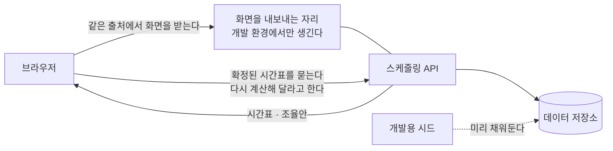

> 문서 버전: 1.0.0 draft



## Abstract

화면 프로토타입은 확정된 화면 설계를 실제로 브라우저에서 열어보고, 그 화면이 서버가 정말 돌려주는 값으로 그려지는지 확인하기 위한 자리다. 화면마다 두 벌을 둔다 — 설계를 그대로 굳혀둔 **원본**과, 그 원본에서 박아둔 예시 데이터만 걷어내고 서버 응답으로 갈아끼운 **실물 사본**이다. 사본은 마크업과 색·간격을 원본에서 한 글자도 바꾸지 않고 데이터가 들어오는 통로만 바꿔 끼운다. 아직 통로가 없는 정보는 화면이 임시로 메우거나 "미연동"이라고 스스로 밝힌다.

## Introduction

설계를 그림으로만 확정하면 두 가지를 놓친다. 하나는 서버가 실제로 돌려주는 값의 모양이 화면이 기대하는 모양과 다를 때이고, 다른 하나는 화면에 꼭 필요한데 아직 아무도 만들지 않은 정보가 무엇인지다. 이 둘은 실제 서버에 붙여보기 전에는 드러나지 않는다.

그래서 설계 화면을 굳혀둔 채로 사본을 하나 더 만들어, 그 사본만 서버에 물렸다. 사본을 돌려보면 "이 화면을 완성하려면 무엇이 더 필요한가"가 목록으로 남는다. 그 목록이 이 문서에서 가장 값진 부분이며, 다음에 만들 통로의 순서를 정하는 근거가 된다.

원본을 남겨두는 이유는 사본이 실험을 하다 망가져도 설계의 정본이 흔들리지 않게 하기 위해서다. 설계가 무엇이었는지는 언제나 원본이 답한다.

## Related Work

- [Banblit 개요](../README.md) — 전체 기능 지도
- [개발용 시드 데이터](./dev-seed/README.md) — 이 화면들이 띄울 데이터를 미리 채워두는 하위 기능
- [스케줄링 API](../scheduling-api/README.md) — 화면이 값을 받아오는 통로이자, 개발 환경에서 이 화면들을 함께 내보내는 쪽
- [기간 자동 배정](../scheduling-api/period-assignment/README.md) — 배정 화면이 부르는 "다시 계산"과 "확정된 시간표"의 실체
- [스케줄러](../scheduler/README.md) — 달력 화면의 설계 정본
- [자동 배정](../auto-assignment/README.md) — 배정 화면이 보여주는 계산 결과의 규칙
- [계정과 역할](../accounts-and-roles/README.md) — 로그인 화면 다섯 벌이 따르는 규칙

## Description

### 두 벌로 나눈다

```
원본  ──(마크업·색·간격을 그대로 복사)──▶  실물 사본
 │                                          │
 │ 예시 데이터가 화면 안에 박혀 있다          │ 데이터 담당을 따로 떼어 서버에 물렸다
 │ 서버 없이도 열린다                        │ 서버가 떠 있어야 뜻이 있다
 ▼                                          ▼
설계가 무엇이었는지의 정본                    설계가 실제로 성립하는지의 확인
```

사본에서 바뀌는 것은 **데이터가 어디서 오는가** 하나뿐이다. 화면의 생김새를 건드리면 "설계대로 그려지는가"라는 질문에 답할 수 없게 되므로, 생김새는 손대지 않는 것이 규칙이다.

### 지금 있는 화면

| 화면 | 무엇을 보여주나 | 서버에 물렸나 |
| --- | --- | --- |
| 랜딩 | 서비스 소개 | 물릴 것이 없다 |
| 계정 | 로그인·가입·아이디 찾기·비밀번호 찾기·비밀번호 재설정 | 아직 — 입력 검사만 화면 안에서 돈다 |
| 스케줄러 | 달력에 확정된 합주 일정 | 예 — 저장된 시간표를 읽어 그린다 |
| 배정 결과 | 확정된 시간표와 조율안, 다시 계산 | 예 — 읽고, 다시 계산하고, 결과를 받는다 |

### 계정 화면은 다섯 벌이 한 자리를 나눠 쓴다

왼쪽 사진은 화면에 붙박이로 두고 오른쪽 서식만 갈아 끼운다. 사진이 자리를 지키므로 화면을 오갈 때 흔들림이 없다.

```
┌────────────────────────────┬──────────────┐
│                            │   로그인      │
│                            │   회원가입    │  ← 다섯 중 하나만 보인다
│         사진 (붙박이)       │   아이디 찾기 │
│                            │   비밀번호 찾기│
│                            │   비밀번호 재설정│
└────────────────────────────┴──────────────┘
       사진 2 : 서식 1 로 나눈다
```

사진을 화면 문서 안에 글자로 박아두었던 것을 파일 참조로 돌려, 문서가 열 배 가까이 가벼워졌다. 화면 문서는 사람이 읽고 고치는 것인데 그림 데이터가 안에 박혀 있으면 열어보기조차 어려워지기 때문이다. 그림 파일 자체도 원본 그대로가 아니라 화면에 필요한 만큼만 줄인 것을 쓴다.

비밀번호 재설정은 비밀번호 찾기에서 본인 확인이 끝났을 때 이어지는 자리다. 다섯 화면은 서로를 오가는 링크로 이어져 있어, 사람이 막다른 곳에 갇히지 않는다.

### 서버가 화면을 함께 내보낸다

브라우저는 화면을 받아온 곳과 다른 곳에 값을 물으려 하면 막는다. 그래서 화면 파일을 브라우저로 직접 열면 사본이 서버에 아무것도 물을 수 없다. 이 문제를 푸는 가장 간단한 방법은 **화면을 API와 같은 곳에서 내보내는 것**이다.

개발 환경에서는 화면 폴더를 서버에 읽기 전용으로 걸어주고, 서버는 그 폴더를 가리키는 값이 실제 폴더일 때만 화면을 내보내는 자리를 만든다. 그 값이 없는 배포 환경에서는 이 자리가 **아예 생기지 않는다** — 조건을 걸어 끄는 것이 아니라, 만들지 않는다. 개발용 장치가 배포에 딸려 나가지 않게 하는 가장 확실한 방법이기 때문이다.

읽기 전용으로 거는 것도 같은 이유다. 서버 쪽에서 이 화면들을 고칠 수 있으면 어느 쪽이 정본인지 흐려진다. 고치는 곳은 언제나 개발자의 컴퓨터 한 곳이고, 서버는 그것을 읽어 내보내기만 한다.

### 화면이 스스로 메우는 자리

사본을 서버에 물려보니, 화면이 필요로 하는데 통로가 없는 정보가 드러났다. 화면은 그 자리를 임시로 메우거나, 메울 수 없으면 사람에게 "미연동"이라고 밝힌다. **이 표가 다음에 만들 통로의 목록이다.**

| 화면이 필요로 하는 것 | 지금 어떻게 메우는가 |
| --- | --- |
| 집중 합주기간의 목록 | 시드가 넣은 번호를 화면에 적어두고 그것만 부른다 |
| 합주실 여닫는 시각 | 실제로 잡힌 배정의 가장 이른 시각과 가장 늦은 시각을 경계로 삼는다 |
| 집중기간의 날짜 범위 | 배정이 걸쳐 있는 날짜의 처음과 끝으로 대신한다 |
| 팀별 명단 | 비워 두고 화면에서 미연동이라고 알린다 |
| 내가 속한 팀 | 로그인이 없어 앞의 두 팀을 내 팀으로 가정한다 |
| 팀·합주실의 전체 목록 | 확정된 시간표에 나온 번호를 뽑아 쓰고, 그것도 비면 시드가 넣은 번호를 쓴다 |
| 지난 계산 이력 | 되돌리는 통로는 있지만 "어느 회차로" 를 고를 목록이 없어 화면을 붙이지 않았다 |
| 계산이 자동으로 도는 시각 | 읽고 쓸 통로가 없어 그 자리를 잠가 두었다 |
| 예약과 못 나오는 시간 | 주고받을 통로가 없어 브라우저 안에만 남는다 — 새로 고치면 사라진다 |

메우는 방식에는 공통점이 있다. **이미 받아온 값에서 뽑아낼 수 있으면 뽑아내고, 그럴 수 없을 때만 화면에 적어둔 값을 쓴다.** 그래야 통로가 생겼을 때 지워야 할 임시 코드가 적다.

### 30분 칸을 사람이 읽는 합주로 되돌린다

계산은 30분 칸을 하나씩 배정하므로, 서버가 돌려주는 시간표는 30분짜리 조각의 나열이다. 사람이 보는 것은 조각이 아니라 "합주 한 번"이다. 그래서 두 화면 모두 같은 팀이 같은 방에서 끊김 없이 이어 쓴 조각을 하나로 합친 다음에 그린다.

```
서버가 준 것   18:00–18:30  18:30–19:00  19:00–19:30   (같은 팀 · 같은 방)
                    └────────────┴────────────┘
화면이 그리는 것        18:00 – 19:30  합주 한 번
```

### 시각은 글자 그대로 자른다

서버는 시간대가 붙지 않은 시각을 준다. 이것을 브라우저의 날짜 값으로 바꾸면 브라우저가 제 시간대를 끼워 넣어 날짜가 하루씩 밀 수 있다. 그래서 화면은 받은 글자에서 날짜 자리와 시각 자리를 그대로 잘라 쓴다. 이는 이 저장소가 시각에 시간대를 붙이지 않기로 한 규칙과 같은 결을 따른다.

### 실패를 감추지 않는다

기간을 여럿 불러오다 일부가 실패하면, 성공한 것만으로 화면을 그리고 실패한 것은 사람에게 알린다. 하나가 실패했다고 화면 전체를 비우지 않는다. 서버에 저장된 배정이 하나도 없을 때도 빈 달력을 정상적으로 그리고 "저장된 배정이 없다"고 말한다 — 비어 있는 것과 고장 난 것은 다르기 때문이다.

## Conclusion

이 화면들은 설계를 확인하는 장치이지 제품이 아니다. 값진 산출물은 화면 자체보다 **"화면이 스스로 메우는 자리"** 표다. 그 표의 항목이 하나씩 지워지는 것이 곧 서버가 완성되어 가는 과정이다. 화면에 띄울 데이터를 어떻게 만드는지는 [개발용 시드 데이터](./dev-seed/README.md)에서, 화면이 부르는 통로의 규칙은 [기간 자동 배정](../scheduling-api/period-assignment/README.md)에서 이어진다.
