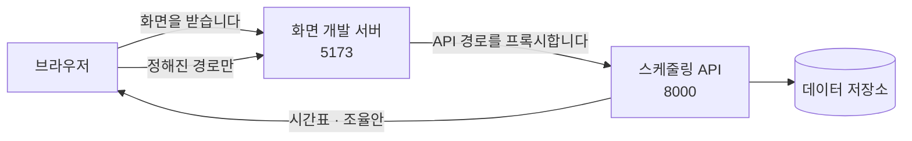

> 문서 버전: 3.1.3 draft



## Abstract

화면은 Banblit을 사용자가 실제로 쓰는 앱입니다. 랜딩, 계정 화면 5개, 스케줄러, 배정 결과가 앱 1개에 들어 있고 주소가 그 안에서 어느 화면을 표시할지 결정합니다. 값은 전부 스케줄링 API에서 조회하는데, 한동안 화면이 임시로 채우던 값은 이제 1개를 제외하고 실제 endpoint(API의 요청 주소 단위)에서 조회하고, 아직 연결하지 못한 1개만 "미연동"으로 표시합니다. 화면끼리 중복되던 스타일과 계산은 공용 파일로 모여 있어, 1곳을 수정하면 모든 화면이 함께 변경됩니다.

## Introduction

설계를 그림으로만 확정하면 2가지를 놓칩니다. 서버가 실제로 반환하는 값의 형태가 화면이 기대하는 형태와 다를 때와, 화면에 필요한데 아직 아무도 만들지 않은 정보가 무엇인지입니다. 이 2가지는 실제 서버에 연결하기 전에는 드러나지 않습니다.

그래서 확정된 설계를 정적 화면으로 먼저 구현하고 정적 화면을 실제 서버에 연결하여 없는 endpoint를 목록으로 정리한 뒤, 그 정적 화면들을 앱 1개로 옮겼습니다. 옮기면서 얻은 결과는 3가지입니다. 화면끼리 중복되던 부분이 공용 컴포넌트가 되었고, 계정 화면 5개가 각자의 주소를 갖게 되었으며, 서버를 호출하는 방식이 1곳으로 모였습니다.

옮기기가 끝난 뒤 정적 화면은 삭제했습니다. 그때까지는 "설계가 무엇이었는가"에 답하는 판정 기준이었지만, 앱이 설계를 전부 구현한 뒤부터는 수정하지 않는 사본이 앱과 어긋나는 2번째 정본이 되었습니다. 설계가 무엇이었고 왜 달라졌는지는 이 문서와 이웃 문서가 대신 적습니다.

## Related Work

- [Banblit 개요](../README.md) — 전체 기능 지도
- [개발 환경 실행](../dev-environment/README.md) — 이 화면을 띄우는 서비스와 그 기동 절차
- [스케줄링 API](../scheduling-api/README.md) — 화면이 값을 받아오는 endpoint
- [기간 자동 배정](../scheduling-api/period-assignment/README.md) — 배정 화면이 부르는 "다시 계산"과 "확정된 시간표"의 실체
- [스케줄러](../scheduler/README.md) — 달력 화면의 설계 정본
- [자동 배정](../auto-assignment/README.md) — 배정 화면이 보여주는 계산 결과의 규칙
- [계정과 역할](../accounts-and-roles/README.md) — 계정 화면 5개가 따르는 규칙
- [게시판과 공지](../boards/README.md) — 글·댓글·첨부파일 화면이 따르는 규칙

## Description

### 스타일과 계산을 공용 파일로 모았습니다

화면 6개가 각자 정의하던 상단바·사이드바·탭·카드·프로필 카드·알림 띠·입력칸·버튼과 어두운 팔레트를 공용 파일 2개로 합쳤습니다. 색과 본문 폭 같은 값이 `base.css`, 상단바·사이드바·카드·입력칸의 스타일이 `shell.css`입니다. 화면별 파일에는 그 화면에만 있는 스타일만 남습니다.

```
        예전                              지금
 화면마다 제 상단바              공용 색·폭 한 벌
 화면마다 제 팔레트       ─▶     공용 껍데기 한 벌
 화면마다 제 입력칸              화면별 파일에는 그 화면 것만
```

계산도 같은 방식으로 모았습니다. 날짜를 사용자가 읽는 문자열로 변환하는 계산, 목록이 불러오는 중인지 오류가 발생했는지 정상인지를 판단하는 계산, 여는 버튼과 함께 열리는 프로필 카드를 닫는 처리. 화면마다 따로 작성되어 있던 이 3가지가 각각 파일 1개로 모였습니다. 같은 계산을 2곳에 서로 다르게 작성해 1곳만 수정되는 일이 이 화면들에서 실제로 2번 이상 일어났기 때문입니다.

### 주소가 화면을 결정합니다

| 주소 | 화면 | 서버에 연동되었나 |
| --- | --- | --- |
| `/` | 랜딩 — 서비스 소개 | 연동할 필요가 없습니다 |
| `/login` `/signup` `/find-id` `/find-password` `/reset-password` | 계정 화면 5개 | 예. 5개 모두 연동되었습니다. 소셜 로그인 2가지만 미구현입니다 |
| `/scheduler` | 달력에 확정된 합주 일정과 알림 | 예. 저장된 시간표와 내 알림을 조회하여 표시합니다 |
| `/admin` | 배정 결과와 조율안, 재계산 | 예. 조회하고, 재계산하고, 결과를 받습니다 |
| `/settings` | 합주실 · 기간 · 멤버 · 계정 4개 탭. 입력하고 수정합니다 | 예. 조회하고, 생성하고, 수정합니다 |
| `/notices` | 공지사항 — 목록, 글, 댓글, 첨부파일 | 예 |
| `/board` | 팀 게시판 — 내가 속한 팀의 글, 댓글, 첨부파일 | 예 |
| `/teams` | 팀 찾기 — 팀 목록과 명단 | 예 |
| `/profile` | 프로필 설정 — 내 정보와 포지션 | 예. 조회만 합니다 |

로그인하지 않은 사용자가 열 수 있는 화면은 위 표의 첫 2줄, 랜딩과 계정 화면 5개뿐입니다. 나머지 화면은 로그인 화면으로 redirect(다른 주소로 자동 이동)하고 서버도 값을 반환하지 않습니다. 공지 목록도 로그인이 필요한 화면인데, 어느 팀에도 속하지 않은 사용자는 조회할 수 있지만 로그인하지 않은 사용자는 조회할 수 없습니다.

주소를 나눈 이유가 있습니다. 주소 1개로 묶어 두면 회원가입에 주소가 없어 뒤로 가기가 어긋나고, 이메일 링크로 들어오는 비밀번호 재설정을 받을 경로가 없습니다.

### 계정 화면 5개는 사진을 함께 씁니다

```
┌────────────────────────────┬──────────────┐
│                            │   로그인      │
│                            │   회원가입    │  ← 주소가 바뀌면
│         사진 (붙박이)       │   아이디 찾기 │     오른쪽만 갈린다
│                            │   비밀번호 찾기│
│                            │   비밀번호 재설정│
└────────────────────────────┴──────────────┘
       사진 2 : 서식 1 로 나눈다
```

주소를 5개로 나누면서도 사진이 다시 렌더링되지 않습니다. 5개 화면이 공통 바깥 컴포넌트의 자식 컴포넌트로 포함되어 있어 주소가 바뀌어도 바깥 컴포넌트는 그대로 있고 안쪽만 변경되기 때문입니다. 주소를 가지는 것과 사진을 다시 렌더링하지 않는 것은 양자택일이 아니었습니다.

### 중복되던 부분이 공용 컴포넌트가 되었습니다

스케줄러와 배정 결과 화면은 상단바·사이드바·탭·카드·오른쪽 패널이 거의 같습니다. 처음에는 2개 화면을 각각 따로 옮겼고 그래서 같은 스타일의 클래스 이름이 30개 넘게 중복되었는데, 중복은 같은 컴포넌트라는 뜻이었습니다.

```
     AppShell  (상단바 + 사이드바 + 본문 격자 + 알림)
        ├── Card   ── 테두리와 여백을 가진 상자
        ├── Tabs   ── 내 일정 / 예약 / 전체 일정
        └── Panel  ── 오른쪽 공지 · 팀 목록
     Field        ── 계정 서식 다섯 벌이 함께 쓰는 입력 한 칸
     icons        ── 화면마다 박혀 있던 그림을 모아둔 자리
```

### 서버를 호출하는 지점은 1곳입니다

화면마다 따로 서버를 호출하면 실패했을 때 화면마다 다르게 처리됩니다. 그래서 호출 지점을 1곳으로 모으고 그 1곳에 2가지 규칙을 적용했습니다.

첫째는 시간 제한 8초입니다. 브라우저의 요청에는 기본적으로 시간 제한이 없어서 서버가 응답을 반환하지 않고 연결을 유지하면 화면이 "불러오는 중"에서 무한정 멈춥니다. 8초는 측정에서 도출한 값이 아니라 판단인데, 조회는 즉시 반환되고 재계산은 실측 0.3초라 충분하다고 판단했지만, 데이터가 커지면 부족할 수 있습니다.

둘째는 재조회를 1번까지만 수행하는 것입니다. 서버가 응답하지 않을 때 화면이 계속 요청을 반복하면 사용자는 멈춘 화면만 보게 되므로, 1번 더 시도하고 실패하면 사유를 화면에 표시합니다.

서버가 요청을 거절할 때 사유를 담는 필드는 정의되어 있어서, 화면은 그 메시지만 추출하여 보여줍니다.

### 누가 하는 일인지는 화면이 정하지 않습니다

이전에는 "누구 이름으로 예약할지", "누구를 팀에 참가시킬지", "누가 팀을 생성하는지"를 화면이 요청에 포함하여 전송했지만, 지금은 서버가 로그인 상태를 기준으로 결정합니다. 화면에서 그 값을 담던 3개 필드를 삭제했습니다.

| 필드 | 이전 | 현재 |
| --- | --- | --- |
| 예약 양식 | 누구 이름으로 예약할지 화면이 포함하여 전송했습니다 | 서버가 로그인한 사용자로 예약을 생성합니다 |
| 팀 참가 | 누구를 참가시킬지 화면이 포함하여 전송했습니다 | 서버가 로그인한 사용자를 팀에 추가합니다 |
| 팀 생성 | 누가 생성하는지 화면이 포함하여 전송했습니다 | 서버가 로그인한 사용자를 생성자로 인식합니다 |

화면이 포함하여 전송하던 값이라 화면이 변경하여 전송할 수도 있었고, 다른 사용자 이름으로 예약을 생성하거나 다른 사용자를 팀에 강제로 추가하는 요청을 방어할 수단이 화면에는 없었습니다. 이 3개 필드는 이제 화면이 아무것도 전송하지 않으므로 변경하여 전송할 데이터도 없습니다.

팀 생성 양식에서 "내 계정을 확인하지 못했습니다"라는 안내가 삭제되었습니다. 화면이 계정 정보를 보유할 필요가 없어졌기 때문입니다. 이 양식은 여전히 권한 항목을 사전에 확인하지 않고, 권한이 없으면 서버가 반환한 이유를 양식 안에 그대로 표시합니다.

예약할 때 선택 가능한 팀은 내가 속한 팀뿐입니다. 화면은 원래도 내 팀만 버튼으로 제공했고 이제 서버도 같은 규칙으로 검증하는데, 화면을 거치지 않고 들어오는 요청이 있을 수 있기 때문입니다. 어떤 기준으로 요청자를 검증하는지는 [계정과 역할](../accounts-and-roles/README.md)에서 다룹니다.

3개 필드를 삭제한 뒤 화면 테스트와 타입 검사가 통과했고, 같은 변경사항을 반영한 서버 쪽 테스트도 통과했습니다.

### 버튼을 숨기는 기준이 바뀌었습니다 (2026-09-07)

이전에는 화면이 "이 사용자가 헤드매니저인가"만 확인하고 관리 버튼 전체를 표시하거나 숨겼지만, 지금은 "그 사용자가 그 권한 항목을 보유하는가"를 각 위치에서 별도로 확인합니다. 권한 항목이 무엇이고 어떻게 활성화 및 비활성화하는지는 [계정과 역할](../accounts-and-roles/README.md)이 정본이고, 이 문서에서는 화면이 권한 항목을 어떻게 사용하는지만 설명합니다.

```
이전:   헤드매니저인가 ──▶ 관리 버튼 전부 표시 / 전부 숨김
현재:   합주실 항목 보유 ──▶ 합주실 수정 버튼
        기간 항목 보유   ──▶ 기간 수정·삭제 버튼
        권한 관리 항목 보유 ──▶ 멤버 탭
        …각 위치에서 자신의 항목을 확인합니다
```

변경된 위치는 3곳입니다.

| 위치 | 변경 내용 |
| --- | --- |
| 사이드바 | 관리 메뉴를 그룹화한 섹션의 제목이 "헤드매니저"에서 **"관리"**로 변경되었습니다. 권한 항목을 모두 보유한 사용자만 있는 섹션이 아니게 되었으므로 단일 역할 이름을 사용할 수 없습니다. 해당 섹션은 관련 권한 항목을 **1개라도** 보유한 사용자에게만 표시됩니다 |
| 설정 화면 | 멤버 탭이 추가되었습니다. permission set(권한 집합)을 생성·수정·삭제하고, permission set을 사용자에게 할당하거나 제거하고, 가입한 전체 사용자를 목록으로 조회합니다 |
| 관리 버튼 전체 | 표시 및 숨김 판단이 단일 역할이 아니라 각 위치의 서로 다른 권한 항목으로 결정됩니다 |

멤버 탭은 "권한 관리" 항목을 보유한 사용자에게만 표시됩니다. 보유하지 않은 사용자에게는 탭 자체가 렌더링되지 않고, 탭을 보는 중에 해당 항목을 잃으면 첫 탭으로 돌아갑니다. 접근할 수 없는 탭에 머물러 있게 하지 않기 위함입니다.

### 다른 사용자가 변경한 값이 새로고침 없이 표시됩니다 (2026-09-14)

화면이 서버에서 조회한 값(확정 시간표, 예약, 공지와 글, 알림, 팀 목록)은 원래 화면이 처음 로드될 때 1번만 수신했습니다. 그 이후 배정 엔진이 배정을 실행하거나 다른 멤버가 예약을 생성해도, 새로고침 전에는 내 화면이 변경되지 않았습니다. 서버가 화면에 "변경되었습니다"라고 알릴 방법이 없기 때문입니다.

지금은 **화면에 표시된 모든 query(TanStack Query가 관리하는 서버 조회 1개)가 20초마다 서버에 재조회하고, 응답이 변경된 부분만 다시 렌더링합니다.** 다른 탭으로 이동했다가 돌아올 때도 즉시 재조회합니다(이전에는 비활성화되어 있었습니다). 새로고침처럼 화면 전체가 깜빡이지 않고, 작성 중이던 내용도 유지됩니다. 사용자가 직접 수행한 작업(예약·불가능 일정·글·권한·팀 수정)은 polling(주기적으로 서버에 같은 요청을 다시 보내 변경을 확인하는 방식)과 무관하게 즉시 반영됩니다. 해당 작업이 관련 목록을 바로 다시 조회하기 때문입니다.

20초는 사용자 결정입니다(처음 30초로 제안했다가 감소시켰습니다). 간격이 짧을수록 변경사항이 빨리 반영되지만 서버에 그만큼 자주 요청합니다. 값은 `frontend/src/main.tsx`의 `LIVE_REFETCH_MS` 상수로 관리됩니다. 서버 부하가 문제가 되면 조회마다 간격을 달리 설정하거나 server push(서버가 변경을 화면에 먼저 알리는 방식)로 변경할 수 있습니다.

### 권한 항목 2가지를 화면이 읽습니다 (2026-09-14)

"타 멤버 글 수정 및 삭제"와 "타 멤버 예약 수정 및 취소"는 서버가 이미 지원하고 있었지만 화면 어느 곳에서도 구현되지 않아, 권한을 부여받아도 화면에서는 아무 동작이 일어나지 않았습니다.

| 항목 | 화면의 동작 |
| --- | --- |
| 타 멤버 글 수정 및 삭제 | 공지와 팀 게시판에서 다른 사용자의 글·댓글·첨부 옆에도 **삭제** 버튼이 표시됩니다. 수정 버튼은 여전히 작성자에게만 표시됩니다. 서버는 수정도 허용하지만 화면은 삭제만 표시하기로 결정했습니다(사용자 결정 2026-09-11) |
| 타 멤버 예약 수정 및 취소 | 설정에 **예약 탭**이 추가되었습니다. 오늘부터 90일 이내의 모든 멤버 예약을 날짜·시간·합주실·예약자 표로 조회하고, 어느 예약이든 취소할 수 있습니다. 취소하면 달력도 함께 다시 조회합니다 |

검증은 `lib/boards.ts`의 `boardActions` 함수가 수행합니다. 수정은 작성자만 가능하고, 삭제는 작성자이거나 권한자가 가능하며, 사용자 정보를 아직 확인하지 못했으면 수정·삭제 모두 불가합니다. 예약 탭이 90일까지만 표시하는 이유는 예약 목록을 제공하는 서버 endpoint가 합주실·날짜 범위로만 매개변수를 받기 때문입니다. 90일보다 먼 미래의 예약을 다루어야 하면 월간 페이지 네비게이션을 추가하거나 전체 목록을 반환하는 새로운 endpoint를 생성할 수 있습니다.

검증은 `frontend/src/lib/boards.test.ts`의 `boardActions` 4개 경우와 `frontend/src/lib/slots.test.ts`의 `upcomingBookings`로 실행했습니다. 화면 테스트 234개가 통과하고 타입 오류는 0개입니다. 실행 명령은 `docker compose run --rm --no-deps web npm test`와 `npm run typecheck`입니다.

버튼을 숨기는 것은 사용자 경험 개선일 뿐 보안의 근거가 아닙니다. 권한 항목을 수신하지 못했거나 응답에 권한 항목 목록이 없으면 화면은 "미지원"으로 인식하고 숨기는데, 잠깐 표시되었다가 사라지는 버튼보다 처음부터 표시하지 않는 편이 낫기 때문입니다. 실제 권한 검증은 항상 서버가 수행하고, 화면이 숨기지 못한 버튼을 누르더라도 서버가 거절합니다.

내 permission set을 수정하면 내 화면도 즉시 다시 렌더링됩니다. 멤버 탭에서 저장하면 permission set 목록만이 아니라 "내 계정"도 함께 다시 조회하는데, 방금 수정한 permission set이 내 permission set이면 내가 보유한 권한 항목이 이미 변경되었으므로, 이전 값을 유지하면 이미 잃은 권한의 버튼이 화면에 남기 때문입니다.

기간의 배정 계산 실행 시각을 화면에서 설정할 수 있게 되면서 "화면이 필요로 하는 것" 표에서 1줄이 삭제되었습니다. 설정 화면의 기간 양식이 하루 2번의 계산 시각을 입력하고 수정하며, 그 값이 [자동 배정](../auto-assignment/README.md)이 실행되는 실제 시각이 됩니다.

### 역할 문구·매일 기간·멤버 추방을 화면에 반영했습니다 (2026-09-14)

| 위치 | 화면의 동작 | 규칙의 정본 |
| --- | --- | --- |
| 사이드바와 프로필 화면의 프로필 카드 | 이름 아래 역할 문구는 내 계정 조회가 반환한 permission set(권한 집합) 이름을 ", " 로 이어 표시합니다. permission set 이 0개이면 "일반멤버", 아직 계정을 조회하지 못했으면 빈 문자열입니다. "헤드매니저" 라는 글자를 화면이 계산하지 않습니다 | [계정과 역할](../accounts-and-roles/README.md) |
| 설정 화면의 기간 양식 | 종류가 집중 합주기간이고 "매일" 이 켜져 있으면 종료일 입력을 숨깁니다. 저장할 때는 종료일에 시작일과 같은 값을 넣어 보냅니다. 기간 목록의 행은 "<시작일> 부터 <종료일> 까지" 대신 "<시작일> 부터 매일" 을 표시합니다 | [합주실과 기간](../practice-room-and-periods/README.md) |
| 설정 화면의 멤버 탭 | "멤버 추방" 항목을 가진 사람에게만 멤버 명단 표에 열이 1개 추가되고, 행마다 삭제 아이콘 버튼("<이름> 추방")이 표시됩니다. 로그인한 본인의 행에는 표시하지 않습니다. 누르면 "<이름>을/를 추방할까요? 계정과 글·댓글·예약이 함께 삭제돼요." 라고 1회 확인하고, 성공하면 "<이름> 님을 추방했어요." 를 표시한 뒤 멤버 명단과 permission set 목록을 서버에서 다시 조회합니다 | [계정과 역할](../accounts-and-roles/README.md) |

검증은 `frontend/src/lib/account.test.ts` 의 역할 문구 시나리오와 `frontend/src/lib/pipeline.test.ts` 의 매일 기간 저장값·멤버 추방 호출 시나리오로 실행했습니다. 화면 테스트 237개가 통과합니다.

### 3가지 기능이 서버에 연동되었습니다 (2026-09-07)

첨부파일, 화면 내 알림, 계정 화면 3가지가 서버에 연동되었습니다. 규칙 자체는 각각 담당 문서에서 다루고, 이 문서에서는 화면의 구현만 설명합니다.

| 기능 | 화면의 구현 | 규칙의 정본 |
| --- | --- | --- |
| 첨부파일 | 파일 선택 단계에서 크기와 유형을 **먼저 검증합니다**. 업로드 진행률을 표시하고, 다운로드할 때는 파일명을 클릭하여 수신합니다. 삭제 버튼은 작성자에게만 표시됩니다 | [게시판과 공지](../boards/README.md) |
| 화면 내 알림 | 달력 화면의 오른쪽 패널 최상단에 있는 카드입니다. 안 읽은 개수와 badge(안 읽음 표시)를 표시하고, 클릭하면 읽음으로 표시됩니다. 자동 배정 엔진이 실행한 결과뿐만 아니라 배정 화면에서 재계산하거나 되돌린 작업도 이 카드에 표시됩니다 | 위치는 [스케줄러](../scheduler/README.md), 발생 조건은 [자동 배정](../auto-assignment/README.md) |
| 아이디 찾기 · 비밀번호 찾기 · 비밀번호 재설정 | 이전에는 확인만 하던 3개 화면이 실제로 이메일을 전송하고 비밀번호를 변경합니다 | [계정과 역할](../accounts-and-roles/README.md) |

첨부는 글이 먼저입니다. 파일은 첨부될 글이 존재해야 업로드할 수 있으므로 글을 먼저 생성한 후 파일을 전송하는데, 이 과정에서 글은 생성되었으나 파일 업로드 단계에서 중단되는 중간 상태가 발생합니다. 이때 화면은 생성된 글의 ID를 기억하고 있다가 재시도하면 새로운 글을 생성하지 않고 남은 파일만 다시 업로드합니다. 기억하지 않으면 재시도할 때마다 동일한 글이 중복 생성됩니다.

화면의 검증은 사용자 편의를 위한 것이고 보안의 근거가 아닙니다. 화면을 거치지 않고 API에 직접 요청할 수 있으므로 서버가 동일한 검증을 수행합니다. 화면이 먼저 검증하는 이유는 300MB를 모두 업로드한 후에 거절당하는 상황을 피하기 위함입니다. 파일 선택 창에 확장자 필터를 적용하는 이유도 같지만, 사용자가 "모든 파일" 옵션을 선택하여 필터를 우회할 수 있으므로 이 필터는 검증을 대체할 수 없습니다.

알림 메시지는 화면이 생성합니다. 서버는 발생한 이벤트의 유형만 전송하므로 메시지 문구를 수정하면 이미 저장된 알림도 함께 변경됩니다. 반대로 화면이 정의하지 않은 유형의 알림이 수신되면 해당 유형명을 그대로 표시하지 않고 사전에 정의한 기본 메시지로 대체합니다.

비밀번호 재설정 화면은 URL 매개변수로 token을 수신합니다. 이메일의 링크가 token을 포함하여 이 화면을 열 때, token을 입력 필드로 받지 않는 이유는 사용자가 복사-붙여넣기하기에는 길기 때문입니다. 계정 화면 5개 각각이 고유한 경로를 갖는 이유 1개가 이 화면이 token을 수신할 전용 경로의 필요성이었습니다.

비밀번호 찾기 화면은 승인된 설계에서 변경되었습니다. 이전에는 아이디와 휴대폰 번호를 입력받아 SMS로 본인 확인하는 방식이었으나, 본인 확인을 이메일로 변경하면서 이메일 입력 필드 1개로 단순화되었습니다. 변경 이유는 [계정과 역할](../accounts-and-roles/README.md)에 기록되어 있습니다.

### 생성 양식은 모달로 옮겼습니다 (2026-09-08)

이전에는 목록 아래에 입력 양식이 항상 확장되어 있었습니다. 새로 생성할 계획이 없는 사용자도 이 양식을 계속 보게 되었고, 목록이 그만큼 밀려났습니다.

현재는 목록 아래에 **`+ 새 ~~` 버튼 1개**만 있고, 클릭하면 dialog(화면 위에 뜨는 대화 상자)가 열립니다. 팀 생성처럼 2단계 이상을 거쳐야 하는 경우 dialog 내에서 다음 단계로 진행하고, 사용자를 검색해야 하는 경우 dialog 위에 다른 dialog를 중첩하여 표시합니다.

```
목록 화면
├─ 목록 (창에 들어가는 만큼만)
└─ [‹ 1 2 ›]              [+ 새 팀]
                                │
                          ┌─────┴──────────────┐
                          │ 모달: 구성 정하기    │
                          │  드럼 − 1 +         │
                          │  [구성 확정]        │
                          └─────┬──────────────┘
                                │
                          ┌─────┴──────────────┐
                          │ 모달: 사람 채우기    │
                          │  드럼 🔍 ──▶ 서브모달│
                          └────────────────────┘
```

**Dialog는 구현 1개를 모든 화면에서 재사용합니다.** 제목·본문·하단 버튼이라는 구조가 모든 dialog에서 동일합니다. 브라우저에 내장된 dialog 요소를 사용하므로, 배경 어두워짐과 Esc 키로 닫기 기능을 별도로 구현하지 않았습니다.

**목록은 스크롤하지 않고 페이지 단위로 전환됩니다.** 화면 높이를 기준으로 표시되는 행의 개수를 계산하고 나머지는 다음 페이지로 넘깁니다. 따라서 페이지 네비게이션 행이 화면 크기에 관계없이 항상 카드 하단에 위치합니다. 페이지가 1개뿐일 때도 행이 그대로 표시됩니다. 버튼 위치가 변경되면 다음에 클릭할 위치를 매번 다시 찾아야 합니다.

**수정은 수정 아이콘, 삭제는 삭제 아이콘입니다.** 수정을 클릭하면 생성 시와 동일한 dialog가 기존 값으로 채워진 상태로 열립니다. 삭제는 "정말 ~~을(를) 삭제하시겠습니까?"라는 1번의 확인만 요청합니다.

### 배치를 창 크기에 맞추지 않습니다 (2026-09-08)

모니터는 사용자마다 다릅니다. 따라서 레이아웃을 특정 화면 크기에 맞춘 절대 픽셀 값으로 구성하지 않습니다.

| 요소 | 반응형 설정 |
| --- | --- |
| 본문 | 최대 너비까지만 커지고 그 이상은 가운데 정렬합니다. 화면이 너무 넓으면 표의 행을 눈으로 추적하기 어려워집니다 |
| 왼쪽 사이드바·오른쪽 패널 | 화면 너비에 대한 상대 비율입니다. 매우 좁거나 매우 넓을 때만 최소·최대 너비 제약이 적용됩니다 |
| 권한 항목 타일 | 타일이 배치된 **행의 너비**에 대한 상대 비율입니다. 화면 전체가 아닌 행을 기준으로 계산하면 패널이 열리고 닫힐 때 타일이 불필요하게 움직이지 않습니다 |
| 표의 셀 | 텍스트 길이 기준의 최소 너비입니다. 폰트 크기가 변경되면 함께 조정됩니다. 남은 수평 공간은 끝쪽의 빈 셀이 채웁니다 |

달력 화면 2개는 최대 너비를 설정하지 않습니다. 화면이 넓을수록 한눈에 들어오는 정보량이 많아지므로 제한할 이유가 없습니다.

스크롤 막대는 숨깁니다. 스크롤 동작은 그대로 작동하고 시각적인 막대만 표시되지 않습니다. 화면의 2개 이상 영역이 각각 독립적으로 스크롤되는 구조이므로, 막대를 표시하면 각 위치에 회색 줄이 그려집니다.

### slot을 사람이 읽는 합주로 되돌립니다

배정 엔진은 slot(1시간 단위 시간 칸)을 1개씩 배정하므로 서버가 반환하는 시간표는 slot의 나열이지만, 사용자가 세는 단위는 slot이 아니라 "합주 1회"입니다. 따라서 동일한 팀이 동일한 합주실에서 연속으로 사용하는 slot을 1개로 합친 후 렌더링합니다.

```
서버가 반환한 값   18:00–18:30  18:30–19:00  19:00–19:30   (동일 팀 · 동일 공간)
                        └────────────┴────────────┘
화면이 렌더링하는 것      18:00 – 19:30  합주 세션 하나
```

slot을 합치는 계산과 달력에 데이터를 채우는 계산은 화면 컴포넌트와 분리되어 있으며, 이 2개 계산에 테스트가 작성되어 있습니다. 화면 컴포넌트 자체를 렌더링하는 테스트는 미구현입니다.

### 시각은 글자 그대로 자릅니다

서버는 tzinfo(시간대 정보)가 없는 datetime을 전송하는데, 이를 브라우저의 Date 객체로 변환하면 브라우저가 현지 시간대를 자동으로 추가하여 날짜가 하루씩 밀릴 수 있습니다. 따라서 화면은 수신한 문자열에서 날짜와 시간 부분을 직접 추출하여 사용하며, 이는 이 저장소가 시각에 시간대를 포함하지 않기로 정한 규칙과 일관성이 있습니다.

날짜를 하루씩 증분할 때만 예외적으로 날짜 계산 함수를 사용하는데, 이 경우 기준점을 정오(noon)로 설정합니다. 자정을 기준으로 하면 서머타임이 적용되는 지역에서 하루가 23시간이 되는 날에 날짜 1개가 통째로 건너뛰어질 수 있기 때문입니다.

### 화면이 임시로 채우던 값

화면을 실제 서버에 연결했을 때 화면에 필요하지만 endpoint가 없는 정보가 드러났습니다. 화면은 그 값을 임시로 채우거나, 채울 수 없으면 "미연동"으로 표시했는데, 이 표가 앞으로 생성할 endpoint의 목록이 되었고, endpoint가 구현되면 화면이 그 endpoint를 연결한 후 표에서 삭제했습니다.

표는 1행을 제외하고 삭제되었습니다 (2026-09-07). 값을 임시로 채우던 자리가 1개씩 실제 endpoint로 교체되었으며, 삭제된 행과 현재 그 값을 채우는 방식은 다음과 같습니다.

| 삭제된 행 | 현재 담당 endpoint |
| --- | --- |
| 집중 합주기간의 목록 | 기간 목록 endpoint. 달력·배정 화면 모두 기간 목록 endpoint를 호출합니다. 화면에 기록해둔 고정 번호는 삭제했습니다 |
| 합주실의 운영 시간 | 합주실 목록 endpoint. 합주실 목록 중 가장 이른 개방 시각과 가장 늦은 폐쇄 시각이 달력의 시작과 종료가 됩니다 |
| 집중 합주기간의 날짜 범위 | 동일한 기간 목록 endpoint가 제공하는 시작일·종료일 |
| 팀별 명단 | 명단 endpoint. 팀 화면·프로필, 달력의 일일 상세, 설정 화면의 통계까지 모두 명단 endpoint를 사용합니다 |
| 팀·합주실의 전체 목록 | 팀 목록·합주실 목록 endpoint |
| 예약과 불가능 일정 | 예약·불가능시간 endpoint. 서버에 저장되며, 예약자도 서버가 결정합니다 |

남은 행은 1개입니다.

| 화면이 필요로 하는 정보 | 현재 처리 방식 |
| --- | --- |
| 배정 계산 이력 | 배정기록 목록을 반환하는 endpoint도, 되돌리는 endpoint도 이미 구현되어 있습니다. 배정 화면이 아직 배정기록 목록을 UI에 연결하지 않아서 이 행을 "미연동"으로 표시합니다. 생성할 endpoint가 아니라 연결할 UI가 남았습니다 |

"현재 로그인한 사용자"는 이 표에서 삭제되었습니다. 로그인 기능이 추가되면서 화면은 서버에 "내 계정"을 조회하여 이름·역할·포지션을 수신하고, 그 응답에 포함된 소속 팀 목록으로 내 팀을 필터링합니다. 하드코딩된 사용자 1명과 팀 2개는 삭제했으며, 로그인 상태를 어떻게 유지하는지는 [계정과 역할](../accounts-and-roles/README.md)에서 설명합니다.

배정 화면의 오른쪽 패널에 있는 배정 계산 시간 입력 필드도 이제 연결되어 있습니다. 설정 화면과 동일한 endpoint로 조회하고 수정합니다. 기간에 속한 값이므로 화면이 2개이어도 endpoint는 1개입니다.

임시값을 채우는 방식에는 공통 패턴이 있었습니다. 이미 수신한 값에서 추출할 수 있으면 추출하고, 추출할 수 없을 때만 화면에 임시로 기록한 값을 사용했는데, 그래서 endpoint가 구현될 때마다 삭제해야 하는 임시 코드의 양이 적었습니다.

### 화면과 API는 다른 곳에서 옵니다

브라우저는 보안상의 이유로 페이지를 로드한 주소가 아닌 다른 출처로부터의 요청을 차단합니다(CORS 정책). 화면과 API가 서로 다른 서버에서 실행되는 현재 상황에서 이 제약을 해결하는 방법은 화면 개발 서버가 지정된 경로만 API 서버로 프록시(프록시는 클라이언트 요청을 받아 서버로 전달하고 응답을 반환하는 중개 역할)하는 것이며, 브라우저 입장에서는 모든 요청이 단일 출처에서 온 것으로 인식됩니다.

```
브라우저 ──▶ 화면 개발 서버 ──┬─ 화면 · 이미지 · 스타일      : 직접 제공합니다
                              └─ 지정된 API 경로            : 스케줄링 API로 프록시합니다
```

프록시할 경로 목록은 화면 개발 서버의 설정이 관리하며, 목록에 없는 경로는 프록시되지 않으므로 API endpoint가 추가되면 이 목록도 함께 업데이트해야 합니다.

이전에는 프록시할 경로를 1개씩 나열하던 방식이었는데, endpoint를 추가할 때 이 목록 업데이트를 빠뜨리면 개발 서버가 해당 경로를 자신이 제공하는 경로로 인식하고 화면 페이지를 반환했습니다. 값이 전달되지 않는데 오류 메시지도 표시되지 않아서 문제를 파악하기 어려웠습니다.

현재는 화면이 API를 호출할 때 주소 앞에 `/api` 접두사를 붙입니다. 프록시할 경로와 프록시하지 않을 경로를 이 접두사 1개로 구분하므로 목록을 별도로 관리할 필요가 없어졌으며, 화면의 경로와 API의 endpoint가 동일한 이름으로 충돌하는 것도 방지합니다. 예를 들어 `/teams`는 팀 조회 화면이면서 동시에 팀 목록 API endpoint인데, 접두사가 없었을 때는 2개 중 1개만 정상 작동했습니다.

```
브라우저 ──▶ 화면 개발 서버 ──┬─ /api로 시작       : 접두사를 제거하고 스케줄링 API로 프록시합니다
                              └─ 그 외의 경로      : 화면 페이지를 제공합니다
```

접두사를 추가하는 곳은 화면이 API를 호출하는 1곳이고, 제거하는 곳은 개발 서버와 배포 환경에 각각 1곳씩 있습니다.

개발 서버의 프록시는 배포 환경에서는 작동하지 않습니다. 개발 서버는 개발 중에만 실행되므로 배포 환경에서는 화면을 제공하는 리버스 프록시(reverse proxy는 클라이언트로부터의 요청을 받아 백엔드 서버로 전달하는 서버)가 동일한 역할을 수행하는데, 접두사가 있는 요청만 접두사를 제거한 후 API 서버로 전달하고 나머지는 화면을 반환합니다. 리버스 프록시는 요청 본문 크기 제한을 적용하는 지점이기도 하므로, 개발 환경에는 이 검증 계층이 없어서 첨부 파일 크기 검증이 서버 1곳에만 존재합니다. 자세한 내용은 [게시판과 공지](../boards/README.md)에서 다룹니다.

정적 화면 파일들을 별도로 제공하던 구조는 해당 파일들과 함께 삭제되었습니다. 현재 브라우저는 단일 앱 번들만 수신합니다.

### 실패를 감추지 않습니다

2개 이상의 기간을 조회하는 중 1개 이상이 실패하면 성공한 기간만으로 화면을 렌더링하고 실패한 기간을 사용자에게 표시합니다. 기간 1개가 실패했다고 화면 전체를 비우지 않습니다. 서버에 저장된 배정이 없을 때도 빈 달력을 정상적으로 렌더링하고 "저장된 배정이 없습니다"라고 표시하는데, 데이터 부재와 오류 발생은 다르기 때문입니다.

### 설정 화면은 계산 결과를 함께 표시합니다

합주실의 운영 시간만 정해서는 그 설정이 실제로 실행 가능한지 판단할 수 없습니다. 집중 합주기간 동안 모든 팀이 정확히 동일한 시간을 할당받아야 하고, 팀 1개라도 할당량을 충족하지 못하면 전체 배정이 실패로 처리되기 때문입니다. 따라서 설정 화면은 현재 입력한 값으로 총 몇 시간이 사용 가능한지를 실시간으로 표시합니다.

```
합주실 A  18:00 – 22:00   4시간
합주실 B  19:00 – 22:00   3시간
                       ─────────
              하루      7시간
              14일 기준  98시간   팀 6개 기준: 팀당 16시간 할당, 남은 시간 2시간
```

이 계산은 이미 화면이 보유한 값으로 수행 가능하므로 서버에 조회할 필요가 없습니다. 실제 배정을 실행하기 전에 설정의 타당성을 미리 검증하는 것이 목적입니다.

### 오래 걸리는 계산을 기다리는 방식

배정 계산은 조율안까지 포함하면 20초를 초과한 경우도 있는데, 화면의 요청 타임아웃은 8초입니다. 그대로 두면 사용자 판단이 가장 필요한 경우에만 화면이 먼저 대기를 중단하게 됩니다.

따라서 서버가 계산 요청의 연결을 유지한 채 계산하지 않습니다. 요청을 수신하면 즉시 작업 ID만 반환하고 계산은 백그라운드에서 진행되며, 화면은 그 작업 ID로 완료 여부를 polling합니다.

```
화면 ──▶ 서버   "이 기간을 재계산해 주세요"
     ◀──        "수신했습니다. 작업 ID는 7c2e1a9f…입니다"   (즉시)
     ──▶        "그 ID의 작업이 끝났나요?"           (재조회)
     ◀──        "아직 진행 중입니다"
     ──▶        "지금은요?"
     ◀──        "완료됐습니다. 결과는 팀별 배정 slot 목록입니다"
```

polling에도 상한이 있습니다. 설정된 시간을 초과하면 대기를 중지하고 사용자에게 표시하는데, 응답이 전혀 오지 않는 경우와 시간이 오래 걸리는 경우는 다르기 때문입니다.

### 아직 정리되지 않은 것

화면별 스타일이 서로 영향을 미치지 않도록 격리하는 방식이 최종 방식이 아닙니다. 현재는 각 화면에 고유한 표시자(marker)를 1개씩 적용하고 그 표시자 내에서만 스타일이 적용되도록 범위를 제한해 두었는데, 목표하는 방식은 각 화면의 스타일을 자동으로 격리하는 방식입니다. 다만 현재 스타일 규칙이 클래스명이 아니라 DOM 요소 자체를 선택자로 사용하고 있어서 표시자만으로는 완전한 격리가 불가능하므로, 전체 설계를 완전히 구현한 후 별도 작업으로 연기했습니다.

## Conclusion

화면은 이제 설계를 검증하는 도구가 아니라 완성된 제품입니다. 가장 중요한 산출물은 여전히 "화면이 필요로 하는 정보" 표이며, 이 표의 행이 1개씩 삭제되는 과정이 서버가 완성되어 가는 과정을 나타냅니다. 이 화면을 실행하는 절차는 [개발 환경 실행](../dev-environment/README.md)에서 설명하고, 화면이 호출하는 endpoint의 규칙은 [기간 자동 배정](../scheduling-api/period-assignment/README.md)에서 계속됩니다.
