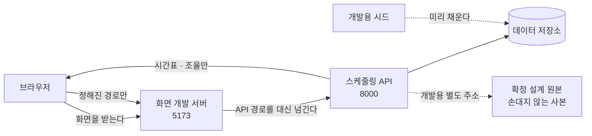

> 문서 버전: 2.3.0 draft



## Abstract

화면은 Banblit 을 사람이 실제로 쓰는 자리다. 랜딩, 계정 다섯 벌, 스케줄러, 배정 결과가 **하나의 앱**에 들어 있고, 주소가 그 안에서 어느 화면을 보일지 가른다. 값은 전부 스케줄링 API 에서 받아오며, 아직 통로가 없는 정보는 화면이 이미 받아온 값에서 뽑아내거나 사람에게 "미연동"이라고 밝힌다. 설계를 굳혀둔 정적 화면은 따로 남아 있고, 그것이 "설계가 무엇이었는가"에 답한다.

## Introduction

설계를 그림으로만 확정하면 두 가지를 놓친다. 서버가 실제로 돌려주는 값의 모양이 화면이 기대하는 모양과 다를 때와, 화면에 꼭 필요한데 아직 아무도 만들지 않은 정보가 무엇인지다. 이 둘은 실제 서버에 붙여보기 전에는 드러나지 않는다.

그래서 확정된 설계를 정적 화면으로 먼저 굳히고, 그것을 실제 서버에 물려 무엇이 없는지 목록으로 뽑았다. 그 다음 그 정적 화면들을 앱 하나로 옮겼다. 옮기면서 얻은 것은 세 가지다 — 화면끼리 겹치던 부분이 실제로 하나의 부품이 되었고, 계정 다섯 벌이 각자의 주소를 갖게 되었으며, 서버를 부르는 방식이 한 자리로 모였다.

설계 원본을 그대로 남겨두는 이유는, 옮기다 무언가 어긋났을 때 무엇이 옳았는지 판정할 기준이 필요하기 때문이다. 실제로 옮기는 도중 모양이 무너진 적이 있고, 그때 원본과 나란히 놓고 비교해 되돌렸다.

## Related Work

- [Banblit 개요](../README.md) — 전체 기능 지도
- [개발용 시드 데이터](./dev-seed/README.md) — 이 화면들이 띄울 데이터를 미리 채워두는 하위 기능
- [스케줄링 API](../scheduling-api/README.md) — 화면이 값을 받아오는 통로
- [기간 자동 배정](../scheduling-api/period-assignment/README.md) — 배정 화면이 부르는 "다시 계산"과 "확정된 시간표"의 실체
- [스케줄러](../scheduler/README.md) — 달력 화면의 설계 정본
- [자동 배정](../auto-assignment/README.md) — 배정 화면이 보여주는 계산 결과의 규칙
- [계정과 역할](../accounts-and-roles/README.md) — 계정 화면 다섯 벌이 따르는 규칙

## Description

### 설계 정본과 실물을 나눈다

```
설계 원본 (정적 화면 네 개)          실물 (앱 하나)
 │ 서버 없이도 열린다                 │ 주소마다 다른 화면을 보인다
 │ 예시 데이터가 안에 박혀 있다        │ 서버가 준 값으로 그린다
 │ 손대지 않는다                      │ 여기서 계속 자란다
 ▼                                   ▼
"설계가 무엇이었는가"의 답            "설계가 실제로 성립하는가"의 답
```

원본은 판정 기준이므로 고치지 않는다. 설계 자체를 바꾸기로 했을 때만 원본이 바뀐다.

### 주소가 화면을 가른다

| 주소 | 화면 | 서버에 물렸나 |
| --- | --- | --- |
| `/` | 랜딩 — 서비스 소개 | 물릴 것이 없다 |
| `/login` `/signup` `/find-id` `/find-password` `/reset-password` | 계정 다섯 벌 | 아직 — 입력 검사만 화면 안에서 돈다 |
| `/scheduler` | 달력에 확정된 합주 일정 | 예 — 저장된 시간표를 읽어 그린다 |
| `/admin` | 배정 결과와 조율안, 다시 계산 | 예 — 읽고, 다시 계산하고, 결과를 받는다 |
| `/settings` | 합주실과 기간을 헤드매니저가 넣고 고친다 | 예 — 읽고, 만들고, 고친다 |
| `/notices` | 공지사항 — 목록, 글, 댓글 | 예 |
| `/board` | 팀 게시판 — 내가 속한 팀의 글 | 예 |
| `/teams` | 팀 찾기 — 팀 목록과 명단 | 예 |
| `/profile` | 프로필 설정 — 내 정보와 포지션 | 예 — 보여주기만 한다 |

주소를 나눈 것은 취향이 아니다. 하나로 묶어 두면 회원가입에 주소가 없어 뒤로 가기가 어긋나고, 메일 링크로 들어오는 비밀번호 재설정을 받을 자리가 아예 없다.

### 계정 다섯 벌은 사진을 함께 쓴다

```
┌────────────────────────────┬──────────────┐
│                            │   로그인      │
│                            │   회원가입    │  ← 주소가 바뀌면
│         사진 (붙박이)       │   아이디 찾기 │     오른쪽만 갈린다
│                            │   비밀번호 찾기│
│                            │   비밀번호 재설정│
└────────────────────────────┴──────────────┘
       사진 2 : 서식 1 로 나눈다
```

주소를 다섯으로 나누면서도 사진이 다시 그려지지 않는다. 다섯 화면이 **공통 바깥 틀의 자식**으로 들어가 있어, 주소가 바뀌어도 바깥 틀은 그대로 있고 안쪽만 갈리기 때문이다. 주소를 갖는 것과 사진이 안 흔들리는 것은 양자택일이 아니었다.

### 겹치던 것이 부품이 되었다

스케줄러와 배정 결과 화면은 상단바·사이드바·탭·카드·오른쪽 패널이 거의 같다. 처음에는 두 화면을 각각 따로 옮겼고, 그래서 같은 모양의 이름이 서른 개 넘게 겹쳤다. 겹친 것은 우연이 아니라 같은 부품이라는 신호였다.

```
     AppShell  (상단바 + 사이드바 + 본문 격자 + 알림)
        ├── Card   ── 테두리와 여백을 가진 상자
        ├── Tabs   ── 내 일정 / 예약 / 전체 일정
        └── Panel  ── 오른쪽 공지 · 팀 목록
     Field        ── 계정 서식 다섯 벌이 함께 쓰는 입력 한 칸
     icons        ── 화면마다 박혀 있던 그림 열한 개
```

### 서버를 부르는 자리는 하나다

화면마다 제각각 서버를 부르면 실패했을 때 화면마다 다르게 실패한다. 그래서 부르는 자리를 하나로 모으고, 거기에 두 가지 규칙을 박았다.

- **시간 제한 8초.** 브라우저의 요청에는 원래 시간 제한이 없다. 서버가 답을 안 주고 붙잡고 있으면 화면이 "불러오는 중" 에서 영원히 멈춘다. 8초는 근거 있는 값이 아니라 판단이다 — 조회는 즉시 오고 재계산은 실측 0.3초라 넉넉하다고 본 것이다. 데이터가 커지면 모자란다.
- **되묻기는 한 번까지.** 서버가 죽어 있을 때 화면이 조용히 계속 두드리면 사람은 멈춘 화면만 본다. 한 번 더 해보고 안 되면 사유를 화면에 띄운다.

서버가 거절할 때 사유를 담는 자리는 한 곳으로 정해져 있어, 화면은 그 한 문장만 꺼내 보여준다.

### 30분 칸을 사람이 읽는 합주로 되돌린다

계산은 30분 칸을 하나씩 배정하므로, 서버가 돌려주는 시간표는 30분짜리 조각의 나열이다. 사람이 보는 것은 조각이 아니라 "합주 한 번"이다. 그래서 같은 팀이 같은 방에서 끊김 없이 이어 쓴 조각을 하나로 합친 다음에 그린다.

```
서버가 준 것   18:00–18:30  18:30–19:00  19:00–19:30   (같은 팀 · 같은 방)
                    └────────────┴────────────┘
화면이 그리는 것        18:00 – 19:30  합주 한 번
```

합치는 계산과 달력을 채우는 계산은 화면과 떨어져 있고, 검사가 붙어 있는 곳도 여기다. 화면 자체를 띄워 보는 검사는 아직 없다.

### 시각은 글자 그대로 자른다

서버는 시간대가 붙지 않은 시각을 준다. 이것을 브라우저의 날짜 값으로 바꾸면 브라우저가 제 시간대를 끼워 넣어 날짜가 하루씩 밀 수 있다. 그래서 화면은 받은 글자에서 날짜 자리와 시각 자리를 그대로 잘라 쓴다. 이는 이 저장소가 시각에 시간대를 붙이지 않기로 한 규칙과 같은 결을 따른다.

날짜를 하루씩 세어 나갈 때만 예외로 날짜 계산을 쓰는데, 이때는 정오를 기준으로 센다. 자정으로 두면 여름시간제가 있는 지역에서 하루가 23시간이 되는 날에 날짜 하나가 통째로 건너뛴다.

### 화면이 스스로 메우는 자리

화면을 서버에 물려보니, 화면이 필요로 하는데 통로가 없는 정보가 드러났다. 화면은 그 자리를 임시로 메우거나, 메울 수 없으면 사람에게 "미연동" 이라고 밝힌다. **이 표가 다음에 만들 통로의 목록이다.**

| 화면이 필요로 하는 것 | 지금 어떻게 메우는가 |
| --- | --- |
| 집중 합주기간의 목록 | 달력·배정 화면은 아직 시드가 넣은 번호를 적어두고 부른다 — 설정 화면이 쓰는 통로로 옮기면 지워진다 |
| 합주실 여닫는 시각 | 달력·배정 화면은 아직 잡힌 배정의 가장 이른 시각과 가장 늦은 시각을 경계로 삼는다 — 같은 통로로 옮기면 지워진다 |
| 집중기간의 날짜 범위 | 같은 이유로 아직 배정이 걸쳐 있는 날짜의 처음과 끝으로 대신한다 |
| 팀별 명단 | 비워 두고 화면에서 미연동이라고 알린다. 설정 화면의 셈도 이것이 없어 팀 수를 사람이 직접 넣는다 |
| 팀·합주실의 전체 목록 | 확정된 시간표에 나온 번호를 뽑아 쓰고, 그것도 비면 시드가 넣은 번호를 쓴다 |
| 지난 계산 이력 | 되돌리는 통로는 있지만 "어느 회차로" 를 고를 목록이 없어 화면을 붙이지 않았다 |
| 계산이 자동으로 도는 시각 | 읽고 쓸 통로가 없어 그 자리를 잠가 두었다 |
| 예약과 못 나오는 시간 | 주고받을 통로가 없어 브라우저 안에만 남는다 — 새로 고치면 사라진다 |

**"지금 보고 있는 사람"은 이 표에서 빠졌다.** 로그인이 붙으면서 화면은 서버에 "내 계정"을 물어 이름·역할·포지션을 받고, 그 계정 번호가 어느 팀 명단에 있는지로 내 팀을 가려낸다. 고정해 두었던 한 사람과 두 팀은 지웠다. 어떻게 로그인 상태가 유지되는지는 [계정과 역할](../accounts-and-roles/README.md)에서 다룬다.

메우는 방식에는 공통점이 있다. **이미 받아온 값에서 뽑아낼 수 있으면 뽑아내고, 그럴 수 없을 때만 화면에 적어둔 값을 쓴다.** 그래야 통로가 생겼을 때 지워야 할 임시 코드가 적다.

### 화면과 API 는 다른 곳에서 온다

브라우저는 화면을 받아온 곳과 다른 곳에 값을 물으려 하면 막는다. 화면과 API 가 서로 다른 자리에서 도는 지금, 이 문제를 푸는 것은 **화면 개발 서버가 정해진 경로만 API 로 대신 넘겨주는 것**이다. 브라우저 입장에서는 모든 것이 한 곳에서 온 것이 된다.

```
브라우저 ──▶ 화면 개발 서버 ──┬─ 화면 · 그림 · 모양      : 직접 돌려준다
                              └─ 정해진 API 경로들       : 스케줄링 API 로 넘긴다
```

넘길 경로 목록은 화면 쪽 설정이 갖는다. 목록에 없는 주소는 넘어가지 않으므로, API 통로가 늘어나면 이 목록도 함께 늘려야 한다.

넘길 경로를 하나씩 적어 두던 때에는, 통로를 늘리면서 그 목록을 빠뜨리면 개발 서버가 그 주소를 자기 것으로 알고 **화면을 그대로 돌려주었다.** 값이 오지 않는데 오류도 안 뜨는 모양이라 알아채기 어려웠다.

**지금은 화면이 서버를 부를 때 주소 앞에 `/api` 를 붙인다.** 넘길 것과 아닌 것이 그 한 글자로 갈리므로 목록을 관리할 일이 없어졌다. 더 중요한 것은 **화면 주소와 서버 통로가 같은 이름을 두고 다투지 않게 된 것**이다 — `/teams` 는 팀 찾기 화면이면서 팀 목록 통로이기도 했고, 접두사가 없을 때는 둘 중 하나만 살았다.

```
브라우저 ──▶ 화면 개발 서버 ──┬─ /api 로 시작 : 접두사를 떼고 스케줄링 API 로 넘긴다
                              └─ 그 밖         : 화면을 돌려준다
```

붙이는 자리는 한 곳이고(화면이 서버를 부르는 자리), 떼는 자리도 개발과 배포에 각각 하나씩이다.

**이 장치는 배포에 가지 않는다.** 개발 서버는 개발할 때만 도는 것이라, 배포에서는 주소를 나눠주는 다른 것이 같은 일을 대신해야 한다. 아직 정하지 않았다.

설계 원본을 내보내는 자리는 이와 별개로 스케줄링 API 쪽에 남아 있다. 그쪽은 화면 폴더를 가리키는 값이 주어질 때만 만들어지고, 값이 없는 배포에서는 자리 자체가 생기지 않는다.

### 실패를 감추지 않는다

기간을 여럿 불러오다 일부가 실패하면, 성공한 것만으로 화면을 그리고 실패한 것은 사람에게 알린다. 하나가 실패했다고 화면 전체를 비우지 않는다. 서버에 저장된 배정이 하나도 없을 때도 빈 달력을 정상적으로 그리고 "저장된 배정이 없다" 고 말한다 — 비어 있는 것과 고장 난 것은 다르기 때문이다.

### 설정 화면은 셈을 함께 보여준다

합주실을 몇 시에 열고 닫을지 정하는 것만으로는, 그 설정이 실제로 쓸 만한지 알 수 없다. 집중기간에는 **모든 팀이 정확히 같은 몫**을 가져야 하고, 한 팀이라도 채우지 못하면 배정 전체가 실패로 넘어가기 때문이다. 그래서 설정 화면은 지금 넣은 값으로 얼마가 열리는지를 그 자리에서 함께 보여준다.

```
합주실 A  18:00 – 22:00   4시간
합주실 B  19:00 – 22:00   3시간
                       ─────────
              하루      7시간
              14일 기준  98시간   팀이 여섯이면 팀당 16시간, 남는 것 2시간
```

이 셈은 서버에 묻지 않는다. 이미 화면이 들고 있는 값으로 낼 수 있기 때문이다. 배정을 실제로 돌려보기 전에 설정이 말이 되는지 판단할 수 있게 하는 것이 목적이다.

### 오래 걸리는 계산을 기다리는 방식

배정 계산은 조율안까지 가면 20초를 넘긴 적이 있다. 그런데 화면은 8초에 요청을 끊는다. 그대로 두면 **가장 사람의 판단이 필요한 경우에만 화면이 먼저 포기한다.**

그래서 서버가 계산을 붙잡고 있지 않는다. 요청을 받으면 곧바로 작업 번호만 돌려주고, 계산은 뒤에서 돈다. 화면은 그 번호로 끝났는지 되묻는다.

```
화면 ──▶ 서버   "이 기간을 다시 계산해 주세요"
     ◀──        "접수했습니다. 번호는 이것입니다"   (곧바로)
     ──▶        "그 번호, 끝났나요?"               (되묻기)
     ◀──        "아직입니다"
     ──▶        "지금은요?"
     ◀──        "끝났습니다. 결과는 이것입니다"
```

되묻는 것에도 상한이 있다. 정해둔 시각을 넘기면 그만두고 사람에게 알린다 — 답이 영원히 안 오는 것과 오래 걸리는 것은 다르기 때문이다.

### 아직 정리되지 않은 것

화면별 모양이 서로 섞이지 않게 막는 방식이 최종형이 아니다. 지금은 화면마다 표시를 하나 걸고 그 표시 안에서만 모양이 먹도록 가둬 두었는데, 정석은 각 화면의 모양을 자동으로 갈라 주는 방식이다. 다만 지금 모양 규칙이 이름이 아니라 요소 자체를 가리키는 것을 쓰고 있어 그것만으로는 안 잡힌다. 확정 설계를 다 옮긴 뒤에 따로 할 일이다.

## Conclusion

화면은 이제 설계를 확인하는 장치가 아니라 제품 그 자체다. 그래도 가장 값진 산출물은 여전히 **"화면이 스스로 메우는 자리"** 표다. 그 표의 항목이 하나씩 지워지는 것이 곧 서버가 완성되어 가는 과정이다. 화면에 띄울 데이터를 어떻게 만드는지는 [개발용 시드 데이터](./dev-seed/README.md)에서, 화면이 부르는 통로의 규칙은 [기간 자동 배정](../scheduling-api/period-assignment/README.md)에서 이어진다.
