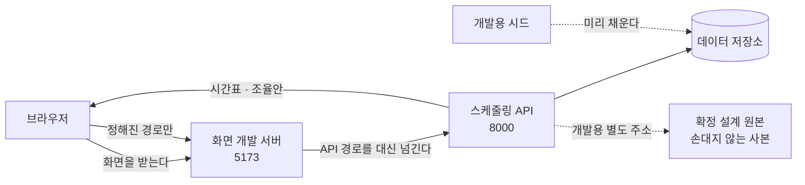

> 문서 버전: 2.7.0 draft



## Abstract

화면은 Banblit 을 사람이 실제로 쓰는 자리다. 랜딩, 계정 다섯 벌, 스케줄러, 배정 결과가 **하나의 앱**에 들어 있고, 주소가 그 안에서 어느 화면을 보일지 가른다. 값은 전부 스케줄링 API 에서 받아온다 — 한동안 화면이 임시로 메우던 자리는 이제 거의 다 실제 통로로 바뀌었고, 아직 이어 붙이지 못한 한 자리만 사람에게 "미연동"이라고 밝힌다. 설계를 굳혀둔 정적 화면은 따로 남아 있고, 그것이 "설계가 무엇이었는가"에 답한다.

## Introduction

설계를 그림으로만 확정하면 두 가지를 놓친다. 서버가 실제로 돌려주는 값의 모양이 화면이 기대하는 모양과 다를 때와, 화면에 꼭 필요한데 아직 아무도 만들지 않은 정보가 무엇인지다. 이 둘은 실제 서버에 붙여보기 전에는 드러나지 않는다.

그래서 확정된 설계를 정적 화면으로 먼저 굳히고, 그것을 실제 서버에 물려 무엇이 없는지 목록으로 뽑았다. 그 다음 그 정적 화면들을 앱 하나로 옮겼다. 옮기면서 얻은 것은 세 가지다 — 화면끼리 겹치던 부분이 실제로 하나의 부품이 되었고, 계정 다섯 벌이 각자의 주소를 갖게 되었으며, 서버를 부르는 방식이 한 자리로 모였다.

설계 원본을 그대로 남겨두는 이유는, 옮기다 무언가 어긋났을 때 무엇이 옳았는지 판정할 기준이 필요하기 때문이다. 실제로 옮기는 도중 모양이 무너진 적이 있고, 그때 원본과 나란히 놓고 비교해 되돌렸다.

## Related Work

- [Banblit 개요](../README.md) — 전체 기능 지도
- [개발용 시드 데이터](./dev-seed/README.md) — 이 화면들이 띄울 데이터를 미리 채워두는 하위 기능
- [스케줄링 API](../scheduling-api/README.md) — 화면이 값을 받아오는 통로
- [기간 자동 배정](../scheduling-api/period-assignment/README.md) — 배정 화면이 부르는 "다시 계산"과 "확정된 시간표"의 실체
- [스케줄러](../scheduler/README.md) — 달력 화면의 설계 정본
- [자동 배정](../auto-assignment/README.md) — 배정 화면이 보여주는 계산 결과의 규칙
- [계정과 역할](../accounts-and-roles/README.md) — 계정 화면 다섯 벌이 따르는 규칙
- [게시판과 공지](../boards/README.md) — 글·댓글·첨부파일 화면이 따르는 규칙

## Description

### 설계 정본과 실물을 나눈다

```
설계 원본 (정적 화면 네 개)          실물 (앱 하나)
 │ 서버 없이도 열린다                 │ 주소마다 다른 화면을 보인다
 │ 예시 데이터가 안에 박혀 있다        │ 서버가 준 값으로 그린다
 │ 손대지 않는다                      │ 여기서 계속 자란다
 ▼                                   ▼
"설계가 무엇이었는가"의 답            "설계가 실제로 성립하는가"의 답
```

원본은 판정 기준이므로 고치지 않는다. 설계 자체를 바꾸기로 했을 때만 원본이 바뀐다.

### 주소가 화면을 가른다

| 주소 | 화면 | 서버에 물렸나 |
| --- | --- | --- |
| `/` | 랜딩 — 서비스 소개 | 물릴 것이 없다 |
| `/login` `/signup` `/find-id` `/find-password` `/reset-password` | 계정 다섯 벌 | 예 — 다섯 벌 모두 물렸다. 소셜 로그인 두 줄만 아직이다 |
| `/scheduler` | 달력에 확정된 합주 일정과 알림 | 예 — 저장된 시간표와 내 알림을 읽어 그린다 |
| `/admin` | 배정 결과와 조율안, 다시 계산 | 예 — 읽고, 다시 계산하고, 결과를 받는다 |
| `/settings` | 합주실 · 기간 · 권한 세 탭 — 넣고 고친다 | 예 — 읽고, 만들고, 고친다 |
| `/notices` | 공지사항 — 목록, 글, 댓글, 첨부파일 | 예 |
| `/board` | 팀 게시판 — 내가 속한 팀의 글, 댓글, 첨부파일 | 예 |
| `/teams` | 팀 찾기 — 팀 목록과 명단 | 예 |
| `/profile` | 프로필 설정 — 내 정보와 포지션 | 예 — 보여주기만 한다 |

**로그인하지 않은 사람이 열 수 있는 것은 위 표의 첫 두 줄뿐이다** — 랜딩과 계정 다섯 벌이다. 나머지는 문지기가 로그인 화면으로 돌려보내고, 서버도 값을 주지 않는다. 공지 목록도 여기에 든다 — 어느 팀에도 속하지 않은 사람은 보지만, 로그인하지 않은 사람은 못 본다.

주소를 나눈 것은 취향이 아니다. 하나로 묶어 두면 회원가입에 주소가 없어 뒤로 가기가 어긋나고, 메일 링크로 들어오는 비밀번호 재설정을 받을 자리가 아예 없다.

### 계정 다섯 벌은 사진을 함께 쓴다

```
┌────────────────────────────┬──────────────┐
│                            │   로그인      │
│                            │   회원가입    │  ← 주소가 바뀌면
│         사진 (붙박이)       │   아이디 찾기 │     오른쪽만 갈린다
│                            │   비밀번호 찾기│
│                            │   비밀번호 재설정│
└────────────────────────────┴──────────────┘
       사진 2 : 서식 1 로 나눈다
```

주소를 다섯으로 나누면서도 사진이 다시 그려지지 않는다. 다섯 화면이 **공통 바깥 틀의 자식**으로 들어가 있어, 주소가 바뀌어도 바깥 틀은 그대로 있고 안쪽만 갈리기 때문이다. 주소를 갖는 것과 사진이 안 흔들리는 것은 양자택일이 아니었다.

### 겹치던 것이 부품이 되었다

스케줄러와 배정 결과 화면은 상단바·사이드바·탭·카드·오른쪽 패널이 거의 같다. 처음에는 두 화면을 각각 따로 옮겼고, 그래서 같은 모양의 이름이 서른 개 넘게 겹쳤다. 겹친 것은 우연이 아니라 같은 부품이라는 신호였다.

```
     AppShell  (상단바 + 사이드바 + 본문 격자 + 알림)
        ├── Card   ── 테두리와 여백을 가진 상자
        ├── Tabs   ── 내 일정 / 예약 / 전체 일정
        └── Panel  ── 오른쪽 공지 · 팀 목록
     Field        ── 계정 서식 다섯 벌이 함께 쓰는 입력 한 칸
     icons        ── 화면마다 박혀 있던 그림 열한 개
```

### 서버를 부르는 자리는 하나다

화면마다 제각각 서버를 부르면 실패했을 때 화면마다 다르게 실패한다. 그래서 부르는 자리를 하나로 모으고, 거기에 두 가지 규칙을 박았다.

- **시간 제한 8초.** 브라우저의 요청에는 원래 시간 제한이 없다. 서버가 답을 안 주고 붙잡고 있으면 화면이 "불러오는 중" 에서 영원히 멈춘다. 8초는 근거 있는 값이 아니라 판단이다 — 조회는 즉시 오고 재계산은 실측 0.3초라 넉넉하다고 본 것이다. 데이터가 커지면 모자란다.
- **되묻기는 한 번까지.** 서버가 죽어 있을 때 화면이 조용히 계속 두드리면 사람은 멈춘 화면만 본다. 한 번 더 해보고 안 되면 사유를 화면에 띄운다.

서버가 거절할 때 사유를 담는 자리는 한 곳으로 정해져 있어, 화면은 그 한 문장만 꺼내 보여준다.

### 누가 하는 일인지는 화면이 정하지 않는다

예전에는 "누구 이름으로 예약할지", "누구를 팀에 넣을지", "누가 팀을 만드는지"를 화면이 요청에 적어 보냈다. 지금은 서버가 로그인 상태로 정한다. 화면에서 그 값을 담던 세 자리를 지웠다.

| 자리 | 예전 | 지금 |
| --- | --- | --- |
| 예약 서식 | 누구 이름으로 잡는지 화면이 적어 보냈다 | 서버가 로그인한 사람으로 잡는다 |
| 팀 참가 | 누구를 넣을지 화면이 적어 보냈다 | 서버가 로그인한 사람을 넣는다 |
| 팀 만들기 | 누가 만드는지 화면이 적어 보냈다 | 서버가 로그인한 사람으로 본다 |

화면이 적어 보내던 값이라 화면이 바꿔 보낼 수도 있었다. 남의 이름으로 예약을 잡거나 남을 팀에 밀어 넣는 요청을 막을 방법이 화면 쪽에는 없었다. 이 세 자리는 이제 화면이 아무것도 보내지 않으므로 바꿔 보낼 것도 없다.

**팀 만들기 서식에서 "내 계정을 확인하지 못했다"는 안내가 사라졌다.** 계정을 화면이 들고 있을 필요가 없어졌기 때문이다. 이 서식은 여전히 역할을 미리 감추지 않는다 — 권한이 없으면 서버가 돌려준 사유를 그 자리에 그대로 보여준다.

**예약할 때 고를 수 있는 팀은 내가 속한 팀뿐이다.** 화면은 원래도 내 팀만 단추로 내놓고 있었고, 이제 서버도 같은 규칙으로 거절한다 — 화면을 거치지 않고 들어오는 요청이 있기 때문이다. 어떤 근거로 요청한 사람을 가려내는지는 [계정과 역할](../accounts-and-roles/README.md)에서 다룬다.

세 자리를 지운 뒤 화면 검사와 화면 타입 검사가 통과했고, 같은 변경을 받는 서버 쪽 검사도 통과했다.

### 단추를 감추는 기준이 바뀌었다 (2026-09-07)

예전에는 화면이 "이 사람이 헤드매니저인가" 하나만 보고 관리용 단추를 통째로 보이거나 감췄다. 지금은 **"그 사람에게 그 항목이 켜져 있는가"** 를 자리마다 따로 본다. 항목이 무엇이고 어떻게 켜고 끄는지는 [계정과 역할](../accounts-and-roles/README.md)이 정본이고, 여기서는 화면이 그것을 어떻게 쓰는지만 적는다.

```
예전:  헤드매니저인가 ──▶ 관리용 단추 전부 보임 / 전부 감춤
지금:  합주실 항목이 켜졌나 ──▶ 합주실 고치기 단추
       기간 항목이 켜졌나   ──▶ 기간 고치기 단추
       권한 변경 항목이 켜졌나 ──▶ 권한 탭
       …자리마다 자기 항목을 본다
```

바뀐 자리는 셋이다.

| 자리 | 무엇이 달라졌나 |
| --- | --- |
| 사이드바 | 관리용 메뉴를 묶어 둔 구역의 제목이 "헤드매니저" 에서 **"관리"** 로 바뀌었다. 열한 개를 다 가진 사람만 있는 구역이 아니게 됐으므로 한 역할의 이름을 붙여 둘 수 없다. 그 구역은 관련된 항목을 **하나라도** 가진 사람에게만 보인다 |
| 설정 화면 | 권한 탭이 늘었다. 권한 묶음을 만들고·고치고·지우고, 그 묶음을 사람에게 붙이거나 뗀다 |
| 관리용 단추 전반 | 보이고 감추는 판단이 역할 하나가 아니라 자리마다 다른 항목으로 갈렸다 |

**권한 탭은 권한 변경 항목을 가진 사람에게만 나온다.** 없는 사람에게는 탭 자체가 그려지지 않고, 보고 있던 중에 그 항목을 잃으면 첫 탭으로 되돌아간다 — 열 수 없는 자리에 머물러 있게 두지 않는다.

**감추는 것은 정리일 뿐 근거가 아니다.** 항목을 못 받아왔거나 응답에 항목 목록이 없으면 화면은 "없는 것"으로 보고 감춘다. 잠깐 보였다 사라지는 단추보다 처음부터 없는 편이 낫기 때문이다. 실제 판정은 언제나 서버가 하며, 화면이 감추지 못한 단추를 눌러도 서버가 거절한다.

**내 묶음을 고치면 내 화면도 곧바로 다시 그린다.** 권한 탭에서 저장하면 묶음 목록만이 아니라 "내 계정" 도 함께 다시 받아온다. 방금 고친 묶음이 내 것이면 내가 가진 항목이 이미 바뀐 것이라, 낡은 값을 들고 있으면 이미 잃은 단추가 화면에 남는다.

**기간의 계산 시각을 화면에서 정할 수 있게 되면서 "메우는 자리" 표에서 한 줄이 빠졌다.** 설정 화면의 기간 서식이 하루 두 번의 계산 시각을 그대로 넣고 고치고, 그 값이 실제로 [자동 배정](../auto-assignment/README.md)이 스스로 도는 시각이 된다.

### 세 가지가 화면에 붙었다 (2026-09-07)

첨부파일, 화면 안 알림, 그리고 계정 화면 세 벌이 서버에 물렸다. 규칙 자체는 각각 주인이 있는 장에서 다루고, 여기서는 화면이 무엇을 하는지만 적는다.

| 무엇 | 화면이 하는 일 | 규칙의 정본 |
| --- | --- | --- |
| 첨부파일 | 파일을 고르는 자리에서 크기와 종류를 **먼저 거른다**. 올라가는 동안 얼마나 갔는지 보여주고, 받을 때는 이름을 눌러 내려받는다. 지우는 자리는 글쓴이에게만 보인다 | [게시판과 공지](../boards/README.md) |
| 화면 안 알림 | 달력 화면 오른쪽 목록의 맨 위 카드다. 안 읽은 개수와 표시를 띄우고, 누르면 읽은 것이 된다. 스스로 돈 계산만이 아니라 배정 화면에서 다시 계산하거나 되돌린 것도 여기 뜬다 | 자리는 [스케줄러](../scheduler/README.md), 언제 무엇이 남는지는 [자동 배정](../auto-assignment/README.md) |
| 아이디 찾기 · 비밀번호 찾기 · 재설정 | 성공한 척만 하던 세 벌이 실제로 메일을 띄우고 비밀번호를 바꾼다 | [계정과 역할](../accounts-and-roles/README.md) |

**첨부는 글이 먼저다.** 파일은 붙을 글이 있어야 올릴 수 있으므로 글을 먼저 만들고 파일을 뒤이어 보낸다. 그래서 **글은 만들어졌는데 첨부에서 걸리는 중간 상태**가 생긴다. 이때 화면은 만들어 둔 글 번호를 들고 있다가, 다시 누르면 글을 새로 만들지 않고 남은 파일만 다시 올린다. 그러지 않으면 다시 누를 때마다 같은 글이 하나씩 더 생긴다.

**거르는 자리가 화면에도 있는 것은 편의지 근거가 아니다.** 화면을 거치지 않고 들어오는 요청이 있으므로 서버가 같은 것을 다시 거른다. 화면이 먼저 보는 것은 300MB를 다 올려보낸 뒤에 거절당하는 일을 없애기 위해서다. 고르는 창에 확장자를 걸어 두는 것도 마찬가지다 — 사람이 "모든 파일"을 골라 넘길 수 있으므로 검사를 대신하지 못한다.

**알림 문장은 화면이 만든다.** 서버는 무슨 일이 있었는지 종류만 보낸다. 문구를 고치면 이미 쌓인 알림까지 함께 바뀌는 대신, 화면이 모르는 종류가 오면 그 이름을 그대로 내보이지 않고 무난한 문장으로 대신해야 한다.

**재설정 화면은 토큰을 주소로 받는다.** 메일의 링크가 토큰을 달고 이 화면을 연다. 입력칸으로 받지 않는 것은 사람이 옮겨 적을 길이가 아니기 때문이며, 계정 다섯 벌에 각자 주소를 준 이유 가운데 하나가 바로 이 화면이 받을 자리가 필요해서였다.

**비밀번호 찾기 화면은 확정 시안과 달라졌다.** 원래 아이디와 전화번호를 받아 휴대전화로 확인하는 모양이었는데, 본인 확인을 메일로 정하면서 이메일 한 칸이 됐다. 설계 원본은 판정 기준이므로 고치지 않고 그대로 두었다 — 원본과 지금이 다른 자리가 여기라는 것과 왜 바뀌었는지는 [계정과 역할](../accounts-and-roles/README.md)이 적어 두었다.

### 30분 칸을 사람이 읽는 합주로 되돌린다

계산은 30분 칸을 하나씩 배정하므로, 서버가 돌려주는 시간표는 30분짜리 조각의 나열이다. 사람이 보는 것은 조각이 아니라 "합주 한 번"이다. 그래서 같은 팀이 같은 방에서 끊김 없이 이어 쓴 조각을 하나로 합친 다음에 그린다.

```
서버가 준 것   18:00–18:30  18:30–19:00  19:00–19:30   (같은 팀 · 같은 방)
                    └────────────┴────────────┘
화면이 그리는 것        18:00 – 19:30  합주 한 번
```

합치는 계산과 달력을 채우는 계산은 화면과 떨어져 있고, 검사가 붙어 있는 곳도 여기다. 화면 자체를 띄워 보는 검사는 아직 없다.

### 시각은 글자 그대로 자른다

서버는 시간대가 붙지 않은 시각을 준다. 이것을 브라우저의 날짜 값으로 바꾸면 브라우저가 제 시간대를 끼워 넣어 날짜가 하루씩 밀 수 있다. 그래서 화면은 받은 글자에서 날짜 자리와 시각 자리를 그대로 잘라 쓴다. 이는 이 저장소가 시각에 시간대를 붙이지 않기로 한 규칙과 같은 결을 따른다.

날짜를 하루씩 세어 나갈 때만 예외로 날짜 계산을 쓰는데, 이때는 정오를 기준으로 센다. 자정으로 두면 여름시간제가 있는 지역에서 하루가 23시간이 되는 날에 날짜 하나가 통째로 건너뛴다.

### 화면이 스스로 메우는 자리

화면을 서버에 물려보니, 화면이 필요로 하는데 통로가 없는 정보가 드러났다. 화면은 그 자리를 임시로 메우거나, 메울 수 없으면 사람에게 "미연동" 이라고 밝혔다. **이 표가 다음에 만들 통로의 목록이었고**, 통로가 생긴 줄은 화면이 그것을 다 쓰고 나면 표에서 지웠다.

**표가 거의 다 지워졌다 (2026-09-07).** 값을 임시로 메우던 자리가 하나씩 실제 통로로 옮겨졌다. 지워진 줄과 그 자리를 지금 무엇이 채우는지는 이렇다.

| 지워진 줄 | 지금 무엇이 채우나 |
| --- | --- |
| 집중 합주기간의 목록 | 기간 목록 통로 — 달력·배정 화면 모두 이것을 부른다. 화면에 적어 두었던 번호는 지웠다 |
| 합주실 여닫는 시각 | 합주실 목록 통로 — 그중 가장 이르게 열고 가장 늦게 닫는 시각이 달력의 앞뒤가 된다 |
| 집중기간의 날짜 범위 | 같은 기간 목록 통로가 주는 시작일·종료일 |
| 팀별 명단 | 명단 통로 — 팀 화면·프로필에 이어 달력의 하루 상세와 설정 화면의 셈까지 모두 이것을 쓴다 |
| 팀·합주실의 전체 목록 | 팀 목록·합주실 목록 통로 |
| 예약과 못 나오는 시간 | 예약·불가능시간 통로 — 서버에 남고, 예약을 누가 하는 것인지도 서버가 정한다 |

남은 것은 하나다.

| 화면이 필요로 하는 것 | 지금 어떻게 메우는가 |
| --- | --- |
| 지난 계산 이력 | 회차 목록을 주는 통로도, 되돌리는 통로도 이미 있다. 배정 화면이 아직 그 목록을 붙이지 않아 그 자리를 "미연동"으로 적어 둔다 — 만들 통로가 아니라 이어 붙일 화면이 남은 것이다 |

**"지금 보고 있는 사람"은 이 표에서 빠졌다.** 로그인이 붙으면서 화면은 서버에 "내 계정"을 물어 이름·역할·포지션을 받고, 그 응답에 함께 오는 소속 목록으로 내 팀을 가려낸다. 고정해 두었던 한 사람과 두 팀은 지웠다. 어떻게 로그인 상태가 유지되는지는 [계정과 역할](../accounts-and-roles/README.md)에서 다룬다.

**배정 화면에는 "미연동"이 하나 더 남아 있다.** 오른쪽에 계산이 도는 시각을 보여주는 칸이다. 그 값을 읽고 쓰는 통로는 설정 화면이 이미 쓰고 있으므로, 여기도 만들 것이 아니라 같은 통로를 붙이면 되는 자리다.

메우는 방식에는 공통점이 있었다. **이미 받아온 값에서 뽑아낼 수 있으면 뽑아내고, 그럴 수 없을 때만 화면에 적어둔 값을 쓴다.** 그 덕에 통로가 생길 때마다 지운 임시 코드가 적었다.

### 화면과 API 는 다른 곳에서 온다

브라우저는 화면을 받아온 곳과 다른 곳에 값을 물으려 하면 막는다. 화면과 API 가 서로 다른 자리에서 도는 지금, 이 문제를 푸는 것은 **화면 개발 서버가 정해진 경로만 API 로 대신 넘겨주는 것**이다. 브라우저 입장에서는 모든 것이 한 곳에서 온 것이 된다.

```
브라우저 ──▶ 화면 개발 서버 ──┬─ 화면 · 그림 · 모양      : 직접 돌려준다
                              └─ 정해진 API 경로들       : 스케줄링 API 로 넘긴다
```

넘길 경로 목록은 화면 쪽 설정이 갖는다. 목록에 없는 주소는 넘어가지 않으므로, API 통로가 늘어나면 이 목록도 함께 늘려야 한다.

넘길 경로를 하나씩 적어 두던 때에는, 통로를 늘리면서 그 목록을 빠뜨리면 개발 서버가 그 주소를 자기 것으로 알고 **화면을 그대로 돌려주었다.** 값이 오지 않는데 오류도 안 뜨는 모양이라 알아채기 어려웠다.

**지금은 화면이 서버를 부를 때 주소 앞에 `/api` 를 붙인다.** 넘길 것과 아닌 것이 그 한 글자로 갈리므로 목록을 관리할 일이 없어졌다. 더 중요한 것은 **화면 주소와 서버 통로가 같은 이름을 두고 다투지 않게 된 것**이다 — `/teams` 는 팀 찾기 화면이면서 팀 목록 통로이기도 했고, 접두사가 없을 때는 둘 중 하나만 살았다.

```
브라우저 ──▶ 화면 개발 서버 ──┬─ /api 로 시작 : 접두사를 떼고 스케줄링 API 로 넘긴다
                              └─ 그 밖         : 화면을 돌려준다
```

붙이는 자리는 한 곳이고(화면이 서버를 부르는 자리), 떼는 자리도 개발과 배포에 각각 하나씩이다.

**이 장치는 배포에 가지 않는다.** 개발 서버는 개발할 때만 도는 것이라, 배포에서는 화면을 내보내는 앞단이 같은 일을 대신한다 — 접두사가 붙은 것만 떼어 서버로 넘기고 나머지는 화면을 돌려준다. 그 앞단은 요청 크기 상한을 거는 자리이기도 하다. 개발에는 그 자리가 없어 첨부 크기를 재는 겹이 한 겹뿐이며, 자세한 것은 [게시판과 공지](../boards/README.md)에서 다룬다.

설계 원본을 내보내는 자리는 이와 별개로 스케줄링 API 쪽에 남아 있다. 그쪽은 화면 폴더를 가리키는 값이 주어질 때만 만들어지고, 값이 없는 배포에서는 자리 자체가 생기지 않는다.

### 실패를 감추지 않는다

기간을 여럿 불러오다 일부가 실패하면, 성공한 것만으로 화면을 그리고 실패한 것은 사람에게 알린다. 하나가 실패했다고 화면 전체를 비우지 않는다. 서버에 저장된 배정이 하나도 없을 때도 빈 달력을 정상적으로 그리고 "저장된 배정이 없다" 고 말한다 — 비어 있는 것과 고장 난 것은 다르기 때문이다.

### 설정 화면은 셈을 함께 보여준다

합주실을 몇 시에 열고 닫을지 정하는 것만으로는, 그 설정이 실제로 쓸 만한지 알 수 없다. 집중기간에는 **모든 팀이 정확히 같은 몫**을 가져야 하고, 한 팀이라도 채우지 못하면 배정 전체가 실패로 넘어가기 때문이다. 그래서 설정 화면은 지금 넣은 값으로 얼마가 열리는지를 그 자리에서 함께 보여준다.

```
합주실 A  18:00 – 22:00   4시간
합주실 B  19:00 – 22:00   3시간
                       ─────────
              하루      7시간
              14일 기준  98시간   팀이 여섯이면 팀당 16시간, 남는 것 2시간
```

이 셈은 서버에 묻지 않는다. 이미 화면이 들고 있는 값으로 낼 수 있기 때문이다. 배정을 실제로 돌려보기 전에 설정이 말이 되는지 판단할 수 있게 하는 것이 목적이다.

### 오래 걸리는 계산을 기다리는 방식

배정 계산은 조율안까지 가면 20초를 넘긴 적이 있다. 그런데 화면은 8초에 요청을 끊는다. 그대로 두면 **가장 사람의 판단이 필요한 경우에만 화면이 먼저 포기한다.**

그래서 서버가 계산을 붙잡고 있지 않는다. 요청을 받으면 곧바로 작업 번호만 돌려주고, 계산은 뒤에서 돈다. 화면은 그 번호로 끝났는지 되묻는다.

```
화면 ──▶ 서버   "이 기간을 다시 계산해 주세요"
     ◀──        "접수했습니다. 번호는 이것입니다"   (곧바로)
     ──▶        "그 번호, 끝났나요?"               (되묻기)
     ◀──        "아직입니다"
     ──▶        "지금은요?"
     ◀──        "끝났습니다. 결과는 이것입니다"
```

되묻는 것에도 상한이 있다. 정해둔 시각을 넘기면 그만두고 사람에게 알린다 — 답이 영원히 안 오는 것과 오래 걸리는 것은 다르기 때문이다.

### 아직 정리되지 않은 것

화면별 모양이 서로 섞이지 않게 막는 방식이 최종형이 아니다. 지금은 화면마다 표시를 하나 걸고 그 표시 안에서만 모양이 먹도록 가둬 두었는데, 정석은 각 화면의 모양을 자동으로 갈라 주는 방식이다. 다만 지금 모양 규칙이 이름이 아니라 요소 자체를 가리키는 것을 쓰고 있어 그것만으로는 안 잡힌다. 확정 설계를 다 옮긴 뒤에 따로 할 일이다.

## Conclusion

화면은 이제 설계를 확인하는 장치가 아니라 제품 그 자체다. 그래도 가장 값진 산출물은 여전히 **"화면이 스스로 메우는 자리"** 표다. 그 표의 항목이 하나씩 지워지는 것이 곧 서버가 완성되어 가는 과정이다. 화면에 띄울 데이터를 어떻게 만드는지는 [개발용 시드 데이터](./dev-seed/README.md)에서, 화면이 부르는 통로의 규칙은 [기간 자동 배정](../scheduling-api/period-assignment/README.md)에서 이어진다.
