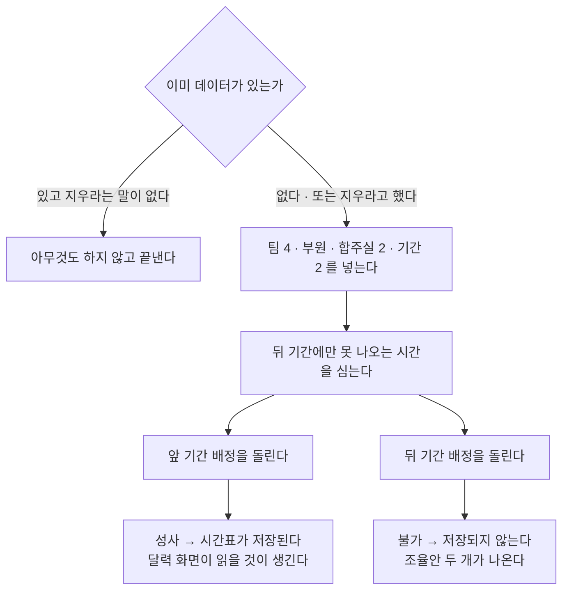

> 문서 버전: 1.0.1 draft



## Abstract

개발용 시드 데이터는 화면이 띄울 실제 데이터를 저장소에 미리 채워 넣는 장치다. 단순히 표를 채우는 것이 아니라, **화면이 보여줘야 할 두 가지 상태를 일부러 함께 만든다** — 배정이 성사돼 시간표가 확정된 상태와, 자리를 채우지 못해 조율안이 나온 상태다. 이 둘이 동시에 있어야 화면의 모든 갈래를 한 번에 눈으로 확인할 수 있다.

## Introduction

빈 저장소에 붙은 화면은 아무것도 증명하지 못한다. 그렇다고 데이터를 손으로 넣으면 넣을 때마다 모양이 달라져, 어제 본 화면과 오늘 본 화면이 다른 이유가 코드 때문인지 데이터 때문인지 알 수 없게 된다.

더 큰 문제는 **실패한 상태를 손으로 만들기가 어렵다는 것**이다. 배정이 풀리지 않는 상황은 우연히 만들어지지 않는다. 누가 언제 못 나오는지를 정확히 설계해야 "이 사람만 빼면 풀린다"는 조율안이 나온다. 시드는 그 설계를 코드로 굳혀, 누가 언제 돌리든 같은 실패가 같은 모양으로 재현되게 한다.

## Related Work

- [화면](../README.md) — 이 데이터를 띄우는 화면들 (상위 기능)
- [데이터 저장소](../../database-layer/README.md) — 시드가 채우는 표들과 그 규칙
- [자동 배정](../../auto-assignment/README.md) — 시드가 실제로 돌려보는 계산과 조율안의 규칙
- [기간 자동 배정](../../scheduling-api/period-assignment/README.md) — 시드가 부르는, 저장까지 잇는 배정 통로
- [팀과 소속](../../teams/README.md) — 사람·팀·포지션 구조
- [합주실과 기간](../../practice-room-and-periods/README.md) — 합주실 운영시간과 집중 합주기간

## Description

### 기간을 둘 두는 이유

```
앞 기간 ── 아무도 막지 않는다 ──▶ 배정 성사 ──▶ 시간표가 저장된다
                                                └─ 달력 화면이 읽을 것

뒤 기간 ── 두 사람이 서로 다른 날을 막는다 ──▶ 배정 불가 ──▶ 저장되지 않는다
                                                └─ 배정 화면의 A안 · B안
```

한 기간만 두면 화면의 절반밖에 못 본다. 성공만 있으면 조율안 화면이 영원히 비어 있고, 실패만 있으면 확정된 시간표를 볼 수 없다. 그래서 처음부터 둘을 만든다.

### 조율안이 둘 나오도록 설계한다

뒤 기간에서 한 팀의 두 사람이 못 나오는 시간을 신고하는데, **막는 날이 서로 겹치지 않게** 심는다. 그래야 "둘 중 누구 하나만 빠져도 나머지 날짜로 자리를 채울 수 있다"가 성립해 조율안이 두 개 나온다.

```
       21일 22일 23일 24일 25일 26일
사람 A  ██   ██   ██   ·    ·    ·
사람 B   ·    ·    ·   ██   ██   ██
        └── A를 빼면 여기가 열린다 ──┘
        └────── B를 빼면 여기가 열린다
```

막는 날을 겹쳐 심으면 아무도 빼도 풀리지 않아 조율안이 하나도 나오지 않는다. 조율안 화면을 확인하는 것이 목적이므로, 이 배치는 우연이 아니라 의도된 것이다.

### 명단은 화면 설계와 같은 것을 쓴다

시드의 명단은 설계 화면에 그려져 있던 명단을 그대로 옮긴 것이다. 그중에서도 두 가지를 일부러 담았다.

| 담은 것 | 왜 |
| --- | --- |
| 두 팀에 걸친 **한 사람** | 사람이 두 팀을 겸할 때 계산이 그를 한 몸으로 다루는지 눈으로 확인한다 |
| 이름이 같은 **다른 두 사람** | 사람을 이름이 아니라 번호로 가르는 규칙이 화면까지 지켜지는지 확인한다 |

이 저장소는 동명이인이 있다는 전제 위에 서 있다. 그 전제가 실제로 지켜지는지는 동명이인이 들어 있는 데이터로 화면을 띄워봐야만 알 수 있다.

### 넣고 끝내지 않고, 실제로 돌려본다

시드는 데이터를 넣은 뒤 **각 기간의 배정을 실제로 계산한다.** 계산 결과를 한 줄로 알려주므로, 화면을 열기 전에 이미 "앞 기간은 성사돼 저장됐고 뒤 기간은 조율안 두 개가 나왔다"를 확인할 수 있다.

화면이 비어 보일 때 원인이 화면인지 데이터인지 가려내는 데 이 한 줄이 결정적이다. 시드가 성사라고 말했는데 화면이 비었다면 화면 문제이고, 시드가 이미 불가라고 말했다면 화면은 정상이다.

### 두 번 돌려도 망가지지 않는다

이미 데이터가 있으면 시드는 **아무것도 하지 않고 끝낸다.** 지우고 다시 넣는 것은 그렇게 하라고 분명히 말했을 때만 한다. 손으로 만들어둔 데이터를 무심코 날리는 일을 막기 위해서다.

지울 때는 자식 표부터 지워 표 사이의 참조가 깨지지 않게 한다. 다만 **포지션은 지우지 않는다** — 그것은 시드가 만든 데이터가 아니라 저장소를 세울 때 함께 들어간 기준 데이터이므로, 시드의 소관이 아니다. 자기가 만들지 않은 것은 지우지 않는 것이 원칙이다.

```
지운다:  배정 백업 → 배정 → 못 나오는 시간 → 소속 → 기간 → 합주실 → 팀 → 사람
안 지운다: 포지션 (기준 데이터)
```

### 계산이 도는 만큼 시간이 걸린다

시드는 표를 채우는 것으로 끝나지 않고 배정 계산을 기간마다 한 번씩 돌린다. 게다가 실패한 기간에서는 조율안을 찾느라 사람 수만큼 계산을 더 돌린다. 그래서 시드는 즉시 끝나지 않는다. 이것은 느린 것이 아니라 실제 계산을 정직하게 돌린 결과다.

실행 방법과 걸리는 시간, 미리 해두어야 할 일은 명령어 문서가 정본이다.

## Conclusion

시드의 값은 데이터의 양이 아니라 **상태의 다양성**에 있다. 성공과 실패, 겸직과 동명이인을 한 번에 담았기 때문에 화면의 갈래를 하나씩 열어볼 수 있다. 이 데이터를 화면이 어떻게 그리는지는 [화면](../README.md)에서, 시드가 채우는 표들의 규칙은 [데이터 저장소](../../database-layer/README.md)에서 이어진다.
