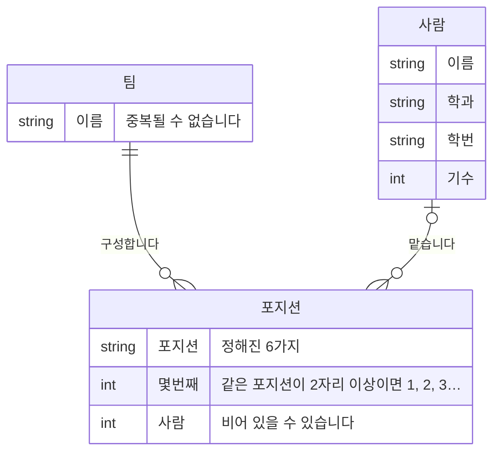

> 문서 버전: 2.0.3 draft



## Abstract

팀은 **포지션 구성**으로 정의합니다. 팀을 만들 때 드럼 1자리, 기타 2자리처럼 포지션마다 몇 자리를 둘지 정하면 그만큼 포지션이 생기고, 그 포지션을 사람으로 채웁니다. 사람이 아직 없는 포지션은 정상 상태입니다. 구성을 먼저 정하고 사람을 나중에 추가합니다.

1명은 2개 이상 팀의 포지션을 맡을 수 있지만, **팀 1개 안에서는 포지션 1개만** 맡습니다. 2개 포지션을 맡으면 배정 계산이 같은 시간에 같은 사람을 2번 계산합니다.

## Introduction

밴드에서는 1명이 2개 이상 팀에 속하는 일이 흔하고, 기타도 치고 드럼도 치는 사람이 팀마다 다른 포지션을 맡기도 합니다. 이 구조를 저장하지 못하면 배정 계산이 잘못됩니다.

이 구조에 더해, 팀은 사람이 모여서 생기지 않고, **구성을 먼저 정하고 포지션을 채워서** 생깁니다. 드럼 포지션이 비어 있는 4인조는 3명 팀이 아니라 포지션 1개가 빈 4인조입니다. 그래서 이 기능은 사람의 명단이 아니라 **포지션의 명단**을 팀의 정의로 삼습니다.

## Related Work

- [Banblit 개요](../README.md) — 전체 기능 지도
- [계정과 역할](../accounts-and-roles/README.md) — 요청한 사용자를 확인하는 로그인 session과 항목별 권한
- [자동 배정](../auto-assignment/README.md) — 포지션을 맡은 사람을 근거로 팀 합주 시간을 배정
- [게시판과 공지](../boards/README.md) — 팀 게시판을 읽을 수 있는지 결정하는 기준
- [데이터 저장소](../database-layer/README.md) — 팀과 포지션이 실제로 저장되는 방식
- [화면](../screens/README.md) — 팀 목록과 명단을 표시하는 화면

## Description

### 포지션은 (팀 + 포지션 + 몇 번째)입니다

포지션은 정해진 6가지입니다. 보컬, 일렉, 통기타, 베이스, 신디, 드럼입니다.

같은 포지션을 2자리 이상 두면 **몇 번째인지**로 구분합니다. 일렉이 2자리이면 (일렉, 1)과 (일렉, 2)입니다. 포지션마다 1자리씩이면 번호가 화면에 표시되지 않고 "드럼", "베이스"로만 표시됩니다.

```
팀 "새벽 네시"의 구성
┌──────────────┬────────────┐
│ 보컬          │ 박서연      │
│ 일렉 1        │ 이도현      │
│ 일렉 2        │ (비어 있음) │
│ 베이스        │ 최유진      │
│ 드럼          │ 정하람      │
└──────────────┴────────────┘
        5자리 중 4자리가 참
```

### 구성은 나중에 수정할 수 있습니다

팀을 만든 뒤에도 포지션별 인원을 수정할 수 있습니다. 수정할 때 **이미 배정된 사람은 유지됩니다.** 같은 (포지션, 몇 번째)를 그대로 두고, 늘어난 만큼만 새 포지션을 추가하고, 줄어들면 번호가 큰 쪽부터 삭제합니다. 구성을 전부 다시 생성하면 수정하지 않은 포지션의 사람까지 함께 삭제되는데, 인원 1명을 수정하려고 팀 전체를 다시 채울 이유가 없습니다.

```
일렉 2 ─▶ 3 으로 늘리면
  (일렉,1) 이도현   그대로
  (일렉,2) 김하늘   그대로
  (일렉,3) ―        새로 생김

일렉 3 ─▶ 1 로 줄이면
  (일렉,1) 이도현   그대로
  (일렉,2)(일렉,3)  번호가 큰 쪽부터 없앰
```

### 참가 신청은 삭제했습니다 (2026-09-08)

예전에는 멤버가 공개된 팀 목록에서 참가를 신청하고, 팀마다 자동 승인·직접 승인을 선택해 두는 구조였습니다. 그 구조를 삭제했습니다.

**팀의 구성은 신청자 1명이 정할 일이 아니기 때문입니다.** 포지션 구성은 배정 계산의 입력입니다. 누가 어느 포지션에 들어오는지가 그 팀의 합주 시간과 다른 팀의 합주 시간을 함께 변경합니다. 본인이 신청해서 참가하는 방식은 그 결정을 신청한 사람에게 맡기는 것이고, 그러면 승인 단계를 다시 추가해야 합니다. 승인 단계를 추가하는 것보다 **처음부터 권한을 가진 사람이 추가하는 편**이 단계가 1개 적습니다.

지금은 "포지션별 인원 배치"를 가진 사람이 빈 포지션에 사람을 추가합니다. 화면에서는 포지션 옆의 검색 아이콘을 눌러 사람을 검색하여 선택합니다. 포지션에서 사람을 삭제하는 권한은 "포지션 배치 인원 제외"입니다.

### 사람을 삭제해도 포지션은 남습니다

포지션에서 사람을 삭제하면 그 포지션은 **비워지지만 삭제되지 않습니다.** 본인이 탈퇴하거나 "멤버 추방" 을 가진 사람이 추방해 계정이 삭제될 경우에도 같습니다. 그 사람이 맡던 포지션은 비워지고 유지됩니다. 포지션은 팀의 구성이므로, 사람이 나갔다고 포지션이 삭제되면 안 됩니다. 드럼 포지션이 빈 채로 남아 있어야 다음 사람을 그 포지션에 추가할 수 있습니다.

반대로 팀을 삭제하면 그 팀의 포지션은 함께 삭제됩니다. 팀이 삭제된 뒤의 포지션은 참조할 팀이 없습니다.

### 누가 무엇을 할 수 있는지 서버가 검증합니다

| 하는 일 | 할 수 있는 사람 |
| --- | --- |
| 팀 생성 | "팀 생성"을 가진 사용자 |
| 팀 이름 수정, 포지션 구성 수정 | "팀 수정"을 가진 사용자 |
| 팀 삭제 | "팀 삭제"를 가진 사용자 |
| 포지션에 사람 추가 | "포지션별 인원 배치"를 가진 사용자 |
| 포지션에서 사람 삭제 | 본인, 또는 "포지션 배치 인원 제외"를 가진 사용자 |
| 팀 목록·팀 명단·멤버 명단 조회 | 로그인한 사용자 전체 |

**동작 1개가 권한 항목 1개입니다.** 예전에는 "팀 만들기·이름 바꾸기" 항목 1개가 생성과 수정을 함께 허용했습니다. 지금은 생성·수정·삭제가 각각 별도 항목을 갖습니다. 어떤 항목이 있고 누가 그 항목을 갖는지는 [계정과 역할](../accounts-and-roles/README.md)이 정본입니다.

**사람 검색 입력칸은 빈 검색어에 빈 결과를 반환합니다.** 포지션에 추가할 사람은 이름의 부분 문자열로 검색합니다. 검색어가 비어 있을 때 전체를 반환하면, 검색 endpoint(API의 요청 주소 단위)가 전체 멤버 명단을 반환하는 endpoint가 됩니다. 그래서 빈 검색어에는 빈 결과를 반환합니다.

**팀을 만들 때 "만든 사람"을 요청에 담아 보내지 않습니다.** 만든 사람은 인증 cookie의 소유자이므로 요청에 담긴 값은 신뢰할 수 없습니다.

**어떻게 확인했나.** 팀·포지션 endpoint를 확인하는 테스트가 로그인하지 않은 요청과 권한이 없는 요청을 서로 다른 응답으로 구분하는지 확인합니다. 구성을 수정할 때 배정된 사람이 유지되는지, 줄일 때 번호가 큰 쪽부터 삭제되는지, 1명이 같은 팀의 2개 포지션을 맡으려 하면 거절되는지, 팀을 삭제하면 포지션이 함께 삭제되는지도 같은 파일이 확인합니다. 서버 테스트 468개와 화면 테스트 202개가 모두 통과합니다.

## Conclusion

팀의 구성이 정해지면, 그 팀들이 언제 합주하는지를 다루는 [합주실과 기간](../practice-room-and-periods/README.md) 및 [스케줄러](../scheduler/README.md)로 이어집니다.
