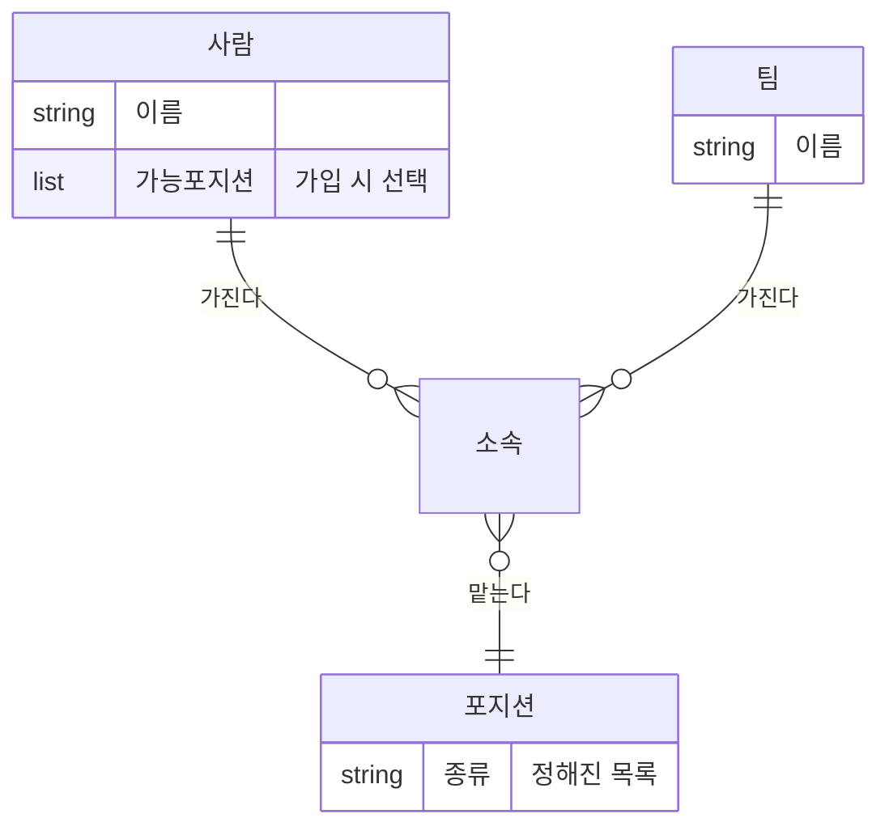

> 문서 버전: 1.0.1 draft



## Abstract

팀과 소속은 "누가 어느 팀에서 어떤 악기를 맡는가"를 다룬다. 한 사람은 여러 팀에 속할 수 있고, 여러 악기를 다루는 사람은 팀마다 다른 포지션으로 소속될 수 있다. 그래서 소속은 사람 하나가 아니라, 사람과 팀과 포지션을 묶은 단위로 기록한다. 팀은 헤드매니저가 만들고, 멤버는 공개된 팀 목록에서 참가를 신청한다.

## Introduction

밴드에서는 한 사람이 여러 팀을 겸하는 일이 흔하고, 기타도 치고 드럼도 치는 사람이 팀마다 다른 악기를 맡기도 한다. 이런 구조를 담지 못하면 일정 계산이 어긋난다. 예를 들어 같은 사람이 두 팀에 동시에 배정되면 안 되기 때문에, 소속을 정확히 기록하는 일이 이후의 [자동 배정](../auto-assignment/README.md)의 바탕이 된다.

## Related Work

- [Banblit 개요](../README.md) — 전체 기능 지도
- [계정과 역할](../accounts-and-roles/README.md) — 참가를 승인하는 헤드매니저 권한
- [자동 배정](../auto-assignment/README.md) — 소속을 근거로 팀 합주 시간을 배정
- [게시판과 공지](../boards/README.md) — 소속에 따라 팀 게시판 접근이 갈림
- [데이터 저장소](../database-layer/README.md) — 소속(사람+팀+포지션)과 이름 식별자 규칙이 실제로 저장되는 방식

## Description

**소속의 단위.** 소속은 (사람 + 팀 + 포지션) 하나로 본다. 같은 사람이 A팀에서는 기타, B팀에서는 드럼을 맡으면 서로 다른 두 소속이 된다.

**포지션.** 악기 포지션은 정해진 목록에서 고른다. 사람은 가입할 때 자신이 맡을 수 있는 포지션을 체크한다.

**팀 참가 흐름.**

```
멤버가 공개 팀 목록에서 팀 선택
        │
     참가 신청
        │
   ┌────┴─────┐
자동 승인     직접 승인(헤드매니저 확인)
   │            │
   └──── 소속 성립 ────┘
```

- 팀은 헤드매니저가 만든다. 헤드매니저가 멤버를 직접 넣을 수도 있다.
- 지향점은 멤버가 스스로 팀에 참가하는 것이다.
- 참가 승인 방식은 팀마다 자동 승인과 직접 승인 중에서 헤드매니저가 고른다.
- 소속 인원 수나 악기 구성에는 제약을 두지 않는다.

## Conclusion

팀과 소속이 정해지면, 그 팀들이 언제 합주하는지를 다루는 [합주실과 기간](../practice-room-and-periods/README.md) 및 [스케줄러](../scheduler/README.md)로 이어진다.
