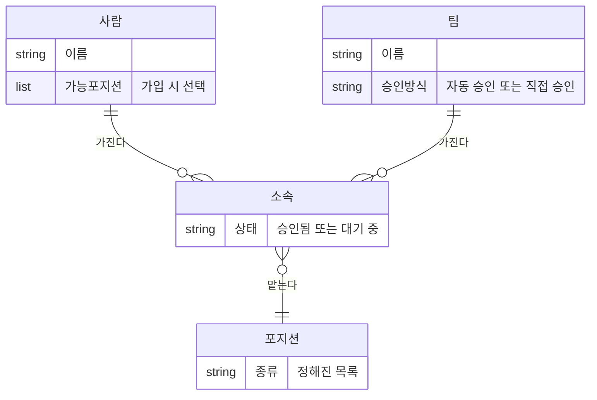

> 문서 버전: 1.3.1 draft



## Abstract

팀과 소속은 "누가 어느 팀에서 어떤 악기를 맡는가"를 다룬다. 한 사람은 여러 팀에 속할 수 있고, 여러 악기를 다루는 사람은 팀마다 다른 포지션으로 소속될 수 있다. 그래서 소속은 사람 하나가 아니라, 사람과 팀과 포지션을 묶은 단위로 기록한다. 팀은 "팀 만들기·이름 바꾸기" 항목을 가진 사람이 만들고, 멤버는 공개된 팀 목록에서 참가를 신청한다. 신청이 곧바로 소속이 되는지, 승인을 받아야 소속이 되는지는 팀마다 고른 승인 방식이 가른다. 승인을 기다리는 사람은 아직 그 팀 소속이 아니다.

## Introduction

밴드에서는 한 사람이 여러 팀을 겸하는 일이 흔하고, 기타도 치고 드럼도 치는 사람이 팀마다 다른 악기를 맡기도 한다. 이런 구조를 담지 못하면 일정 계산이 어긋난다. 예를 들어 같은 사람이 두 팀에 동시에 배정되면 안 되기 때문에, 소속을 정확히 기록하는 일이 이후의 [자동 배정](../auto-assignment/README.md)의 바탕이 된다.

## Related Work

- [Banblit 개요](../README.md) — 전체 기능 지도
- [계정과 역할](../accounts-and-roles/README.md) — 요청한 사람을 가려내는 로그인 세션과 항목별 권한
- [자동 배정](../auto-assignment/README.md) — 소속을 근거로 팀 합주 시간을 배정
- [게시판과 공지](../boards/README.md) — 소속에 따라 팀 게시판 접근이 갈림
- [데이터 저장소](../database-layer/README.md) — 소속(사람+팀+포지션)과 이름 식별자 규칙이 실제로 저장되는 방식
- [화면](../screens/README.md) — 팀 목록과 명단이 실제로 그려지는 자리

## Description

**소속의 단위.** 소속은 (사람 + 팀 + 포지션) 하나로 본다. 같은 사람이 A팀에서는 기타, B팀에서는 드럼을 맡으면 서로 다른 두 소속이 된다.

**포지션.** 악기 포지션은 정해진 목록에서 고른다. 사람은 가입할 때 자신이 맡을 수 있는 포지션을 체크한다.

**팀 참가 흐름.** 그림의 두 갈래는 이제 실제 동작이다 — 그동안은 승인 방식을 무엇으로 정해 두든 신청하면 그 자리에서 가입됐다.

```
멤버가 공개 팀 목록에서 팀 선택
        │
     참가 신청
        │
   ┌────┴──────────────────┐
자동 승인 팀              직접 승인 팀
   │                        │
소속 성립(승인됨)      신청 걸림(대기 중)
                            │
                  ┌─────────┴──────────┐
                승인                  거절 또는 본인이 취소
                  │                        │
             소속 성립(승인됨)         신청이 사라짐
```

- 팀을 만드는 것도, 이름을 바꾸는 것도 "팀 만들기·이름 바꾸기" 항목을 가진 사람이 한다.
- 지향점은 멤버가 스스로 팀에 참가하는 것이다.
- 참가 승인 방식은 팀마다 자동 승인과 직접 승인 중에서 같은 항목을 가진 사람이 고른다. **이미 있던 팀은 전부 자동 승인**으로 시작한다 — 지금까지의 동작이 그것이었다.
- 소속 인원 수나 악기 구성에는 제약을 두지 않는다.
- 팀 목록을 읽으면 그 팀의 승인 방식이 함께 담겨 온다. 신청 버튼을 누르기 전에 즉시 들어가는 팀인지 기다려야 하는 팀인지 알 수 있어야 하기 때문이다.

**소속에 상태가 생겼다.** 승인됨과 대기 중 두 가지다. **이미 있던 소속은 전부 승인됨**이다 — 대기 중이라는 것이 지금까지 없었다.

**대기 중인 사람은 그 팀 소속이 아니다.** 이것은 표현의 문제가 아니라, 소속을 세거나 훑는 자리 전부에서 실제로 빠진다는 뜻이다.

| 그 팀에서 | 승인됨 | 대기 중 |
| --- | --- | --- |
| 팀 명단에 나오는가 | 나온다 | 나오지 않는다 |
| 팀 인원 수에 세는가 | 센다 | 세지 않는다 |
| 팀 게시판을 읽고 쓸 수 있는가 | 된다 | 안 된다 |
| 그 팀 이름으로 예약할 수 있는가 | 된다 | 안 된다 |
| 자동 배정이 보는 팀 명단에 들어가는가 | 들어간다 | 들어가지 않는다 |

소속을 세거나 훑는 자리는 서버 전체에 열한 곳이 있고, 그 열한 곳을 모두 찾아 승인된 것만 보도록 맞췄다. 한 곳이라도 빠뜨리면 명단에는 없는 사람이 배정에는 들어가는 식으로 어긋난다.

**신청 취소는 팀에서 나가는 것과 같은 자리로 한다.** 대기 중인 자기 신청을 무르는 것은 결국 그 팀과의 관계를 끊는 일이라, 통로를 따로 만들지 않고 나가는 자리가 상태를 가리지 않고 처리한다.

**로그인한 사람은 자기 신청 상태를 읽을 수 있다.** 내 계정을 묻는 자리가 승인된 소속과 대기 중인 신청을 한 목록에 담아 상태로 갈라 준다. 그러지 않으면 신청해 놓고 페이지를 닫은 사람이 자기가 신청을 냈는지조차 알 수 없다.

**승인과 거절이 거의 동시에 들어오면.** 같은 신청에 승인과 거절이 겹쳐 들어오면, 방금 승인돼 소속이 된 행을 뒤늦게 도착한 거절이 그대로 지울 수 있었다. 신청을 찾아내는 자리에 잠금을 걸어 한 번에 하나만 지나가게 했다. 먼저 들어온 쪽이 상태를 바꾸고 나면 뒤늦은 쪽은 찾는 조건에 더 이상 걸리지 않아 "그런 참가 신청이 없다"로 걸러진다.

### 누가 무엇을 할 수 있는지 서버가 가른다

**서버가 요청을 보낸 사람이 누구인지 안다.** 로그인 상태를 서버가 직접 들고 있게 되면서, 팀과 소속을 건드리는 자리마다 자격을 먼저 확인한다.

| 하는 일 | 할 수 있는 사람 |
| --- | --- |
| 팀 만들기, 팀 이름 바꾸기, 참가 승인 방식 바꾸기 | "팀 만들기·이름 바꾸기"를 가진 사람만 |
| 팀에 참가 신청하기 | 로그인한 사람 — 들어가는 것은 언제나 본인 |
| 팀에서 빼기, 내 신청 취소하기 | 본인, 또는 "팀에서 남을 빼기"를 가진 사람 |
| 참가 신청 목록 읽기, 승인하기, 거절하기 | "팀 참가 승인" 항목을 가진 사람 |
| 팀 목록·팀 명단·포지션 목록 읽기 | 로그인한 사람 전체 |

승인·거절을 가리는 것은 권한 항목 하나다. 어떤 항목들이 있고 누가 그것을 갖는지는 [계정과 역할](../accounts-and-roles/README.md)이 정본이며, 여기서는 승인·거절에 그 항목이 필요하다는 것까지만 적는다. 승인 방식 자체를 바꾸는 것은 팀을 고치는 일이라 팀을 다루는 항목이 가른다.

**참가하는 사람은 언제나 요청을 보낸 본인이다.** 예전에는 누구를 넣을지 요청에 적어 보내면 서버가 그대로 믿었다. 로그인하지 않은 사람도 남을 아무 팀에나 집어넣을 수 있었다는 뜻이다. 지금은 인증 쿠키의 주인만 들어간다. 남을 대신 넣는 길은 만들지 않았다 — 그 화면이 아직 없기 때문이다. 멤버를 직접 넣는 화면을 만들 때 그 통로를 따로 연다.

**소속을 빼는 것은 본인이거나 "팀에서 남을 빼기"를 가진 사람일 때만 된다.** 그 항목이 없는 사람이 남의 소속을 지우려 하면 거절된다.

**팀을 만들 때 "만든 사람"을 요청에 적어 보내던 자리를 없앴다.** 만든 사람은 요청에 적힌 값이 아니라 인증 쿠키의 주인이므로, 적어 보내는 값은 믿을 근거가 되지 못한다. 화면 쪽에서도 그 값을 보내던 자리를 함께 지웠다.

**어떻게 확인했나.** 서버 검사 457개가 모두 통과하고, 타입 검사도 95개 파일에서 이상이 없다. 위 표의 갈림은 팀·소속 통로를 확인하는 검사 파일이 맡는다 — 로그인하지 않은 요청과 로그인했지만 자격이 없는 요청을 서로 다른 응답으로 가르는지까지 함께 본다. 승인 방식 두 갈래, 대기 중인 사람이 명단·인원 수·게시판·예약·배정 명단에서 빠지는 것, 본인이 자기 신청을 무르는 것도 같은 파일이 본다.

저장소를 옮기는 변경이라 데이터를 넣어둔 채로 올렸다 내렸다 왕복해 보았다. 되돌리면 대기 중인 신청은 사라지고 승인된 소속만 남는다 — 상태 열이 없어지는 순간 대기 중이던 행이 소속으로 둔갑하는 것을 막기 위해, 되돌리는 쪽이 그 행들을 먼저 지운다.

## Conclusion

팀과 소속이 정해지면, 그 팀들이 언제 합주하는지를 다루는 [합주실과 기간](../practice-room-and-periods/README.md) 및 [스케줄러](../scheduler/README.md)로 이어진다.
