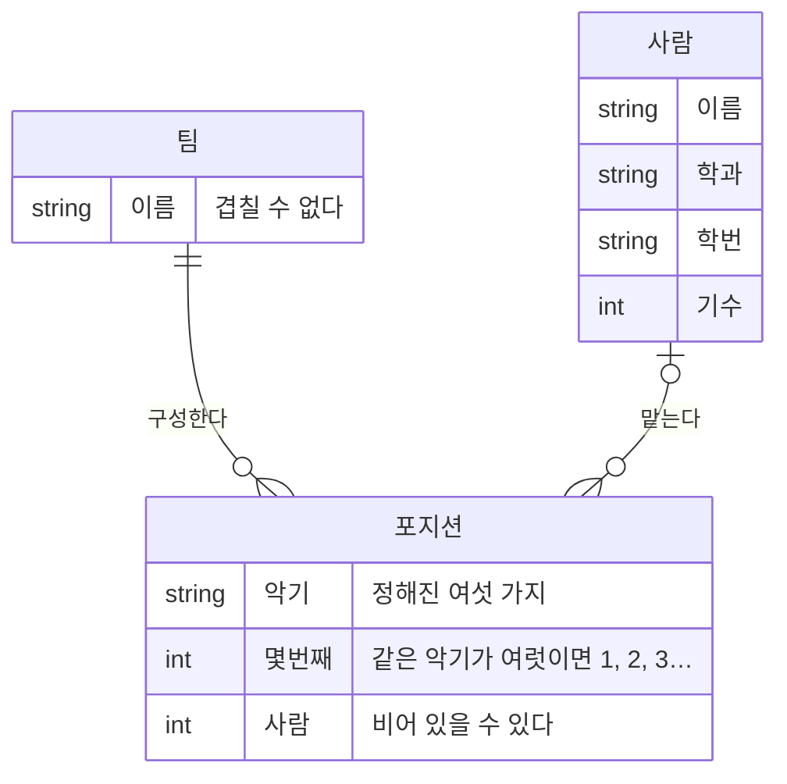

> 문서 버전: 2.0.0 draft



## Abstract

팀은 **악기별 포지션 구성**으로 정의합니다. 팀을 만들 때 드럼 하나, 기타 둘처럼 악기마다 몇 자리를 둘지 정하면 그만큼 포지션이 생기고, 그 포지션을 사람으로 채웁니다. 사람이 아직 없는 포지션은 정상 상태입니다 — 구성이 먼저 서고 사람이 나중에 들어옵니다.

한 사람은 여러 팀의 포지션을 맡을 수 있지만, **한 팀 안에서는 포지션 하나만** 맡습니다. 겸하면 배정 계산이 같은 사람을 같은 시간에 두 번 세게 됩니다.

## Introduction

밴드에서는 한 사람이 여러 팀을 겸하는 일이 흔하고, 기타도 치고 드럼도 치는 사람이 팀마다 다른 악기를 맡기도 합니다. 이 구조를 담지 못하면 일정 계산이 어긋납니다.

여기에 더해, 팀은 사람이 모여서 생기는 것이 아니라 **구성이 먼저 정해지고 그 자리를 채우는** 것입니다. 드럼 자리가 비어 있는 4인조는 3명짜리 팀이 아니라 한 자리가 빈 4인조입니다. 그래서 이 기능은 사람의 목록이 아니라 **포지션의 목록**을 팀의 정의로 삼습니다.

## Related Work

- [Banblit 개요](../README.md) — 전체 기능 지도
- [계정과 역할](../accounts-and-roles/README.md) — 요청한 사람을 가려내는 로그인 세션과 항목별 권한
- [자동 배정](../auto-assignment/README.md) — 포지션에 앉은 사람들을 근거로 팀 합주 시간을 배정
- [게시판과 공지](../boards/README.md) — 팀 게시판을 읽을 수 있는지 가르는 기준
- [데이터 저장소](../database-layer/README.md) — 팀과 포지션이 실제로 저장되는 방식
- [화면](../screens/README.md) — 팀 목록과 명단이 실제로 그려지는 자리

## Description

### 포지션은 (팀 + 악기 + 몇 번째)입니다

악기는 정해진 여섯 가지입니다 — 보컬, 일렉, 통기타, 베이스, 신디, 드럼.

같은 악기를 여러 자리 두면 **몇 번째인지**로 갈립니다. 일렉이 둘이면 (일렉, 1)과 (일렉, 2)입니다. 악기마다 한 자리씩이면 번호가 화면에 나오지 않고 "드럼", "베이스"로만 보입니다.

```
팀 "새벽 네시"의 구성
┌──────────────┬────────────┐
│ 보컬          │ 박서연      │
│ 일렉 1        │ 이도현      │
│ 일렉 2        │ (비어 있음) │
│ 베이스        │ 최유진      │
│ 드럼          │ 정하람      │
└──────────────┴────────────┘
        5자리 중 4자리가 참
```

### 구성은 나중에 고칠 수 있습니다

팀을 만든 뒤에도 악기별 인원을 고칠 수 있습니다. 고칠 때 **이미 앉아 있는 사람은 그대로 있습니다** — 같은 (악기, 몇 번째)를 그대로 두고, 늘어난 만큼만 새 포지션을 만들고, 줄어들면 번호가 큰 쪽부터 없앱니다. 구성을 통째로 다시 만들면 손대지 않은 자리의 사람까지 함께 빠지는데, 인원 하나를 고치려고 팀 전체를 다시 채우게 만들 이유가 없습니다.

```
일렉 2 ─▶ 3 으로 늘리면
  (일렉,1) 이도현   그대로
  (일렉,2) 김하늘   그대로
  (일렉,3) ―        새로 생김

일렉 3 ─▶ 1 로 줄이면
  (일렉,1) 이도현   그대로
  (일렉,2)(일렉,3)  번호가 큰 쪽부터 없앰
```

### 참가 신청은 없앴습니다 (2026-09-08)

예전에는 멤버가 공개된 팀 목록에서 참가를 신청하고, 팀마다 자동 승인·직접 승인을 골라 두는 구조였습니다. 그 구조를 걷어냈습니다.

**팀의 구성은 한 사람이 혼자 정할 일이 아니기 때문입니다.** 포지션 구성은 배정 계산에 그대로 걸립니다 — 누가 어느 자리에 들어오는지가 그 팀의 합주 시간과 다른 팀의 합주 시간을 함께 바꿉니다. 본인이 신청해서 들어오는 흐름은 그 결정을 신청한 사람에게 맡기는 셈이고, 그러면 승인이라는 단계를 다시 붙여야 합니다. 승인을 붙일 바에는 **처음부터 넣는 사람이 넣는 편**이 단계가 하나 적습니다.

지금은 "멤버 추가"를 가진 사람이 빈 포지션에 사람을 넣습니다. 화면에서는 포지션 옆의 돋보기를 눌러 사람을 찾아 고릅니다. 빼는 것은 "멤버 삭제"입니다.

### 사람이 나가도 포지션은 남습니다

포지션에서 사람을 빼면 그 자리는 **비워지되 사라지지 않습니다.** 계정을 지워도 마찬가지입니다. 포지션은 팀의 구성이라, 사람이 나갔다고 팀에 구멍이 나면 안 됩니다 — 드럼 자리가 빈 채로 남아 있어야 다음 사람을 그 자리에 넣을 수 있습니다.

반대로 팀을 지우면 그 팀의 포지션은 함께 사라집니다. 팀이 없어진 뒤의 포지션은 가리킬 곳이 없습니다.

### 누가 무엇을 할 수 있는지 서버가 가릅니다

| 하는 일 | 할 수 있는 사람 |
| --- | --- |
| 팀 만들기 | "팀 만들기"를 가진 사람 |
| 팀 이름 바꾸기, 포지션 구성 고치기 | "팀 수정"을 가진 사람 |
| 팀 지우기 | "팀 삭제"를 가진 사람 |
| 포지션에 사람 넣기 | "멤버 추가"를 가진 사람 |
| 포지션에서 사람 빼기 | 본인, 또는 "멤버 삭제"를 가진 사람 |
| 팀 목록·팀 명단·멤버 명단 읽기 | 로그인한 사람 전체 |

**동작 하나가 항목 하나입니다.** 예전에는 "팀 만들기·이름 바꾸기" 하나가 만들기와 고치기를 함께 열었습니다. 지금은 만들기·수정·삭제가 각자 자기 항목을 갖습니다. 어떤 항목들이 있고 누가 그것을 갖는지는 [계정과 역할](../accounts-and-roles/README.md)이 정본입니다.

**사람을 찾는 칸은 빈 검색어에 아무것도 돌려주지 않습니다.** 포지션에 넣을 사람을 찾는 자리는 이름 일부로 찾습니다. 검색어가 비어 있을 때 전체를 돌려주면, 그 자리가 명단을 통째로 꺼내는 통로가 됩니다. 그래서 빈 검색어에는 빈 결과로 답합니다.

**팀을 만들 때 "만든 사람"을 요청에 적어 보내지 않습니다.** 만든 사람은 인증 쿠키의 주인이므로 요청에 적힌 값은 믿을 근거가 되지 못합니다.

**어떻게 확인했나.** 팀·포지션 endpoint를 확인하는 테스트가 로그인하지 않은 요청과 권한이 없는 요청을 서로 다른 응답으로 가르는지 봅니다. 구성을 고칠 때 앉아 있던 사람이 남는지, 줄일 때 번호가 큰 쪽부터 없어지는지, 한 사람이 같은 팀의 두 포지션을 맡으려 하면 거절되는지, 팀을 지우면 포지션이 함께 지워지는지도 같은 파일이 봅니다. 서버 테스트 468개와 화면 테스트 202개가 모두 통과합니다.

## Conclusion

팀의 구성이 정해지면, 그 팀들이 언제 합주하는지를 다루는 [합주실과 기간](../practice-room-and-periods/README.md) 및 [스케줄러](../scheduler/README.md)로 이어집니다.
