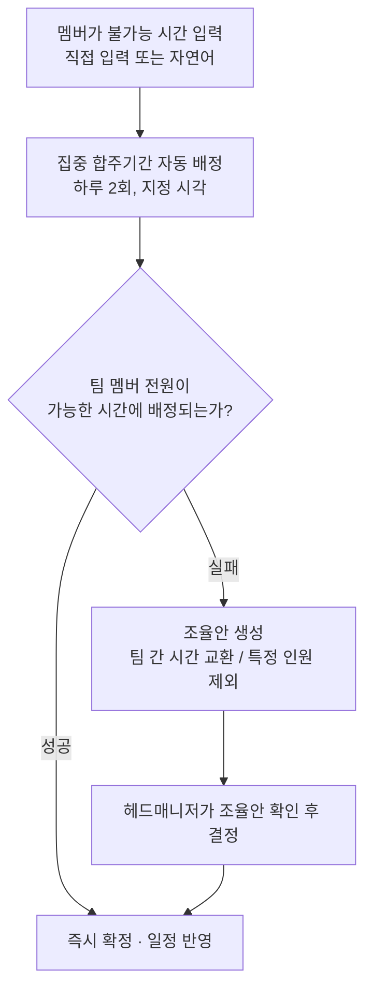

# Banblit

> 문서 버전: 1.0.1 draft

밴드의 공용 합주실 일정을, 멤버가 "사용할 수 없는 시간"만 등록하면 자동으로 배정해주는 합주 일정 관리 서비스입니다.

## Abstract

Banblit은 1개의 합주실을 2개 이상의 밴드 팀이 함께 사용할 때 발생하는 일정 충돌을 줄이기 위해 만든 서비스입니다. 각 멤버는 합주에 참여할 수 없는 시간만 등록하면 되고, 집중 합주기간에는 시스템이 등록된 불가능 시간을 모아 팀별 합주 시간을 자동으로 배정합니다. 자동 배정으로 해결되지 않으면 조율안을 생성하여 권한자가 의사결정하도록 돕습니다.

## 배경

밴드 팀들이 1개의 합주실을 공유할 때 팀 간 시간이 자주 겹칩니다. 특히 한 사람이 2개 이상의 팀에 속해 있으면 그 사람의 일정이 한 번 변경되는 것만으로도 그 사람이 속한 모든 팀의 일정이 연쇄적으로 영향받고, 연쇄 변경을 수동으로 조정하는 작업이 가장 큰 병목입니다.

Banblit은 일정 조정 작업의 자동화를 목표로 합니다.

## 핵심 흐름



자동 배정은 팀 멤버 전원이 사용 가능한 시간에 먼저 배정하고, 불가능하면 팀 간 시간대를 서로 교환하여 전원이 사용 가능해지는 배정을 찾으며, 그래도 불가능하면 특정 인원을 제외했을 때 전원이 사용 가능해지는 배정을 찾습니다. 어떤 경우에도 멤버가 등록한 사용 불가능 시간을 임의로 무시하지 않습니다.

첫 번째 방식(팀 멤버 전원이 사용 가능한 시간에 배정)으로 해결되면 즉시 확정되고, 나머지 2가지 방식(팀 간 시간대 교환, 특정 인원 제외)이 필요한 경우에는 조율안으로 정리하여 권한자의 의사결정을 거칩니다.

## 주요 기능

- **캘린더 스케줄러** — 월 보기는 3가지 모드(전체 팀 일정 / 합주실 예약 / 내 일정)를 탭으로 전환하고, 주 보기는 모든 팀의 하루 일정을 시간 순서로 표시합니다.
- **자동 배정** — 집중 합주기간 동안 모든 팀이 비슷한 합주량을 갖도록 합주 시간을 배정합니다.
- **자연어 입력** — "다음 주 화요일 저녁은 사용할 수 없어" 같은 표현을 사용 불가능 시간으로 등록·수정·삭제합니다.
- **충돌 조율** — 자동 배정이 실패하면 사람이 선택할 수 있는 조율안을 생성합니다.
- **상시 예약** — 집중기간이 아닐 때는 선착순으로 합주실을 예약하고, 취소·변경할 수 있습니다.
- **팀 게시판과 공지** — 팀마다 게시글과 파일을 공유하는 게시판을 두고, 공지는 전체에게 공개합니다.
- **역할과 권한** — 팀·합주실·기간·권한을 관리하는 헤드매니저 역할을 두며, 권한은 필요에 맞게 새로 정의할 수 있습니다.

## 역할

- **헤드매니저** — 팀 생성, 멤버 관리, 합주실과 운영 시간 설정, 집중 합주기간과 계산 시각 지정, 조율안 결정, 공지 발행, 권한 정의를 담당합니다. 인원은 고정하지 않습니다.
- **일반 멤버** — 자신의 사용 불가능 시간을 관리하고, 팀에 참가하며, 일정을 확인합니다.

## 기술 스택

| 구분 | 사용 기술 |
| --- | --- |
| 프론트엔드 | React + Vite + TypeScript |
| 백엔드 | Python + FastAPI |
| 데이터베이스 | PostgreSQL |
| 자연어 처리 | Claude API (연동 예정) |

## 실행

모든 실행은 container(Docker 가 격리해 실행하는 환경) 안에서 이루어집니다. 호스트에는 Docker만 필요합니다.
개별 `docker compose` 명령의 의미와 주의점은 `COMMAND.md`가 정본입니다.

### 개발 (Windows)

```
.\setup.ps1     # 한 번만. .env를 생성하고 git hook과 banblit 명령을 활성화합니다
banblit up
```

화면은 `http://localhost:5173`, API 문서는 `http://localhost:8000/docs`입니다.
`banblit help`로 나머지 명령을 확인합니다.

### 배포 (Linux 서버)

```
curl -fsSL https://get.docker.com | sh
sudo usermod -aG docker $USER      # 그리고 다시 로그인
git clone https://github.com/minkong-dev/Banblit.git
cd Banblit
cp .env.example .env
nano .env                          # 아래 표의 값을 입력합니다
./banblit.sh up
```

`./banblit.sh up`은 image(container 를 생성하는 원본 파일)를 생성하고, migration(데이터베이스 구조 변경 이력)을 적용하며, 전체 서비스를 시작한 후
응답을 기다립니다. 성공하면 `~/.bashrc`에 `banblit` function 을 추가하므로 성공 이후로는
`./` 없이 어느 경로에서나 실행합니다.

`.env`에서 반드시 입력해야 하는 값입니다. 비어 있으면 시작 전에 멈춥니다.

| 값 | 용도 |
| --- | --- |
| `BANBLIT_DOMAIN` | 서비스 주소. 이 이름으로 인증서를 받으므로 실제로 이 서버를 가리켜야 합니다 |
| `POSTGRES_PASSWORD` | 데이터베이스 비밀번호. 견본 값 그대로면 거절합니다 |
| `SMTP_*` | 비밀번호 재설정·계정명 찾기 메일을 발송할 계정. 비어 있으면 메일이 발송되지 않습니다 |
| `APP_ORIGIN` | 메일에 포함할 링크의 접두사. 배포에서는 `https://<도메인>` |

Cloudflare를 사용한다면 `BANBLIT_DOMAIN` 의 DNS 레코드만 프록시를 비활성화하거나(DNS only) 프록시 모드를
Full(strict)로 설정합니다. 2가지 중 어느 것도 하지 않으면 인증서 발급이 차단됩니다.

## 현재 상태

v1 기획을 확정하고 구현했습니다. 합주실·기간·팀·명단·예약·사용 불가능 시간·게시판·
알림·권한과 자동 배정까지 동작하며, 화면 12개가 서버와 통합되어 있습니다.
Claude API 연동과 소셜 로그인은 미구현입니다.

배포 구성(TLS 앞단 서버·정기 백업·요청 제한)은 코드가 완성되어 있으나 실제 서버에서
검증 전입니다.

## 라이선스

[LICENSE](./LICENSE) 파일을 따릅니다.
