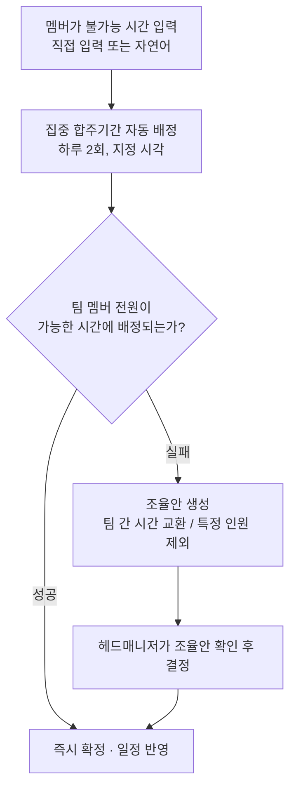

# Banblit

> 문서 버전: 1.0.0 draft

밴드의 공용 합주실 일정을, 멤버가 "안 되는 시간"만 입력하면 자동으로 짜주는 합주 일정 관리 서비스.

## Abstract

Banblit은 하나의 합주실을 여러 밴드 팀이 나눠 쓸 때 생기는 일정 충돌을 줄이기 위한 서비스다. 각 멤버는 자신이 합주에 참여할 수 없는 시간만 등록한다. 집중 합주기간에는 시스템이 그 정보를 모아 팀별 합주 자리를 자동으로 배정하고, 자동 배정으로 답이 나오지 않으면 조율안을 만들어 관리자가 결정하도록 돕는다.

## 배경

밴드 팀들이 하나의 합주실을 공유하면, 팀 간 시간이 자주 겹친다. 특히 한 사람이 여러 팀에 속해 있을 때, 그 사람의 일정이 한 번 바뀌면 관련된 여러 팀의 일정이 연쇄로 무너진다. 이 조정을 사람이 손으로 처리하는 것이 가장 큰 병목이다. Banblit은 이 조정 과정을 자동화하는 것을 목표로 한다.

## 핵심 흐름

자동 배정은 다음 순서로 자리를 찾는다. 어떤 경우에도 멤버가 등록한 불가능 시간을 임의로 무시하지 않는다.

1. 팀 멤버 **전원이 가능한** 시간에 배정한다.
2. 안 되면, **팀 간 시간대를 서로 교환**해 전원이 가능해지는 배정을 찾는다.
3. 그래도 안 되면, **특정 인원을 제외**했을 때 전원이 가능해지는 배정을 찾는다.

1번으로 풀리면 곧바로 확정되고, 2·3번이 필요한 경우에는 조율안으로 정리해 헤드매니저의 결정을 거친다.

## 주요 기능

- **캘린더 스케줄러** — 월 보기는 세 가지 모드(전체 팀 일정 / 합주실 예약 / 내 일정)를 탭으로 전환하고, 주 보기는 모든 팀의 하루 일정을 시간 순서로 펼쳐 본다.
- **자동 배정** — 집중 합주기간 동안 모든 팀이 비슷한 합주량을 갖도록 합주 자리를 배정한다.
- **자연어 입력** — "다음 주 화요일 저녁은 안 돼" 같은 말을 불가능 시간으로 등록·수정·삭제한다.
- **충돌 조율** — 자동 배정이 실패하면 사람이 고를 수 있는 조율안을 제시한다.
- **상시 예약** — 집중기간이 아닐 때는 선착순으로 합주실을 예약하고, 취소·변경할 수 있다.
- **팀 게시판과 공지** — 팀마다 글과 파일을 나누는 게시판을 두고, 공지는 전체에게 공개한다.
- **역할과 권한** — 팀·합주실·기간·권한을 관리하는 헤드매니저 역할을 두며, 권한은 필요에 맞게 새로 정의할 수 있다.

## 역할

- **헤드매니저** — 팀 생성, 멤버 관리, 합주실과 운영 시간 설정, 집중 합주기간과 연산 시각 지정, 조율안 결정, 공지 작성, 권한 정의를 맡는다. 인원은 고정하지 않는다.
- **일반 멤버** — 자신의 불가능 시간을 관리하고, 팀에 참가하며, 일정을 확인한다.

## 기술 스택

| 구분 | 사용 기술 |
| --- | --- |
| 프론트엔드 | React + Vite + TypeScript |
| 백엔드 | Python + FastAPI |
| 데이터베이스 | PostgreSQL |
| 자연어 처리 | Claude API (연동 예정) |

## 현재 상태

초기 단계다. v1 기획을 확정했고 구현을 준비하고 있다. 로컬 실행 방법과 설정 안내는 코드가 추가되는 시점에 이 문서에 채운다.

## 라이선스

[LICENSE](./LICENSE) 파일을 따른다.
