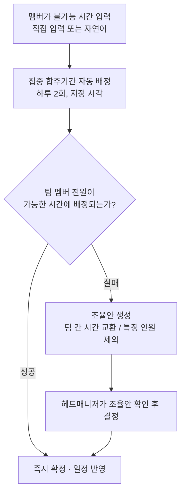

# Banblit

> 문서 버전: 1.0.0 draft

밴드의 공용 합주실 일정을, 멤버가 "안 되는 시간"만 입력하면 자동으로 짜주는 합주 일정 관리 서비스.

## Abstract

Banblit은 하나의 합주실을 여러 밴드 팀이 나눠 쓸 때 생기는 일정 충돌을 줄이려고 만든 서비스입니다. 각 멤버는 자신이 합주에 참여할 수 없는 시간만 등록하면 되고, 집중 합주기간에는 시스템이 그 정보를 모아 팀별 합주 시간을 자동으로 배정합니다. 자동 배정으로 답이 나오지 않으면 조율안을 만들어 관리자가 결정하도록 돕습니다.

## 배경

밴드 팀들이 하나의 합주실을 공유하면 팀 간 시간이 자주 겹칩니다. 특히 한 사람이 여러 팀에 속해 있으면 그 사람의 일정이 한 번 바뀌는 것만으로 관련된 여러 팀의 일정이 연쇄로 무너지고, 그걸 손으로 맞추는 작업이 가장 큰 병목이었습니다.

Banblit은 이 일정 조정 과정을 자동화하는 것을 목표로 합니다.

## 핵심 흐름



자동 배정은 팀 멤버 전원이 가능한 시간에 먼저 배정하고, 안 되면 팀 간 시간대를 서로 교환해 전원이 가능해지는 배정을 찾고, 그래도 안 되면 특정 인원을 제외했을 때 전원이 가능해지는 배정을 찾습니다. 어떤 경우에도 멤버가 등록한 불가능 시간을 임의로 무시하지는 않습니다.

첫 번째로 풀리면 곧바로 확정되고, 나머지 둘이 필요한 경우에는 조율안으로 정리해 헤드매니저의 결정을 거칩니다.

## 주요 기능

- **캘린더 스케줄러** — 월 보기는 세 가지 모드(전체 팀 일정 / 합주실 예약 / 내 일정)를 탭으로 전환하고, 주 보기는 모든 팀의 하루 일정을 시간 순서로 펼칩니다.
- **자동 배정** — 집중 합주기간 동안 모든 팀이 비슷한 합주량을 갖도록 합주 시간을 배정합니다.
- **자연어 입력** — "다음 주 화요일 저녁은 안 돼" 같은 말을 불가능 시간으로 등록·수정·삭제합니다.
- **충돌 조율** — 자동 배정이 실패하면 사람이 고를 수 있는 조율안을 제시합니다.
- **상시 예약** — 집중기간이 아닐 때는 선착순으로 합주실을 예약하고, 취소·변경할 수 있습니다.
- **팀 게시판과 공지** — 팀마다 게시글과 파일을 나누는 게시판을 두고, 공지는 전체에게 공개합니다.
- **역할과 권한** — 팀·합주실·기간·권한을 관리하는 헤드매니저 역할을 두며, 권한은 필요에 맞게 새로 정의할 수 있습니다.

## 역할

- **헤드매니저** — 팀 생성, 멤버 관리, 합주실과 운영 시간 설정, 집중 합주기간과 연산 시각 지정, 조율안 결정, 공지 작성, 권한 정의를 맡습니다. 인원은 고정하지 않습니다.
- **일반 멤버** — 자신의 불가능 시간을 관리하고, 팀에 참가하며, 일정을 확인합니다.

## 기술 스택

| 구분 | 사용 기술 |
| --- | --- |
| 프론트엔드 | React + Vite + TypeScript |
| 백엔드 | Python + FastAPI |
| 데이터베이스 | PostgreSQL |
| 자연어 처리 | Claude API (연동 예정) |

## 실행

모든 실행은 컨테이너 안에서 이뤄집니다. 호스트에는 Docker 만 있으면 됩니다.
개별 `docker compose` 명령의 뜻과 주의점은 `COMMAND.md` 가 정본입니다.

### 개발 (Windows)

```
.\setup.ps1     # 한 번만. .env 를 만들고 git hook 과 banblit 명령을 켠다
banblit up
```

화면은 `http://localhost:5173`, API 문서는 `http://localhost:8000/docs` 입니다.
`banblit help` 로 나머지 명령을 봅니다.

### 배포 (Linux 서버)

```
curl -fsSL https://get.docker.com | sh
sudo usermod -aG docker $USER      # 그리고 다시 로그인
git clone https://github.com/minkong-dev/Banblit.git
cd Banblit
cp .env.example .env
nano .env                          # 아래 표의 값을 채운다
./banblit.sh up
```

`./banblit.sh up` 이 image 를 만들고, 마이그레이션을 맞추고, 전체를 띄운 뒤
응답을 기다립니다. 성공하면 `~/.bashrc` 에 `banblit` 이름을 넣으므로 그 뒤로는
`./` 없이 어느 경로에서나 부릅니다.

`.env` 에서 반드시 채워야 하는 값입니다. 비어 있으면 뜨기 전에 멈춥니다.

| 값 | 무엇 |
| --- | --- |
| `BANBLIT_DOMAIN` | 서비스 주소. 이 이름으로 인증서를 받으므로 실제로 이 서버를 가리켜야 한다 |
| `POSTGRES_PASSWORD` | 데이터베이스 비밀번호. 견본 값 그대로면 거절한다 |
| `SMTP_*` | 비밀번호 재설정·아이디 찾기 메일이 나가는 계정. 비우면 메일이 안 나간다 |
| `APP_ORIGIN` | 메일에 담을 링크의 앞부분. 배포에서는 `https://<도메인>` |

Cloudflare 를 쓴다면 그 레코드만 프록시를 끄거나(DNS only) 프록시 모드를
Full (strict) 로 둡니다. 그렇지 않으면 인증서 발급이 막힙니다.

## 현재 상태

v1 기획을 확정하고 구현했습니다. 합주실·기간·팀·명단·예약·못 나오는 시간·게시판·
알림·권한과 자동 배정까지 동작하며, 화면 열두 벌이 서버에 물려 있습니다.
Claude API 연동과 소셜 로그인은 아직입니다.

배포 구성(TLS 앞단·정기 백업·요청 제한)은 코드가 갖춰져 있으나 실제 서버에서
검증하기 전입니다.

## 라이선스

[LICENSE](./LICENSE) 파일을 따릅니다.
